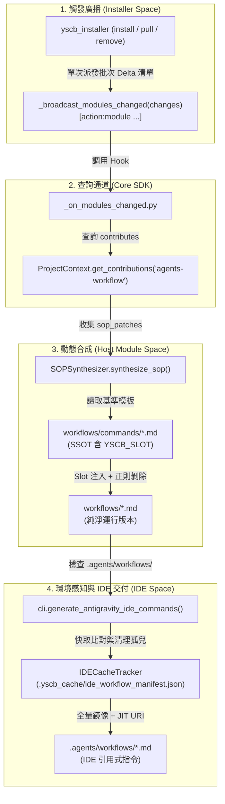

# 模組安裝期連動協定與動態插槽注入手冊 (SOP Interlock Protocol)

本專題手冊定義 YS-Codebase 的**安裝期連動協定 (Installation-time Interlock & Open Protocol)**、三大剛性合約、Slot 插槽注入機制、雙層 Extension 發現鏈與 IDE 指令無感自動同步流水線。

---

## 🎯 1. 核心概念與領域通用語言 (Ubiquitous Language)



| 概念名詞 | 定義與語意約束 |
| :--- | :--- |
| **宿主模組 (Host Module)** | `agents-workflow` 本身。定義基準 SOP 流程與 Slot 插槽，接受外掛模組注入補丁。 |
| **外掛模組 (Plugin Module)** | 任何下游或功能模組（如 `agents-workflow-unity`），於 `manifest.json` 宣告連動貢獻。 |
| **Slot 插槽標記** | 形式如 `<!-- YSCB_SLOT:<SlotName> -->` 的唯一 HTML 註解錨點，合成後保證 100% 正則剝除。 |
| **具體化運行版本 (Materialized SOP)** | 經由連動合成並剝除 Slot 標記後輸出於 `modules/agents-workflow/workflows/*.md` 的純淨文件。 |

---

## 📜 2. 三大剛性協定合約 (The Three Rigid Protocol Contracts)

### 合約 ①：Installer 生命週期廣播合約 (Contract I)
- **進入點**：`modules/<mod>/scripts/_on_modules_changed.py`
- **CLI 傳參**：`python _on_modules_changed.py <action:module> [<action:module> ...]`
- **Action 型別**：`installed`、`updated`、`removed`
- **觸發約束**：整批模組安裝/更新/移除事務完成後**僅派發一次**；`build` 指令嚴格**不觸發**廣播；例外隔離僅輸出 `[WARN]`，不中斷核心事務。

### 合約 ②：Core SDK 跨模組貢獻查詢通道 (Contract II)
- **宣告語義**：外掛模組於 `manifest.json` 頂層欄位宣告 `"contributes": { "<namespace>": { ... } }`。
- **查詢 API**：
  ```python
  ProjectContext.get_contributions(namespace: str, start_dir: Optional[Path] = None) -> List[Tuple[str, Path, Dict[str, Any]]]
  ```
- **保證**：Core SDK 純為無業務偏見的資料通道，不解析具體 namespace 內部資料。

### 合約 ③：Host Module 公開協定合約 (Contract III)
- **命名空間**：`"agents-workflow"`
- **Schema 規範**：
  ```json
  {
    "contributes": {
      "agents-workflow": {
        "schema_version": "1.0",
        "sop_patches": [
          {
            "target_sop": "NewPlan.md",
            "target_slot": "Phase0",
            "position": "append",
            "content_file": "templates/unity_phase0_rules.md"
          }
        ],
        "sop_extensions": [
          {
            "name": "unity_package_verify",
            "script": "scripts/verify_unity.py",
            "doc": "workflows/extensions/unity_package.md",
            "trigger": "on_demand"
          }
        ]
      }
    }
  }
  ```

---

## 🧩 3. 全量 Slot 標記插槽表 (YSCB_SLOT Full Registry)

| 目標 SOP | Slot 名稱 | 注入錨點位置 | 典型用途 |
| :--- | :--- | :--- | :--- |
| `NewPlan.md` | `Phase0` ~ `Phase7` (共 8 個) | 各 Phase 執行步驟末尾、Checkpoint 之前 | 注入特定領域之需求、架構、API、測試或品質條款 |
| `Review.md` | `Step1` ~ `Step4` (共 4 個) | 各 Review 步驟末尾 | 注入領域專屬審查維度 (如 Package, Asset, Shader) |
| `ContextInit.md` | `Step1` ~ `Step4` (共 4 個) | 各加載步驟末尾 | 注入特定引擎/框架之記憶熱啟動規範 |

> [!CAUTION]
> **零殘留標記鐵律 (Zero Residual Slot Tag Axiom)**：
> 產出的具體化文檔（`workflows/*.md` 與 `.agents/workflows/*.md`）**嚴禁殘留任何 `<!-- YSCB_SLOT:... -->` 標記**。合成引擎必須在輸出前調用 `SOPSynthesizer.strip_slot_markers()` 徹底清除。

---

## 🔍 4. 雙層 Extension 發現鏈 (Extension Discovery Hierarchy)

`ExtensionRegistry` 遵循嚴格雙層發現鏈：

$$\text{第一層：專案自定義 } (\texttt{sop\_ext://}) \succ \text{第二層：模組宣告貢獻 } (\texttt{contributes.sop\_extensions}) \succ \text{第三層：宿主內建}$$

- **同名覆蓋**：若專案根目錄 `extensions/` 存在與模組外掛同名的 Extension，專案自定義版本具備最高優先級並覆蓋模組版本。
- **排版標籤**：`ext list` 終端指令輸出明確區分 `[sop_ext]` 與 `[module: <mod_name>]` 來源標籤。

---

## 🔄 5. IDE 孤兒檔案清理機制 (Orphan Tracking)

- **快取檔案**：`.yscb_cache/ide_workflow_manifest.json` 記錄上一輪生成的所有指令檔案。
- **比對清理**：當某模組被移除或某指令被更名時，`IDECacheTracker.clean_orphans()` 自動比對差集並物理刪除過期的孤兒 Markdown 檔案，徹底防止 IDE 指令殘留污染。
