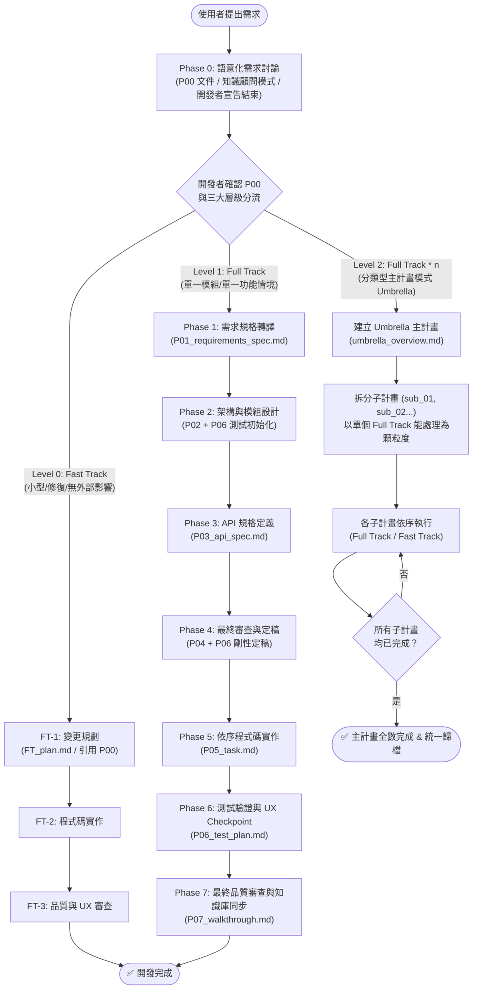
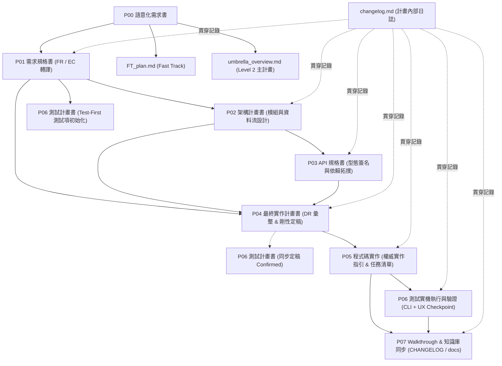

# 標準開發作業流程 (NewPlan)

本文件定義 AI Agent 在本專案中進行功能開發、架構重構或問題修復時**必須強制遵守**的標準作業流程 (SOP)。

---

## 核心原則

所有開發活動必須始終遵守以下三大原則：
1. **零臆測 (Zero Speculation)**：任何不確定的需求、API 行為或架構細節，必須主動向開發者釐清，嚴禁自行假設。
2. **可追溯 (Traceability)**：從需求 (P00 語意 / FR / EC) 到架構、API、程式碼、測試計畫與 Commit 訊息，每個階段皆有對應文件留痕與剛性追溯鏈。
3. **分級管控 (Graduated Control)**：依 Phase 0 分流評估任務規模，嚴格執行三大層級（Level 0: Fast Track / Level 1: Full Track / Level 2: Umbrella 分類型主計畫）。

---

## 🚨 Agent 執行紀律（防呆鐵律）

- **嚴禁連發**：單次 Turn 最多執行一個 Phase。產出階段文件後，必須詢問開發者並**立即 End Turn** 等待回覆。
- **Checkpoint 強制等待**：產出 Phase 文件後，必須等待開發者明確給予「確認/同意/推進」指示，嚴禁 Agent 自行假設通過並跨入下一個 Phase。
- **「問答 $\neq$ 推進」防呆條款 (Clarification $\neq$ Advancement Disambiguation)**：
  - **回覆意圖二分法**：Agent 必須嚴格區分開發者的回覆類型：
    - **類型 A：局部解答 / 意見回饋**（例：解答 Agent 提問、提供特定參數、修改某欄位）➔ Agent **僅可更新當前 Phase 文件**，呈遞更新摘要與變更處，並明確詢問「已為您更新 [項目]，請問本階段內容是否確認無誤，可指示推進至 Phase X？」並**立即 End Turn 等待**，**絕對禁止直接跨入下一 Phase**！
    - **類型 B：推進 / 定稿指令**（例：「確認」、「通過」、「進入 Phase X」、「沒有其他問題了」）➔ 只有接收到此類明確信號，Agent 才能將當前 Phase 標記為 `Confirmed` / `Passed` 並推進。
  - **嚴禁複合推論**：絕對禁止 Agent 自行假設「因為開發者解答了疑問 ➔ 代表整份文件無其他問題 ➔ 自動推進」。
  - **更新後二次確認 (Update & Re-confirm Loop)**：文件修訂後必須重新呈遞修改摘要，並重新等待開發者明確給出類型 B 指令。
- **嚴禁空降實作**：未經 Phase 1~4（或 FT-1）規劃並獲得開發者確認前，**絕對禁止直接編寫或修改原始碼**。
- **除錯排查與範疇保護鐵律 (Scope-Bound Debugging & Anti-Drift Guardrail)**：
  - **「由近及遠、本體優先」排查階層 (Local-First Hierarchy)**：遇到錯誤、異常或視覺/邏輯不符預期時，Agent **必須優先徹底排查當前組件本體內部邏輯與呼叫端傳參配置**。在未 100% 排除自身問題前，**絕對禁止直接跨模組深入下游/外部模組進行修改**。
  - **修改範疇越界阻斷 (Out-of-Scope Modification Gate)**：若排查發現問題似乎位於超出本次 Dev Plan 承諾範圍的外部模組，**Agent 絕對禁止擅自修改外部代碼**！必須立即發起 `Discuss` 向開發者呈遞調用證據，由開發者判定。
  - **阻斷盲目淺層修補 (Anti-Trial-and-Error Loop)**：同一問題**連續 2 次修復失敗**，或修復將破壞既有架構/API 簽名時，必須強制停手發起 `Discuss` 進行 5-Whys 根因分析。
- **模板註解剝除鐵律 (Template Guidance Stripping)**：
  - 模板開頭的 `<!-- === AGENT_GUIDANCE === ... -->` 區塊為 Agent JIT 指引，Agent 在生成實際 Markdown 檔案時**嚴禁輸出任何 HTML 導引註解**，必須保持目標文檔純淨。
- **Phase 0 討論模式鐵律**：
  - **Agent 嚴禁臆測需求**：在 Phase 0 討論階段，Agent 僅作為知識顧問，針對開發者的陳述提出釐清問題。除非開發者明確要求，否則嚴禁主動提出設計方案、功能清單或架構建議。
  - **討論結束必須由開發者明確宣告**：Agent 絕對禁止自行判定需求已釐清完整並推進。必須等待開發者明確表示後，才可將 `P00_semantic_requirements.md` 標記為 `Confirmed`。
  - **Track 分流在 P00 Confirmed 後才執行**：P00 確認後，在同一輪呈遞三大層級分流建議，由開發者最終決定 Track。
- **Phase 1 規格轉譯嚴禁新增臆測**：`P01_requirements_spec.md` 中的每一個 FR 必須可回溯至 `P00_semantic_requirements.md` 中的具體使用情境或 API 使用案例。嚴禁 Phase 1 在 P00 範疇之外新增未經討論的功能點。
- **Test-First 測試前置定稿條款**：`P06_test_plan.md` 必須於 Phase 2~3 隨設計同步初始化草擬 (Draft)，並於 Phase 4 Review 階段與 `P04_implementation_plan.md` 一併剛性定稿 (Confirmed)，嚴禁延至 Phase 6 才開始憑空設計測試項目。Phase 6 之主軸純粹為「測試執行 + 缺陷修復 + 互動/UX/硬體驗證」。
- **Phase 6 人工/UX/硬體測試 Checkpoint 強制等待關卡**：即使自動化測試 100% Passed，Agent **絕對禁止**自行將 P06 標記為 `Passed` 或擅自進入 Phase 7！必須呈遞測試結果，並明確詢問開發者進行實際互動/視覺/硬體驗證。必須等待開發者明確回覆「驗證通過/指示免測」後，方可將 P06 標記為 Passed 並推進至 Phase 7。
- **Phase 6 驗證防呆鐵律 (無 Log 即未驗證)**：若 CLI 編譯/測試命令執行受阻，Agent **絕對禁止**在 `P06_test_plan.md` 與對話中標記 `Passed`。必須明確標記 `[未實機編譯/僅靜態檢查]`，並呈遞精確命令請開發者於控制台執行回填。
- **全階段文件模板剛性對齊**：所有 Phase (P00~P07 / FT_plan / umbrella_overview) 產出文件 **必須 100% 嚴格鏡像標準模板結構**（包含指定欄位、表格與 Header 標頭，含 `> 擴充項目：`），嚴禁 Agent 自行簡化或遺漏模板區塊。
- **目錄歸檔紀律與 CLI 調度優先**：
  - 定式作業（歸檔、檢索、掃描、合規校驗）優先呼叫 `python yscb_cli.py agents-workflow <verify|scan|search|archive>` 指令。
  - **嚴禁 Agent 主動歸檔**：所有計畫預設留存於 `plans://` 原位，僅在開發者明確下達歸檔指令時才執行歸檔工具。

---

## 📁 文件與目錄管理規範

### 工作目錄結構（由 `config.project.json` 定義）

- **獨立計畫（進行中）**：`plans://{YYYY_MM_DD_HHMM_功能名稱}/`  
- **獨立計畫（已歸檔）**：`archive://{YYYY}/{MM}/{YYYY_MM_DD_HHMM_功能名稱}/`  

> `YYYY_MM_DD_HHMM` 為建立計畫的當前時間（24 小時制），防止同天建立多個計畫時目錄名稱衝突。

### 巢狀子計畫管理 (Sub-Plans)

#### 模式 A：衍生型子計畫 (Derived Sub-Plans)
在主計畫執行至 **Phase 6 測試** 過程中，若發現非當前計畫範疇之衍生問題、缺陷修復或功能優化需求，**嚴禁隨意擴大當前計畫範圍**，應於主目錄下建立衍生子計畫：
- **子計畫目錄**：`plans://{主計畫名稱}/sub_{編號}_{子計畫目的}/`
- **預設 Track**：Fast Track（除非開發者指定 Full Track）。
- **處理流程**：子計畫完成後，將關鍵決策與設計變更納入主計畫文檔，並在主計畫的 `P07_walkthrough.md` 中記錄子計畫回歸結果。子計畫完成後留在主目錄內，待主計畫完成時一同歸檔。

#### 模式 B：分類型主計畫 (Umbrella Plan / Master Plan)
進行複合子模組系列開發、大型架構重構或跨領域演進時，建立 Umbrella 主計畫：
- **主計畫目錄**：`plans://{YYYY_MM_DD_HHMM_計畫名稱}/`
- **主計畫產出**：
  - `P00_semantic_requirements.md`（主計畫總綱語意需求與邊界）
  - `umbrella_overview.md`（總覽、子計畫清單與狀態矩陣、跨子計畫依賴關係圖、整體 Decision Records）
  - **主計畫本身不直接撰寫代碼**，專注於架構總覽與依賴協調。
- **子計畫目錄**：`plans://{主計畫名稱}/sub_{編號}_{子計畫名稱}/`
- **子計畫獨立性**：每個子計畫以「單個 Full Track 能處理之顆粒度」為拆分單位，獨立進行 Phase 0 確認後執行其 Full Track (`P01~P07`) 或 Fast Track (`FT_plan`)。
- **依賴管理**：子計畫間若有執行順序依賴，必須記錄於 `umbrella_overview.md` 並依序推進。
- **完成與歸檔**：子計畫完成後留在主目錄內；待所有子計畫全部完成後，整個主目錄一起遷移至 `archive://`。

> [!IMPORTANT]
> **巢狀層級硬性約束**：本專案嚴格限制子計畫目錄最多**兩層結構**（主計畫 ➔ 子計畫），**絕對禁止在子計畫目錄下再開設子計畫**！

---

## 🔗 跨文件 ID 引用與剛性追溯鏈規範

為確保從需求到測試的 100% 可追溯性，所有產出文件必須遵循以下標準 ID 格式：

| ID 類別 | 前綴格式 | 範例 | 說明 |
| :--- | :--- | :--- | :--- |
| **功能需求** | `FR-{XX}` | `FR-01`, `FR-02` | 定義於 `P01`，且必須追溯至 `P00` 語意 |
| **邊界條件** | `EC-{XX}` | `EC-01`, `EC-02` | 定義於 `P01`，涵蓋異常輸入與極限狀態 |
| **非功能需求** | `NFR-{XX}` | `NFR-01` | 定義於 `P01`，涵蓋效能、GC、記憶體指標 |
| **決策紀錄** | `[{Phase}:DR-XX]`（`{Phase}` 為產出該決策之文件對應 Token，如 `P01`/`P02`/`P03`/`P04`/`FT`/`UMBRELLA`） | `[P01:DR-01]` | 各 Phase 關鍵技術與架構裁決，Phase 前綴確保跨文件 ID 全域不重複 |
| **功能測試** | `FT-{XX}` | `FT-01` | 對應 `FR-XX` 的自動化測試 |
| **邊界測試** | `ET-{XX}` | `ET-01` | 對應 `EC-XX` 的防禦與降級測試 |
| **回歸測試** | `RT-{XX}` | `RT-01` | 全域既有功能回歸確認 |
| **效能測試** | `PT-{XX}` | `PT-01` | 對應 `NFR-XX` 的 0-GC 與基準量測 |
| **UX/手動驗證** | `UX-{XX}` | `UX-01` | 開發者實機互動、視覺與原生手感驗證 |
| **缺陷紀錄** | `BUG-{XX}` | `BUG-01` | 測試過程中發現的計畫缺陷或實作錯誤 |

> **剛性追溯鏈矩陣**：
> `P00 語意需求` ➔ `FR-XX / EC-XX` ➔ `[{Phase}:DR-XX] 設計決策` ➔ `Public/Internal API 簽名` ➔ `代碼實作` ➔ `FT-XX / ET-XX 測試`。

---

## 💬 討論與確認機制

### 1. Checkpoint（輕量確認）
- **觸發時機**：每個 Phase 結束產出階段文件時。
- **Agent 行為**：呈遞摘要與關鍵產出，明確詢問開發者是否確認推進，並**立即 End Turn 等待**。

### 2. Deep Discussion（深度討論 / Discuss）
- **觸發時機**：當遇到重大架構歧異、未知技術可行性、跨模組依賴衝突、破壞性變更 (Breaking Changes)、排查範疇越界或修復連續 2 次失敗時。
- **Agent 行為**：依 [Discuss.md](./Discuss.md) 流程暫停推進，進行 5-Whys 根因分析，整理方案比較表 (Pros & Cons)，由開發者深度裁決並記錄 `[{Phase}:DR-XX]`。

---

## 工作流概覽

---

## 階段詳細規範

### Phase 0：語意化需求討論 (Semantic Requirements Discovery)

#### 目標
在動筆寫任何規格之前，以**開放式對話**完整釐清開發者的真實意圖與使用情境，建立可追溯的語意化需求文件 (`P00_semantic_requirements.md`)。三大層級分流在 P00 確認後才執行。

#### 討論模式三大原則
1. **Agent = 知識顧問**：Agent 的職責是提出好問題、提供業界參考、揭示潛在邊界，**絕對不主動提出設計方案或功能列表**，除非開發者明確要求。
2. **開發者主導結束**：討論**必須由開發者明確宣告結束**，Agent 嚴禁自行判定需求完整並推進。
3. **P00 先於分流**：完整討論 → P00 Confirmed → 三大層級分流，三步驟嚴格有序。

#### 執行步驟
1. **建立工作目錄**：`plans://{YYYY_MM_DD_HHMM_功能名稱}/`（由 `config.project.json` 之 `paths.plans_dir` 定義）
2. **雙星伴隨初始化 (Mandatory Co-Initialization)**：
   - 依模組 `workflows/templates/P00_semantic_requirements.md` 建立 `P00_semantic_requirements.md`（狀態標記為 `Discussing`），選擇對應計畫類型（Feature / Refactor / Bug Fix / Performance / Docs / 自訂）。
   - **同時**依模組 `workflows/templates/changelog.md` 建立 `changelog.md`，並立即寫入第 1 筆紀錄（開立計畫目錄與 P00 草稿）。
   - 🚨 **防呆鐵律**：嚴禁延至分流後才建立 `changelog.md`！Phase 0 的所有討論、調研 (R01/R02) 與 DR 決策必須即時記錄於 `changelog.md`。
3. **開放式討論與深度調研 (Phase 0-R)**：
   - 標準情況：Agent 作為知識顧問提問釐清，持續補充 `P00` 的「開放議題紀錄」欄位。
   - **高複雜度/跨度大需求**：若需求涉及全新架構、多維度可行性驗證或資產大規模遷移，依 [Research.md](./Research.md) 啟動特化調研，針對各技術主題產出自由論證格式之專題調研報告，統一採用前綴命名 **`R{n:2d}_{topic}.md`**（例：`R01_architecture_reference.md`）。調研結論收斂回填至 `P00` 與主計畫路線圖。
4. **等待討論結束宣告**：開發者明確表示討論結束後，Agent 整理並最終化 `P00`，呈遞給開發者確認。

→ **Checkpoint** → 開發者確認 P00 內容正確（狀態更新為 `Confirmed`）

5. **執行三大層級分流判定 (Three-Tier Phasing Matrix)**：

| 分流層級 | 適用場景 | 產出與執行軌道 |
| :--- | :--- | :--- |
| **Level 0：Fast Track** | • 修改檔案數 $\le 2$ • 不變更 Public API / 介面簽名 • 不引入新的跨模組依賴 • 純 Bug 修復、內部微調或簡單擴充 | 於工作目錄建立 `FT_plan.md`，嵌入 P00 引用，進入 FT-1 ~ FT-3。 |
| **Level 1：Full Track** | • 單一功能語意、單一使用情境 • 單一模組的新增或重構 • 涉及 Public API 變更或內部依賴調整 | 確認 `changelog.md` 已就緒，進入 Phase 1 ~ Phase 7 完整流程。 |
| **Level 2：Full Track $\times$ n (分類型主計畫 Umbrella)** | • 多個功能語意、多個情境、跨模組大型架構重構 • 子計畫拆分評估以**單個 Full Track 能處理**為單位 | 建立 `umbrella_overview.md`，拆分 `sub_01`, `sub_02`... 各子計畫獨立執行其 Track。 |

---

### Phase 1：需求規格定義（規格轉譯自 P00）

#### 目標
將 `P00_semantic_requirements.md` 的語意需求 1:1 轉譯為可驗收的功能需求 (FR)、非功能需求 (NFR) 與邊界條件 (EC)。**嚴禁在 P00 範疇之外新增未經討論的功能點。**

#### 執行步驟
1. 依 `workflows/templates/P01_requirements_spec.md` 建立 `P01_requirements_spec.md`（狀態標記為 `Draft`），並標注「依據 P00」連結。
2. **規格轉譯（P00 → FR/EC）**：FR 表格中的每一行必須對應至 P00 的具體使用情境或 API 使用案例，填入「對應 P00 語意」欄。
3. 列出邊界/異常情況 (EC) 與非功能需求 (NFR)。
4. **專案特化擴充探測 (Extension Specialization Scan)**：
   - 執行 `python yscb_cli.py agents-workflow ext list` 掃描 `sop_ext://` 下所有可用擴充。
   - 於 `P01_requirements_spec.md` 中輸出「專案擴充特化判定矩陣」，逐項評估納入 (Included) 或排除 (Excluded) 理由。
   - 頂部 Header `> 擴充項目：` 剛性同步已納入之 Extension 名稱（或標記 `none`）。
5. **查閱踩坑紀錄**：主動查閱相關模組在 `docs://` 及 `DESIGN_NOTES.md` 中的 `[!CAUTION]` 或 `[!WARNING]`。
6. 於 `changelog.md` 記錄本階段決策。

→ **Checkpoint** → 開發者確認（狀態更新為 `Confirmed`） → 進入 Phase 2

---

### Phase 2：架構與模組設計

#### 目標
進行架構分層、模組劃分、依賴邊界與資料流設計。

#### 執行步驟
1. 依 `workflows/templates/P02_architecture_plan.md` 建立 `P02_architecture_plan.md`（標記為 `Draft`）。
2. 繪製循序圖或資料流圖。
3. 盤點受影響的模組與檔案清單。
4. **Test-First 初始化**：依 `workflows/templates/P06_test_plan.md` 建立初始草稿 `P06_test_plan.md`（標記為 `Draft`），預先將 FR/EC 映射為測試項目。

→ **Checkpoint** → 開發者確認（狀態更新為 `Confirmed`） → 進入 Phase 3

---

### Phase 3：API 規格定義與依賴拓撲

#### 目標
定義所有 Public/Protected API 簽名、型態、錯誤處理與依賴拓撲順序。

#### 執行步驟
1. 依 `workflows/templates/P03_api_spec.md` 建立 `P03_api_spec.md`（標記為 `Draft`）。
2. 定義型態簽名、命名風格與物理/數學顯式單位。
3. 定義依賴拓撲（實作順序）。
4. **執行 Extension 擴充**：若專案定義了 `P03_*_ext.md`，於標準步驟完成後執行擴充檢查並於 Header `> 擴充項目：` 宣告。

→ **Checkpoint** → 開發者確認（狀態更新為 `Confirmed`） → 進入 Phase 4

---

### Phase 4：最終審查與定稿 (Review & Test-First Confirmed)

#### 目標
全面交叉審查 Phase 1~3 產出物，並將實作計畫與測試計畫一併剛性定稿。

#### 執行步驟
1. **交叉驗證 Checklist**：
   - [ ] 需求規格書中的每個 FR，在 API 規格書中有對應介面
   - [ ] 需求規格書中的每個 EC，在 API 規格書中有對應錯誤策略
   - [ ] 風險評估有對應緩解措施
   - [ ] 物理/數學變數皆帶有顯式單位後綴
2. **Extension 任務自動注入 (Task & Test Injection)**：
   - 將 Phase 1 判定納入的所有 Extension Checklist，實體注入 `P04_implementation_plan.md` 任務細節中。
   - 將 Extension 驗證條件同步注入 `P06_test_plan.md` 測試案例中。
3. **知識庫文檔衝擊盤點 (Documentation Impact Plan)**：
   - 依據 P03 (API 介面)、P05 (實作任務) 與 P06 (測試案例) 進行 7 大抽象知識維度投影。
   - 於 `P04_implementation_plan.md` 中輸出「知識庫文檔衝擊與交付規劃」，明確預排需新建/更新之 `docs/` 文件（特別是維度 3 中觀機制手冊與維度 5 Design Notes）。
   - 💡 可使用 `python yscb_cli.py agents-workflow docs new-topic <ModuleName> <TopicName>` 快速生成標準專題手冊骨架。
4. **靈魂拷問 (Stress Test)**：Agent 主動扮演架構審查員，提出至少 1 個尖銳且具建設性的問題，開發者回答後方可繼續。
5. **產出最終計畫書**：依 `workflows/templates/P04_implementation_plan.md` 模板彙整 DR 與實作細節，狀態更新為 `Confirmed`。
6. **Test-First 定稿**：同步審查並定稿 `workflows/templates/P06_test_plan.md`，狀態更新為 `Confirmed`。

→ **Checkpoint** → 開發者確認「開始實作」 → 進入 Phase 5

---

### Phase 5：程式碼實作

#### 目標
嚴格按照 `P04_implementation_plan.md` 依序撰寫程式碼。

#### 實作紀律與上下文管理 (Context Management)
- **唯一權威上下文**：進入實作階段後，應以 `P04_implementation_plan.md` 與 `P05_task.md` 作為核心上下文，避免頻繁載入過多歷史文件導致注意力發散與 Token 浪費。
- **嚴格守門**：禁止引入計畫中未列出的新 public 類別或方法；禁止修改計畫中未提及的既有檔案。遇阻時依 [Discuss.md](./Discuss.md) 執行深度歸因。

#### 執行步驟
1. **進度追蹤**：依 `workflows/templates/P05_task.md` 建立 `P05_task.md`（標記為 `Implementing`），依 P04 實作順序表展開 TODO 清單 `[ ]`。
2. **依序實作**：按依賴拓撲實作，每完成一項於 `P05_task.md` 標記 `[x]`。
3. **編譯驗證**：每個主要模組實作完成後執行編譯檢查。
4. **偏差三級處置策略 (Deviation Handling)**：
   - 🚨 **Critical**（影響 Public API / 架構 / 跨模組依賴）：**立即停止實作**，向開發者回報並退回 Phase 1~4 修正計畫。
   - ⚠️ **Major**（不影響 Public API 但影響內部模組邏輯）：暫停當前項目並向開發者回報確認。
   - ℹ️ **Minor**（不影響架構之細微調整）：自行處理並詳細記錄於 `P05_task.md` 的偏差紀錄表。

→ 所有 TODO 項目完成 → 進入 Phase 6

---

### Phase 6：測試與驗證

#### 目標
執行 Phase 4 定稿之 `P06_test_plan.md`，完成自動化驗證、人工/UX 驗證與缺陷修復。

#### 執行步驟
1. **自動化測試執行**：執行 CLI 編譯與單元測試，記錄輸出日誌。若命令受阻，標記 `[未實機編譯/僅靜態檢查]`。
2. **人工 / UX / 硬體驗證 Checkpoint（強制等待）**：
   - Agent **絕對禁止**代勾或自行標記 `Passed`。
   - 呈遞測試結果，明確詢問開發者進行實際互動/視覺/硬體驗證。
   - 獲得開發者明確回覆「驗證通過」後，方可將 P06 標記為 `Passed`。
3. **Bug 修復子循環與衍生子計畫**：
   - **實作錯誤**：修復後重新執行受影響測試。
   - **計畫缺陷**：回退 Phase 1~4 修正計畫後再修復。
   - **衍生問題或擴充優化**：若非當前範疇，開立「模式 A：衍生型子計畫 (`sub_XX`)」處理。

→ 所有測試 Passed + 開發者驗證確認 → 進入 Phase 7

---

### Phase 7：最終品質 Review

#### 目標
全面審查程式碼品質、1:1 交付知識庫文檔與產出 Commit 訊息。

#### 執行步驟
1. **代碼清理與規範檢查**：移除 Debug 語句、檢查命名規範、日誌與記憶體安全。
2. **知識庫 1:1 交付對齊 (Knowledge Base Delivery Audit)**：
   - 依據 `P04_implementation_plan.md` 預排之文檔計畫，1:1 實體核對與更新 `docs/` 知識庫。
   - 確認中觀動態機制專題手冊（`[topic].md`）、工程妥協（`DESIGN_NOTES.md#DN-XX`）與模組 `README.md` 已全量交付。
   - 依 `workflows/templates/global_changelog.md` 模板將本次變更摘要追加至專案根目錄 [project://CHANGELOG.md](project://CHANGELOG.md) 最上方。
3. **產出變更摘要**：依 `workflows/templates/P07_walkthrough.md` 模板撰寫變更摘要，包含「知識庫文檔交付驗收對齊表」。
4. **產出 Commit 訊息**：依 Conventional Commits 格式（`<type>(<scope>): <標題>`）產出。
5. **目錄保留原位**：工作目錄維持原位，僅在開發者明確指示時呼叫 `python yscb_cli.py agents-workflow archive <plan_id>` 歸檔。

→ 開發者確認審查通過 → ✅ 開發完成

---

## Fast Track 流程

適用於小型、低風險修改（$\le 2$ 檔案且無 Public API 變更）。

### FT-1：需求確認 & 變更規劃
1. 建立 `FT_plan.md`（標記為 `Planning`），嵌入 P00 引用。
2. 確認無 Public API 與跨模組依賴影響（通過架構確認 Checklist）。
3. → **Checkpoint** → 開發者確認 → FT-2

### FT-2：實作
1. `FT_plan.md` 狀態更新為 `Implementing`。
2. 逐項實作並追蹤進度，每步執行編譯驗證。若遇 Critical 偏差立即升級為 Full Track。
3. → 實作完成 → FT-3

### FT-3：品質 Review
1. `FT_plan.md` 狀態更新為 `Reviewing`。
2. 通過代碼清理、命名、文檔同步與驗證 Checklist。
3. 填入 Commit 訊息與變更摘要，狀態更新為 `Completed`。
4. → **Checkpoint** → 開發者確認 → ✅ 開發完成

---

## 附錄：階段間資訊流依賴圖

