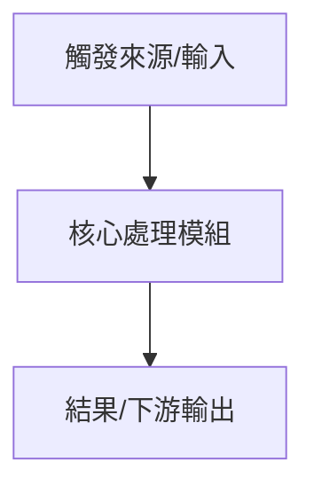

<!--
=== AGENT_GUIDANCE: 架構 & 變更計畫書 (P02) 填寫規範 ===
1. 定位與目的：
   - 進行架構分層、模組劃分、依賴邊界與資料流設計。
2. Agent 行為鐵律：
   - 閱讀原始碼前，優先讀取 docs/ 對應路徑之 README.md 與 DESIGN_NOTES.md。
   - 嚴格遵守 1:1 路徑鏡像與物理單位 _{unit} 規範。
   - 按依賴拓撲順序排列模組變更清單。
3. 產出約束：
   - Agent 生成目標文件時，嚴禁輸出本 HTML 註解區塊。
===================================================
-->
# 架構 & 變更計畫書 (Architecture & Change Plan)

> 功能名稱：[填入功能名稱]  
> 建立日期：[YYYY-MM-DD]  
> 所屬主計畫：[填入主計畫目錄名稱 / 無]  
> 狀態：Draft / Confirmed  
> 擴充項目：none  
> 模板版本：v1.2  

---

## 1. 架構全貌與資料流 (Architecture & Data Flow)

[描述修改前後的架構演進與資料流，建議附上 Mermaid 圖表與已查閱的 docs/ 模組文檔。]

### 既有文檔查閱
- **查閱路徑**：`docs/[Module]/README.md`
- **關鍵坑點/邊界**：[摘要 DESIGN_NOTES 中的 Caution/Warning，若無填無]

---

## 2. 模組變更清單 (按依賴順序)

| 順序 | 類型 | 類別 / 檔案路徑 | 職責與修改概述 | 依賴項 / 影響下游 |
|------|------|----------------|---------------|------------------|
| 1 | Add / Modify / Remove | `[ClassName]` (`path/to/file.cs`) | [職責或修改內容] | [依賴類別或受影響模組] |
| 2 | | | | |

---

## 3. 風險評估與防護

| ID | 風險維度 | 風險描述 | 等級 | 緩解 / 回滾策略 |
|----|---------|---------|------|----------------|
| R-01 | 相容性 / 效能 / 依賴 | [描述潛在風險] | 高/中/低 | [防禦措施或回滾方案] |

---

## 4. Decision Records

> 僅在本階段觸發深度架構取捨時填寫。ID 格式：`[P02:DR-XX]`。

### [P02:DR-01] [議題標題]
- **議題**：[問題描述]
- **結論**：[最終決定]
- **理由**：[為什麼選擇這個方案]
- **排除方案**：[被排除的方案及原因]
