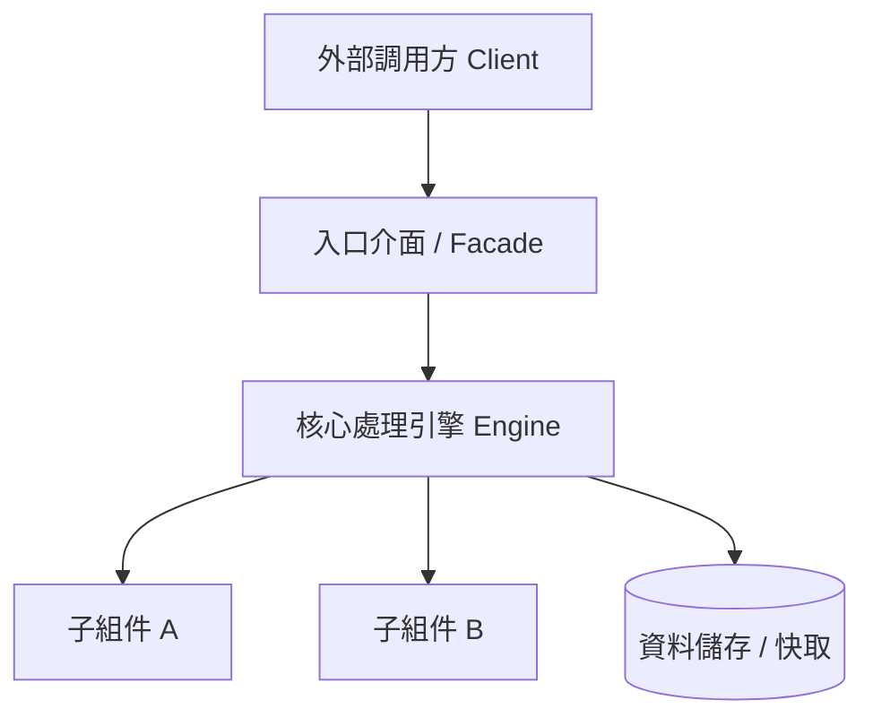

# [模組名稱] (Module Title)

> 一句話描述：[本模組的核心職責是什麼]

---

## 職責邊界 (Scope & Boundaries)

**負責事項 (In-Scope)**：
- [核心職責 1]
- [核心職責 2]

**不負責事項 (Out-of-Scope)**：
- [明確列出本模組不處理的事項，防止概念蔓延與依賴污染]

---

## 架構概覽 (Architecture Topology)

> 30 秒內讓讀者理解整體結構與協同關係（建議使用垂直排版 Mermaid TD 圖）：



---

## 快速上手 (Quick Start & Usage)

```python
# 典型調用範例 (根據專案實際語言替換)
from my_module import Engine

engine = Engine()
result = engine.process("input_data")
print(result)
```

---

## 公開介面速查 (Public API Reference)

| 介面 / 類別名稱 | 核心職責 | 典型使用場景 |
| :--- | :--- | :--- |
| `[ClassName1]` | [主要職責說明] | [何時使用] |
| `[ClassName2]` | [主要職責說明] | [何時使用] |

---

## 專題技術手冊導覽 (Topic Handbooks)

> 若本模組包含複雜動態機制（資料管線、狀態機、協議、演算法），強制建立獨立專題手冊：

| 專題手冊 | 知識維度 | 說明 |
| :--- | :--- | :--- |
| [pipeline_flow.md](./pipeline_flow.md) | 維度 3 (中觀機制) | [資料處理管線流向與 Stage 規格] |
| [lifecycle_fsm.md](./lifecycle_fsm.md) | 維度 3 (中觀機制) | [狀態機轉移矩陣與異常復原] |
| [DESIGN_NOTES.md](./DESIGN_NOTES.md) | 維度 5 (工程妥協) | [記錄非直觀設計、效能/硬體限制與坑點防護] |

---

## 關鍵坑點防護速查 (Critical Invariants)

> 僅列出最關鍵的 `[!CAUTION]` 等級坑點。完整妥協記錄見 [DESIGN_NOTES.md](./DESIGN_NOTES.md)。

> [!CAUTION] 核心不變量防護：[坑點標題]
> [說明什麼情況下觸發，以及未來重構時切勿隨意刪改的原因]

---

## 相關依賴模組 (Related Modules)

- [RelatedModuleA](../RelatedModuleA/README.md)：[與本模組的依賴與協同關係]
