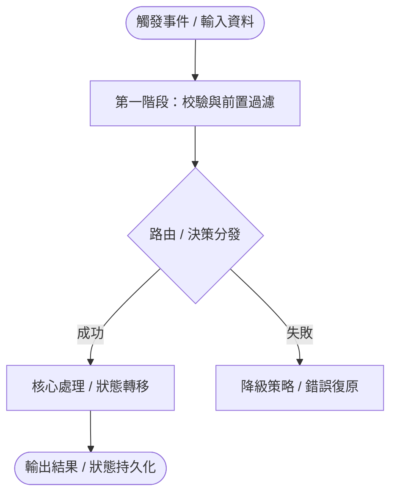

# [專題主題名稱]（例：管線架構 / 狀態機模型 / 通訊協定規格）

> 本文件深入剖析 `[ModuleName]` 中的 **[主題機制]**，說明其動態協同流向、邊界承諾與不變量保證。  
> **不涵蓋**：[明確排除不屬於本專題的範圍，如公開 API 使用範例見 README.md]。

---

## 1. 機制架構概覽 (Mechanism Topology)

> 描述各參與組件間的動態協同流向（優先使用垂直排版 Mermaid TD）：

---

## 2. 核心規範矩陣 (Specification Matrix)

> 根據主題類型選擇合適的表格結構（通訊封包 / 狀態轉移 / 管線階段）：

### 2.1 階段/狀態轉移矩陣 (State / Stage Matrix)

| 階段 / 狀態 (State) | 觸發條件 (Trigger) | 執行行為 (Action) | 次一狀態 (Next State) | 異常處理 (Failure Mode) |
| :--- | :--- | :--- | :--- | :--- |
| `INIT` | 系統啟動 | 載入配置、初始化資源池 | `READY` | 拋出 `InitError` 並清理 |
| `PROCESSING` | 收到處理任務 | 執行管線 Stage 1~3 | `COMPLETED` | 進入 `RETRY` 或 `FAILED` |
| `RETRY` | 暫態逾時 | 指數退避延遲後重試 | `PROCESSING` | 超過上限標記 `FAILED` |

---

## 3. 時序與並行模型 (Temporal & Concurrency Model)

- **並行/執行緒安全保證**：[說明無鎖設計、鎖粒度、臨界區保護或無狀態性質]
- **生命週期管理**：[啟動、心跳檢測、逾時回收與優雅停機 (Graceful Teardown)]
- **資料所有權與記憶體**：[資料流向中的 Copy / Move / Borrow / GC 影響]

---

## 4. 邊界條件與極值防禦 (Edge Cases & Boundaries)

| 極限情況 (Edge Case) | 系統預期行為 | 驗證測試 (P06 錨點) |
| :--- | :--- | :--- |
| 輸入資料長度為 0 / 空值 | 立即返回空集合，不進入核心管線 | `EC-01` |
| 外部依賴中斷 / 逾時 | 觸發本地快取降級，記錄 WARN 日誌 | `EC-02` |
| 記憶體壓力 / 佇列溢位 | 拒絕新連線 (Backpressure)，防止 OOM | `ST-03` |

---

## 5. 關鍵知識點與防坑提醒 (Key Invariants)

> [!CAUTION] 核心坑點防護
> [描述什麼情況下修改會破壞狀態機或導致死鎖/內存洩漏，給未來維護者的剛性警告]

> [!NOTE] 設計細節補充
> [解釋某個非直觀的設計選擇或特定演算法公式]

---

## 6. 相關文件

- [README.md](./README.md) — 返回模組首頁
- [DESIGN_NOTES.md](./DESIGN_NOTES.md) — 查看相關工程妥協與限制
