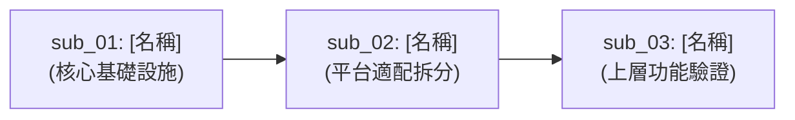

<!--
=== AGENT_GUIDANCE: 分類型主計畫總覽 (umbrella_overview) 填寫規範 ===
1. 定位與目的：
   - 統籌管理 Level 2 (Umbrella) 大型跨模組計畫之子計畫拆分矩陣與依賴路線圖。
2. Agent 行為鐵律：
   - 拆分顆粒度：以「單個 Full Track 能處理之顆粒度」為基本拆分單位。
   - 巢狀層級硬性約束：專案嚴格限制子計畫目錄最多兩層（主計畫 -> sub_XX），絕對禁止在子計畫下再開子計畫！
   - 子計畫目錄前綴強制為 sub_01_, sub_02_ ...。
3. 產出約束：
   - Agent 生成目標文件時，嚴禁輸出本 HTML 註解區塊。
=====================================================================
-->
# 分類型主計畫總覽 (Umbrella Plan Overview)

> 功能名稱：[填入主計畫名稱]  
> 建立日期：[YYYY-MM-DD]  
> 所屬主計畫：無  
> 依據 P00：[P00_semantic_requirements.md](./P00_semantic_requirements.md)  
> 狀態：Planning / In Progress / Completed  
> 擴充項目：none  
> 模板版本：v1.2  

---

## 1. 目標說明與架構總綱

[一段話描述本分類型主計畫的整體目標、演進背景與核心痛點。]

---

## 2. 子計畫拆分清單與執行進度

| 編號 | 子計畫目錄名稱 | 預設 Track | 當前狀態 | 核心目標摘要 |
| :--- | :--- | :---: | :---: | :--- |
| **sub_01** | `sub_01_[名稱]` | Full / Fast | 未開始 / 進行中 / 已完成 | [一句話核心目標與產出] |
| **sub_02** | `sub_02_[名稱]` | Full / Fast | 未開始 / 進行中 / 已完成 | [一句話核心目標與產出] |

---

## 3. 跨子計畫依賴關係圖 (Dependency Roadmap)

> 若子計畫之間有執行先後順序依賴，以 Mermaid 圖或文字記錄於此。無依賴則標記「無」。

---

## 4. 全域 Decision Records (Master DR)

> 影響多個子計畫的跨領域重大架構決策記錄在此。單一子計畫內部的微觀決策記錄在各自的產出物中。ID 格式：`[UMBRELLA:DR-XX]`。

### [UMBRELLA:DR-01] [議題標題]
- **議題**：[問題描述與架構挑戰]
- **結論**：[最終決策方向]
- **理由**：[為何選擇此方案，核心考量是什麼]
- **影響的子計畫**：`sub_01`, `sub_02`
