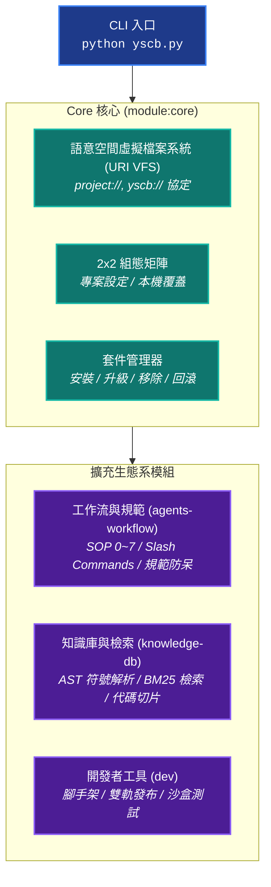

# YS-Codebase (`ys-codebase`)

> 面向 AI Agent 協同開發之微核心架構與模組化工具庫。使用 Python 標準庫實作，無第三方套件依賴。

> [!IMPORTANT]
> ### 🤖 給 AI Agent 的安裝指引 (Agent Installation Guide)
> 若需將本工具庫或模組安裝至目標專案環境，請直接參閱下方 [🛠️ 3. 安裝與快速上手指南 (Installation Guide)](#3-安裝與快速上手指南-installation-guide) 進行配置。

---

## 1. 系統架構 (Architecture Overview)

系統由入口腳本 (`yscb.py`)、微核心 (`core`) 與擴充模組組成：



---

## 2. 核心模組清單 (Ecosystem Modules)

| 模組名稱 | 模組標識 | 職責說明 |
| :--- | :--- | :--- |
| **Core** | `module:core` | **微核心基礎設施**：套件生命週期管理、語意空間協議 VFS、2x2 組態矩陣、CLI 調度與 SemVer 引擎。 |
| **Agents-Workflow** | `module:agents-workflow` | **AI Agent 工作流引擎**：SOP 0~7 開發流程、6 大計畫分支拓撲、行為準則防呆、10 大 Slash Commands 協同。 |
| **Knowledge-DB** | `module:knowledge-db` | **知識庫與符號檢索引擎**：多語言 AST 符號解析 (Python/C/C++/MD)、BM25 多欄位檢索、軟工同義詞庫與代碼切片。 |
| **Dev** | `module:dev` | **模組開發工具箱**：模組腳手架生成、合規檢查、打包建置、沙盒跑測與雙軌發布。 |

---

## 3. 安裝與快速上手指南 (Installation Guide)

### 3.1 基礎環境與宿主綁定 (Standard Base Setup)

1. **環境需求**：Python 3.9+（使用標準庫，無 pip 依賴）。
2. **取得 YSCB**：將 `ys_codebase` 工具庫置於專案目錄中（或作為 submodule）。
3. **綁定宿主專案根目錄**：
   ```bash
   # 設定 project_root (路徑為相對於 yscb.host 即 yscb.py 所在目錄之路徑)
   python yscb.py config set core project_root ./
   
   # 檢查 URI 狀態
   python yscb.py uri check
   ```

---

### 3.2 `agents-workflow` 工作流模組安裝與設定 (Agents-Workflow Setup)

`agents-workflow` 提供 AI Agent 協同開發工作流，包含 **SOP 生命週期**（含 Review 結案審查閘門）、**6 大計畫分支**（Fast Track、Full Track、Umbrella 等）、**7 大 Slash Commands**（如 `/NewPlan`, `/Auto`, `/Discuss` 等）與行為防呆規範。

#### 🚀 安裝與設定步驟

1. **安裝模組**：
   ```bash
   python yscb.py install agents-workflow
   ```

2. **一鍵初始化預設填充內容 (`--init-default`)**：
   - 開發計畫目錄：`paths.plans` ➔ `project://plans`
   - 專案知識庫目錄：`paths.docs` ➔ `project://docs`
   - 歷史封存目錄：`paths.archived` ➔ `workflow.plans://archived`
   - 長期路線圖目錄：`paths.roadmap` ➔ `workflow.plans://roadmap`

3. **自訂配置方案 (選用)**：
   若不使用預設填充內容，可在初始化前透過 CLI 設定：
   ```bash
   python yscb.py config set agents-workflow paths.plans project://my_custom_plans
   python yscb.py config set agents-workflow paths.docs project://my_custom_docs
   ```

> [!CAUTION]
> ### 🚨 給 AI Agent 的提示 (Pre-flight Check)
> 執行一鍵初始化前，**Agent 須先與開發者確認一鍵初始化的預設填充內容（`paths.plans: project://plans`, `paths.docs: project://docs` 等），詢問是否需要調整。**

4. **設定工作環境 (Release Target)**：
   設定規範與 Slash Commands 的輸出目標環境（如 `antigravity`, `claude`, `codex` 等）：
   ```bash
   # 查看可用目標環境清單與啟用狀態
   python yscb.py agents-workflow release-target --list

   # 啟用目標工作環境 (加 --proj 寫入專案共享設定，預設為本機設定)
   python yscb.py agents-workflow release-target --add antigravity --proj
   ```

> [!CAUTION]
> ### 🚨 給 AI Agent 的提示 (Pre-flight Check)
> 執行規範發布前，**Agent 須主動詢問開發者所使用的工作環境 / IDE（例如 Google Antigravity、Claude Code 等），並確認是否需要啟用對應的 Release Target。**

5. **初始化目錄與發布規範**：
   ```bash
   # 建立工作流目錄結構 (plans/, docs/, archived/, roadmap/)
   python yscb.py agents-workflow plan --init-default

   # 發布規範與 Slash Commands 至專案根目錄與目標環境
   python yscb.py agents-workflow release
   ```

6. **驗證工作流狀態**：
   ```bash
   python yscb.py agents-workflow plan status
   ```

---

### 3.3 `knowledge-db` 知識庫檢索模組安裝與設定 (Knowledge-DB Setup)

#### 📌 模組功能概述
`knowledge-db` 提供**多語言 AST 符號解析**（Python、C、C++、Markdown 等）、**增量指紋比對**、**多欄位 BM25 語意檢索**與**代碼切片預覽**，用於快速定位符號與檢索專案文檔。

#### 🚀 安裝與設定步驟

1. **安裝模組**：
   ```bash
   python yscb.py install knowledge-db
   ```

2. **專案源碼空間 (Source Code Space) 設定**：
   設定 `source` space 之包含路徑與副檔名規則，讓檢索引擎涵蓋專案原始碼：
   ```bash
   # 設定源碼包含目錄
   python yscb.py config set knowledge-db spaces.source.includes '["project://src", "project://lib"]'

   # 設定掃描副檔名過濾
   python yscb.py config set knowledge-db spaces.source.file_patterns '["*.py", "*.cpp", "*.h", "*.js", "*.ts"]'
   ```

> [!CAUTION]
> ### 🚨 給 AI Agent 的提示 (Pre-flight Check)
> 安裝完成與初次構建索引前，**Agent 須主動詢問開發者：「請問專案中是否有需要納入檢索的原始碼目錄（例如 `src/`, `lib/` 等）需要先完成設定？」**

3. **掃描與建立索引**：
   ```bash
   # 掃描檔案並提取 AST 符號
   python yscb.py knowledge-db scan

   # 建立 BM25 倒排索引
   python yscb.py knowledge-db index
   ```

4. **驗證檢索狀態**：
   ```bash
   # 檢查空間快取與索引狀態
   python yscb.py knowledge-db status

   # 執行帶代碼切片之檢索
   python yscb.py knowledge-db search "main" -s
   ```

---

## 4. 常用 CLI 指令 (CLI Cheat Sheet)

```bash
# ── 套件與組態 (Core) ──────────────────────────────────────
python yscb.py list                                      # 查看已安裝模組清單
python yscb.py status                                    # 查看模組運行狀態
python yscb.py install <module>                          # 安裝模組
python yscb.py update [module]                           # 升級模組
python yscb.py config list                               # 列出模組組態
python yscb.py uri resolve project://AGENTS.md           # 解析語意 URI

# ── AI Agent 工作流 (Agents-Workflow) ──────────────────────
python yscb.py agents-workflow plan status               # 查詢進行中計畫大綱
python yscb.py agents-workflow plan verify <plan_name>   # 檢核計畫完整性與合規狀態
python yscb.py agents-workflow roadmap --list            # 查看長期策略路線圖

# ── 知識庫檢索 (Knowledge-DB) ──────────────────────────────
python yscb.py knowledge-db search "<query>" -s          # 帶代碼切片預覽檢索
python yscb.py knowledge-db search "<query>" --ftype=py  # 代碼專屬定向檢索
python yscb.py knowledge-db status                       # 查看知識庫索引狀態

# ── 擴充模組開發 (Dev) ─────────────────────────────────────
python yscb.py dev create <name>                         # 建立自訂模組骨架
python yscb.py dev test [name | --all]                   # 執行隔離沙盒測試
python yscb.py dev release <name>                        # 打包純淨發布包
```
