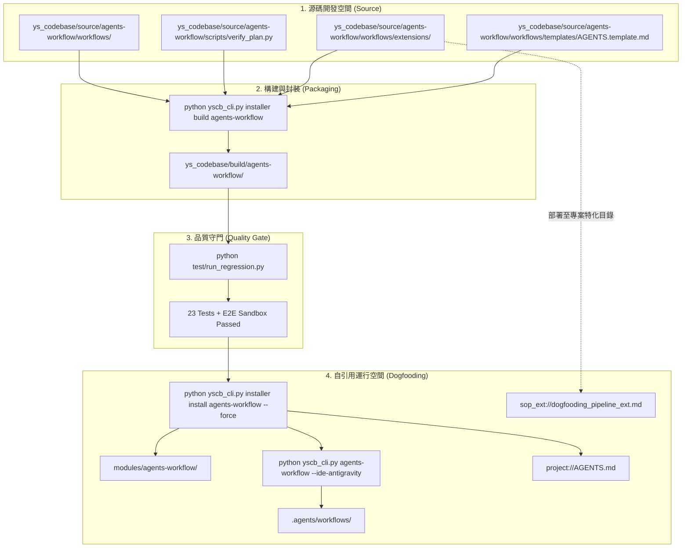

# 架構 & 變更計畫書 (Architecture & Change Plan)

> 功能名稱：架構轉型遷移、SOP 規範對齊、Dogfooding 流水線與 Changelog 防呆加固  
> 建立日期：2026-08-23  
> 所屬主計畫：無  
> 狀態：Confirmed  
> 擴充項目：none  
> 模板版本：v1.2  

---

## 1. 架構全貌與資料流 (Architecture & Data Flow)

本計畫聚焦於將重構後的「100% 零依賴模組化 Codebase 工具庫」完整對齊並固化至全套 SOP 規範文件、專案準則與自動化驗證腳本中，並建立 Dogfooding 自引用雙層防禦體系與 Changelog 伴隨初始化機制。

### 1.1 資料流向與構建拓撲 (Build & Dogfooding Data Flow)

### 1.2 既有文檔查閱
- **查閱路徑**：`docs/AgentsWorkflow/README.md`, `docs/AgentsWorkflow/DETERMINISTIC_SCRIPTS.md`, `docs/_project/STANDARDS.md`, `docs/_project/CONTRIBUTING.md`
- **關鍵坑點/邊界**：
  - `[!CAUTION]` 嚴禁直接修改 `modules/` 與 `.agents/workflows/`，所有變更必須 100% 在 `ys_codebase/source/` 進行。
  - `[!CAUTION]` 修改 `verify_plan.py` 時需確保向後相容性，且不得破壞 23 項既有回歸測試。

---

## 2. 模組變更清單 (按依賴順序)

| 順序 | 類型 | 檔案路徑 | 職責與修改概述 | 依賴項 / 影響下游 |
|:---:|:---:|:---|:---|:---|
| **1** | Add | `extensions/dogfooding_pipeline_ext.md` | [NEW] 建立專案特化 SOP 擴充，定義 Stage 1~4 Checklist | 被 `ext list` 發現，被 Phase 1/4/6/7 驗證 |
| **2** | Add | `ys_codebase/source/agents-workflow/workflows/extensions/dogfooding_pipeline_ext.md` | [NEW] 模組源碼內建擴充模板同步 | 模組 build 打包依賴 |
| **3** | Modify | `ys_codebase/source/agents-workflow/workflows/Review.md` | [MOD] 步驟 2 引入 `ext list/show`，步驟 3 引入 `docs audit` | 影響 Review 工作流與 IDE 指令生成 |
| **4** | Modify | `ys_codebase/source/agents-workflow/workflows/DocumentationStandards.md` | [MOD] 追加「🛠️ 知識庫定式維護工具鏈」章節 (`docs init/audit/new-topic`) | 影響知識庫規範與 IDE 指令生成 |
| **5** | Modify | `ys_codebase/source/agents-workflow/workflows/NewPlan.md` | [MOD] Phase 0 步驟 1/2 強制載明伴隨建立 `changelog.md`；Phase 4/7 融入 `docs new-topic` 與 `archive` | 影響 NewPlan SOP 與 IDE 指令生成 |
| **6** | Modify | `ys_codebase/source/agents-workflow/workflows/templates/AGENTS.template.md` | [MOD] 定式作業 CLI 優先清單補齊 `<docs\|ext>` | 影響模組發布物之 AGENTS 範本 |
| **7** | Modify | `ys_codebase/source/agents-workflow/scripts/verify_plan.py` | [MOD] 移除 `changelog.md` 跳過邏輯，納入存在性與標頭格式檢查 | 影響 `agents-workflow verify` 執行邏輯 |
| **8** | Modify | `AGENTS.md` (根目錄) | [MOD] 補齊 CLI 清單，並於第 4 節寫入 Dogfooding 三層空間與防呆鐵律 | 專案全域 Agent 行為準則 |
| **9** | Modify | `docs/_project/CONTRIBUTING.md` | [MOD] 補齊 Dogfooding 四步流水線 (源碼 ➔ build ➔ regression ➔ install) | 專案貢獻與維護指南 |
| **10** | Modify | `docs/AgentsWorkflow/DETERMINISTIC_SCRIPTS.md` | [MOD] 修正舊版路徑為統一 `python yscb_cli.py agents-workflow ...` | 知識庫定式工具說明 |

---

## 3. 風險評估與防護

| ID | 風險維度 | 風險描述 | 等級 | 緩解 / 回滾策略 |
| :--- | :--- | :--- | :---: | :--- |
| **R-01** | 回歸破壞 | 修改 `verify_plan.py` 可能導致既有單元測試（如 `test_installer.py` 中建立的測試 Plan 目錄）因缺少 `changelog.md` 而失敗 | 中 | 檢查 `test_installer.py` 中測試目錄的模擬生成，確保測試目錄均建立標準檔案或兼容處理，回歸測試 100% 通過後方可發布。 |
| **R-02** | 覆蓋丟失 | 在修改過程中若誤動 `modules/` 檔案，可能在 build/install 時被覆蓋 | 高 | 嚴格遵守 Dogfooding 鐵律：所有改動一律先寫入 `ys_codebase/source/`，再統一 build/install。 |
| **R-03** | 軟合併被破壞 | 修改 `AGENTS.md` 時若破壞 `<!-- YSCB_AGENTS_BEGIN -->` 標記可能導致後續同步失效 | 中 | 保留完整標記結構，特化規則 100% 寫入第 4 節標記之外。 |

---

## 4. Decision Records

### [ARCH:DR-01] 確立 Dogfooding 雙層防禦落地方案
- **議題**：如何在自引用代碼庫中防止 Agent 編輯已安裝產物並保證四步標準流水線執行？
- **結論**：採用「`AGENTS.md` 專案特化規範 (靜態公理) + `extensions/dogfooding_pipeline_ext.md` (動態 Checkpoint)」雙層防禦。
- **理由**：靜態公理在 Session 啟動時建立心智模型，動態 Extension 在 Phase 1~7 各關卡剛性攔截。

### [ARCH:DR-02] 確立 `changelog.md` 伴隨 Phase 0 剛性初始化與 `verify_plan.py` 加固
- **議題**：為何 `changelog.md` 容易被 Agent 遺忘，如何從規範與工具雙向解決？
- **結論**：修改 `NewPlan.md` Phase 0 步驟 1/2 強制伴隨初始化；加固 `verify_plan.py` 納入存在性檢查。
- **理由**：徹底消除時序滯後與工具檢查盲區，保證全生命週期決策 100% 留痕。
