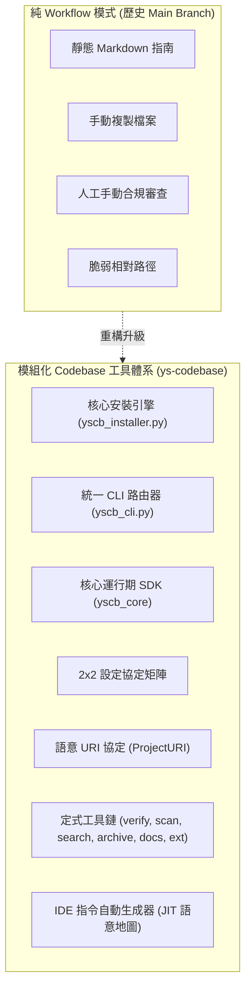

# 技術調研報告：架構轉型遷移完備性驗證、地毯式掃描、SOP 交叉對比與 Changelog 防呆加固

> 功能名稱：架構轉型遷移 (純 Workflow 轉型至模組化 Codebase 工具庫)  
> 建立日期：2026-08-23  
> 所屬主計畫：無  
> 狀態：Concluded  
> 擴充項目：none  
> 模板版本：v1.0  

---

## 1. 調研背景與演進動機 (Background & Context)

專案自早期的「純靜態 Workflow 時代 (Main Branch 歷史)」逐步演進，初期主要依賴靜態 Markdown 工作流程與範本約束開發流程。然而隨著跨專案複用、模組化開發與自動化管理需求增長，純靜態文件模式面臨以下核心瓶頸：
1. **跨專案複製脆弱**：下游專案需要手動複製全部目錄與檔案，難以跟進中央規範更新。
2. **缺乏工程化工具鏈**：缺乏自動化安裝、依賴管理、打包構建 (build) 與發布管線。
3. **無統一 Runtime SDK**：缺乏共享的設定載入、日誌終端與專案根目錄解析機制。
4. **路徑脆弱性**：跨層級跳轉依賴相對路徑 (`../../..`)，結構變動即斷裂。
5. **定式作業依賴手動**：計畫掃描、合規校驗、DR 檢索與歸檔缺乏定式 CLI 命令支援。

為徹底解決上述痛點，專案進行了全面重構，建立了 **`ys-codebase`** 模組化代碼庫工程工具與規範管理系統。

---

## 2. 轉型前後架構對比矩陣 (Architecture Comparison)



| 比較維度 | 舊架構 (純 Workflow) | 新架構 (模組化 Codebase 工具庫) | 升級優勢 |
| :--- | :--- | :--- | :--- |
| **依賴模型** | 無工具依賴（純文件） | 100% Python 3.8+ 標準庫（零外部第三方套件依賴） | 無環境污染、跨平台原生開箱即用 |
| **套件管理** | 手動 Copy 檔案 | `yscb_installer.py` (支援 `init`, `install`, `build`, `push`, `pull`, `status`, `diff`) | 語意化版本 (SemVer)、相依性解析、自動構建發布 |
| **設定架構** | 無或單一寫死路徑 | 2 × 2 設定協定 (Codebase/Module × Project/Local) | 團隊規範 (Git 追蹤) 與個人偏好 (.gitignore) 完美隔離 |
| **Runtime SDK** | 無 | `yscb_core` (`ProjectContext`, `ConfigManager`, `Console`, `ProjectURI`) | 所有模組共享安全底座與 `!undefined` 未初始化防禦 |
| **路徑定錨** | 相對路徑 (`../../`) | 語意 URI (`project://`, `yscb://`, `plans://`, `archive://`, `docs://`, `sop_ext://`) | 解耦實體目錄層級，消除路徑脆弱性 |
| **SOP 規範同步** | 整體覆蓋 (易丟失特化規則) | 軟合併機制 (`<!-- YSCB_AGENTS_BEGIN -->` 定界同步) | 保留專案特化工程規範，同時無損升級中央標準庫 |
| **IDE 工作流整合** | 手動配置 | `agents-workflow --ide-antigravity` (全量鏡像 + JIT 語意地圖) | IDE Slash Commands 一鍵生成與清理 |
| **品質守衛** | 人工核對 | 定式工具鏈 (`verify`, `scan`, `search`, `archive`, `docs audit`, `ext list`) | 秒級自動化驗證，降低人為疏漏 |

---

## 3. 完備性驗證結果 (Completeness Verification)

透過自動化回歸測試套件（`test/run_regression.py`）進行全量驗證，23 項單元測試與下游真實專案沙盒 E2E 回歸測試 **100% 通過 (Ran 23 tests in 2.795s, ALL PASSED)**：

1. **安裝與生命週期**：`init`, `install`, `remove`, `status`, `list`, `diff` 測試全數 Passed。
2. **2x2 設定四層合併**：專案設定與個人設定無損層疊解析正常。
3. **語意 URI 解析**：`ProjectURI.resolve` 與 `to_uri` 正反向解析正確，`!undefined` 攔截機制生效。
4. **軟合併三態處理**：無檔案新建、具備標記局部更新、無標記警告不覆寫三態邏輯完整。
5. **定式作業工具鏈**：`verify` (合規掃描)、`scan` (矩陣掃描)、`search` (DR檢索)、`archive` (安全歸檔)、`docs audit` (死鏈檢查) 實機運作正常。
6. **下游沙盒 E2E**：在隔離 Temp 沙盒中完整模擬新專案起手式、模組安裝、工作流生成、清理與卸載，全流程驗證順暢。

---

## 4. 全量工作流、模板與規範地毯式掃描分析 (Exhaustive Scan Matrix)

本次調研針對專案內全部 9 份工作流指南、15 份模板、5 份專案全域規範及所有定式工具腳本進行逐行地毯式檢驗，盤點出以下詳細狀態與對齊分析：

### 4.1 工作流文件 (Workflows) 檢驗矩陣
| 文件名稱 | 核心職責 | 狀態評估 | 掃描發現與優化空間 |
| :--- | :--- | :---: | :--- |
| **`Review.md`** | 開發後品質審查與驗收 | 良好 | **[Opt-1]** 步驟 2 補充 `ext list / show` 檢索；步驟 3 補充 `docs audit` 自動化死鏈與 Frontmatter 檢查。 |
| **`DocumentationStandards.md`** | 知識庫架構與維護規範 | 良好 | **[Opt-2]** 文末補充「🛠️ 知識庫定式維護工具鏈」章節，載明 `docs init`、`docs audit`、`docs new-topic`。 |
| **`NewPlan.md`** | 標準開發 SOP (Phase 0~7) | 良好 | **[Opt-3]** Phase 0 步驟 1/2 剛性規定同時建立 `P00` 與 `changelog.md`；Phase 4/7 融入 `docs new-topic` 指引；目錄規範融入 `archive` 指令。 |
| **`AGENTS.md` / `AGENTS.template.md`** | 行為準則與硬性紀律 | 良好 | **[Opt-4]** 定式作業 CLI 優先清單補齊 `<verify\|scan\|search\|archive\|docs\|ext>`；區隔計畫內 Changelog 與全域 Changelog。 |
| **`ContextInit.md`** | 新 Session 上下文初始化 | 完美 | 沙盒原生安全讀取、JIT 地圖注入與四步載入流程完備，無待修項目。 |
| **`Continue.md`** | 接續開發工作流 | 完美 | 步驟 1 使用 `scan` 掃描，支援 `handoff.md` 快照與 3-Track 自動恢復。 |
| **`Discuss.md`** | 深度歸因與防淺層修復 | 完美 | 3-Step RCA、5-Whys 根因分析、Local-First 排查階層與 `[DR-XX]` 固化完整。 |
| **`Idea.md`** | 構想靈感孵化池 | 完美 | 開放式自由探討、`idea.md` 模板、立項升級 `P00` 流轉機制完整。 |
| **`Pause.md`** | 暫停開發與交接 | 完美 | 現場凍結快照 `handoff.md` 機制完備。 |
| **`Research.md`** | 深度技術調研工作流 | 完美 | 雙軌生命週期、`R{n:2d}_{topic}.md` 命名與免除死板模板自由論證完備。 |

---

## 5. `changelog.md` 建立規範與驗證工具盲區深度根因分析 (Deep RCA)

經針對「為何 `changelog.md` 容易被 Agent 遺忘」進行專題排查，發現以下 3 大根因並制定加固方案：

### 5.1 根因剖析
1. **時序描述滯後**：`NewPlan.md` Phase 0 僅寫建立目錄與 `P00`，`changelog.md` 卻被排在分流表格的 Full Track 欄位，導致 Phase 0 期間的關鍵決策（R01/R02/DR）無法即時留痕。
2. **驗證腳本盲區**：`verify_plan.py` 遇到 `changelog.md` 直接執行 `continue` 跳過，缺乏存在性與標頭格式檢查。
3. **三種 Changelog 命名混淆**：計畫日誌 (`plans/.../changelog.md`)、全域日誌 (`project://CHANGELOG.md`) 與架構歷史 (`docs/.../CHANGELOG.md`) 職責需進一步在準則中明確區隔。

### 5.2 加固行動
- **[Opt-6] 規範修正**：`NewPlan.md` Phase 0 步驟 1/2 明確定義：**開立計畫目錄時，必須【同時】建立 `P00_semantic_requirements.md` 與 `changelog.md`**。
- **[Opt-7] 工具加固**：更新 `verify_plan.py`，將 `changelog.md` 納入存在性與格式檢查清單，缺失即報錯。

---

## 6. 具體 SOP 優化執行計畫 (Actionable Implementation Plan)

綜合上述地毯式掃描與根因排查，收斂為以下 6 項具體優化改動：

```text
[SOP 文件微調與工具加固清單]
├── 1. Review.md                    ➔ 步驟 2 注入 ext list/show，步驟 3 注入 docs audit
├── 2. DocumentationStandards.md     ➔ 末尾追加「知識庫定式維護工具鏈」章節 (init/audit/new-topic)
├── 3. NewPlan.md                   ➔ Phase 0 剛性伴隨建立 changelog.md；Phase 4/7 注入 docs new-topic 指引
├── 4. AGENTS.md / AGENTS.template  ➔ 定式作業 CLI 指令補齊 docs/ext；第 4 節寫入 Dogfooding 規範
├── 5. verify_plan.py               ➔ 納入 changelog.md 存在性與格式檢驗，消除檢查盲區
└── 6. extensions/                  ➔ 建立 dogfooding_pipeline_ext.md 專案特化擴充
```

---

## 7. 調研總結 (Conclusion)

本專案之模組化工具庫、核心 SDK、測試套件與所有模板均已具備高度成熟的工程化品質。透過上述 6 項文件與工具微調，將能徹底消除工具調度、自引用混淆與日誌遺忘問題，達成最高等級的工程嚴謹性。
