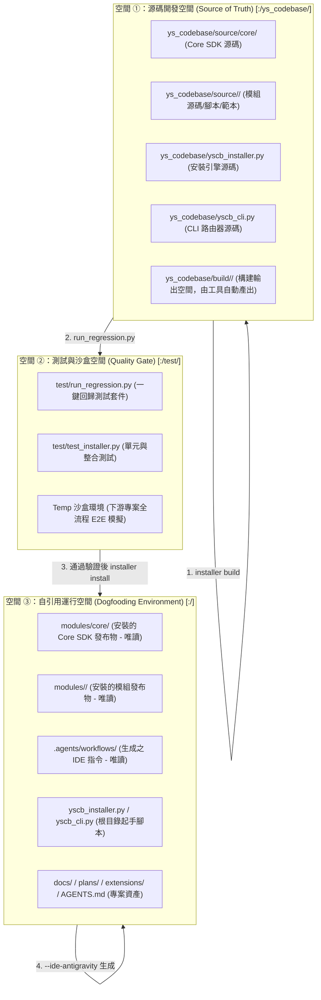

# 技術調研報告：Dogfooding 自引用架構下之源碼修改、回歸測試與自引用更新標準作業規範

> 功能名稱：架構轉型遷移 (Dogfooding 自引用標準作業流水線與防呆紀律)  
> 建立日期：2026-08-23  
> 所屬主計畫：無  
> 狀態：Concluded  
> 擴充項目：none  
> 模板版本：v1.0  

---

## 1. 調研背景與核心痛點 (Background & Problem Statement)

本專案 `ys-codebase` 具備獨特的**自引用（Dogfooding）架構**：專案根目錄既是工具庫自身的開發環境，同時也是使用此工具庫管理 SOP、知識庫與 Dev Plans 的下游消費環境。

在此體系下，專案內部同時存在多個同名或功能重疊的目錄空間，若無剛性約束，AI Agent 在執行任務時極易產生以下**典型混淆與操作偏差 (Drift & Confusion)**：

```text
【典型混淆偏差 1：直接修改已安裝產物 (Direct Edit in modules/)】
Agent 搜尋檔案時找到 modules/agents-workflow/workflows/Review.md 並直接修改。
➔ 後果：下次執行 installer build 或 installer install 時，修改被完全覆蓋並丟失 (Silent Overwrite)！

【典型混淆偏差 2：根目錄起手腳本與源碼腳本不同步 (Root vs. Source Script Drift)】
Agent 僅修改了根目錄的 yscb_installer.py，未修改 ys_codebase/yscb_installer.py（或反之）。
➔ 後果：版本分裂，推送至 Git 或構建發布時產生嚴重不一致。

【典型混淆偏差 3：跳過回歸測試與自引用更新 (Skipping Build/Test/Sync Cycle)】
Agent 修改了 ys_codebase/source/ 中的代碼，但在未執行 build、run_regression 與 install 的情況下宣告完成。
➔ 後果：當前 IDE 使用的工作流與根目錄 modules/ 仍處於舊版本狀態，產生幽靈行為。
```

---

## 2. 三層空間邊界與職責邊界契約 (Three-Tier Spatial Partitioning)

為了從根本上杜絕混淆，專案嚴格劃分三層空間，並建立不可逾越的讀寫權限契約：



### 空間權限與防呆邊界矩陣
| 空間層級 | 實體路徑範疇 | 角色定位 | Agent 寫入權限 | 說明與約束 |
| :--- | :--- | :--- | :---: | :--- |
| **空間 ①**<br>源碼開發空間 | `:/ys_codebase/` | **唯一真實源碼來源<br>(Single Source of Truth)** | **✅ 唯一允許修改** | 所有代碼、模組腳本、SOP 工作流與模板之修改，**100% 必須在此空間進行**。 |
| **空間 ②**<br>測試驗證空間 | `:/test/` | **品質守門閘門<br>(Quality Gate)** | **✅ 測試程式碼維護** | 執行回歸測試；僅在新增功能需擴充測試案例時修改 `test_installer.py`。 |
| **空間 ③**<br>自引用運行空間 | `:/` (根專案) | **自引用消費環境<br>(Dogfooding Consumption)** | **🚫 嚴禁直接手動修改**<br>*(僅限工具自動同步)* | `modules/**` 與 `.agents/**` 為發布產物，**嚴禁手動編輯**，必須透過 CLI 安裝與生成。 |

---

## 3. 標準四步閉環流水線 (The Canonical 4-Stage Pipeline)

任何涉及工具庫、SDK、CLI 或 SOP 工作流的變更，Agent 必須強制依照以下四步標準流水線執行：

```text
+---------------------------------------------------------------------------------------------------+
| 【Stage 1：源碼精準修改】 (Source Modification)                                                   |
|   • 僅於 ys_codebase/source/<module>/ 或 ys_codebase/yscb_*.py 進行編輯                           |
|   • 🚨 嚴禁直接修改 modules/ 或 .agents/workflows/                                                 |
+---------------------------------------------------------------------------------------------------+
                                                  │
                                                  ▼
+---------------------------------------------------------------------------------------------------+
| 【Stage 2：模組打包構建】 (Build Packaging)                                                       |
|   • 執行指令：python yscb_cli.py installer build <module> (或 build --all)                         |
|   • 產物驗證：檢查 ys_codebase/build/<module>/ 是否成功更新且 manifest.json 注入時間戳            |
+---------------------------------------------------------------------------------------------------+
                                                  │
                                                  ▼
+---------------------------------------------------------------------------------------------------+
| 【Stage 3：全量回歸測試】 (Regression Testing Gate)                                               |
|   • 執行指令：python test/run_regression.py                                                        |
|   • 門檻要求：所有單元測試 + 下游沙盒 E2E 回歸必須 100% 通過 (ALL PASSED)                          |
|   • 🚨 若測試失敗，強制回到 Stage 1 修復，絕對禁止強行同步至自引用環境                            |
+---------------------------------------------------------------------------------------------------+
                                                  │
                                                  ▼
+---------------------------------------------------------------------------------------------------+
| 【Stage 4：自引用同步與發布】 (Dogfooding Synchronization)                                         |
|   1. 根目錄入口腳本同步：若 ys_codebase/yscb_*.py 有變更，複製至根目錄 ./yscb_*.py                 |
|   2. 模組發布物安裝：執行 python yscb_cli.py installer install <module> --force                   |
|   3. IDE 指令刷新：若工作流變更，執行 python yscb_cli.py agents-workflow --ide-antigravity       |
|   4. 軟合併驗證：檢查 AGENTS.md 核心標記與專案特化規則是否完好                                    |
|   5. 終端驗收：執行 python yscb_cli.py installer status 與 python yscb_cli.py uri list           |
+---------------------------------------------------------------------------------------------------+
```

---

## 4. 雙層防禦落地方案 (Two-Pillar Implementation Strategy)

經調研與討論確認，本規範將透過以下雙層防禦體系落地：

### 4.1 支柱一：`AGENTS.md` 專案特化區塊規範（靜態認知公理）
- 寫入專案根目錄 [AGENTS.md](file:///H:/UseFolder/CodeRepo/ys_codebase/AGENTS.md) 的「## 4. 專案特化工程規範 (Project Specific Standards)」。
- 該區塊位於軟合併標記之外，不會被中央模板覆蓋，成為 Agent 啟動對話後的第一公理。

### 4.2 支柱二：SOP Phase Extension Checkpoint（動態全流程守門）
- 建立專屬 Extension：`extensions/dogfooding_pipeline_ext.md`（或 `sop_ext://dogfooding_pipeline_ext.md`）。
- **觸發與驗收機制**：
  - **Phase 1 / FT-1**：`ext list` 探測並納入矩陣，Header 宣告 `> 擴充項目：dogfooding_pipeline_ext`。
  - **Phase 4**：將 Stage 1~4 任務注入 `P04_implementation_plan.md`。
  - **Phase 6 / FT-3**：強制實測 `run_regression.py` 取得 ALL PASSED 日誌。
  - **Phase 7 / Review**：`verify` 定式工具 1:1 稽核。

---

## 5. 調研結論 (Conclusion)

透過三層空間權限隔離（源碼空間、測試空間、自引用空間）與雙層防禦體系（AGENTS 專案特化規範 + Phase Extension Checkpoint），專案能徹底消除自引用體系下的同名檔案修改混淆、產物覆蓋丟失與版本分裂問題。

本調研成果作為本次架構轉型遷移計畫的核心規範依據。
