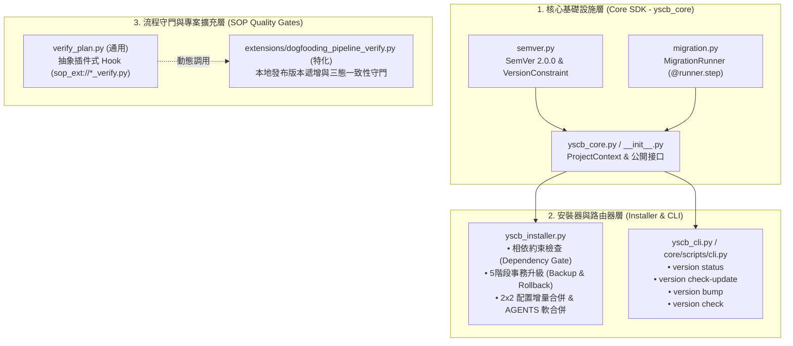

# 架構 & 變更計畫書 (Architecture & Change Plan)

> 功能名稱：完善版本號系統、相依相容性檢查、鏈式增量遷移與更新覆蓋防護  
> 建立日期：2026-08-23  
> 所屬主計畫：無  
> 狀態：Confirmed  
> 擴充項目：dogfooding_pipeline_ext  
> 模板版本：v1.2  

---

## 1. 架構全貌與資料流 (Architecture & Data Flow)

本計畫在現有 `ys-codebase` 模組化體系上，構建底層純標準庫 SemVer 引擎、鏈式增量遷移執行器、事務性安全覆蓋升級管線，以及外掛式擴充稽核守門機制：

### 關鍵資料流：
1. **相依檢查流 (Dependency Verification Flow)**：
   `manifest.json` ➔ 讀取 `dependencies: ["core >= 2.0.0"]` ➔ `VersionConstraint.matches()` ➔ 判定已安裝模組版本 ➔ 放行 / 阻斷。
2. **五階段安全升級流 (Safe Upgrade Pipeline)**：
   `installer install --force` ➔ `Pre-flight Check` ➔ `Snapshot Backup` ➔ `Protected Merge` ➔ `_migration.py (MigrationRunner 鏈式執行)` ➔ `Commit / Rollback on Error`。
3. **外掛式守門流 (Pluggable Quality Gate Flow)**：
   `verify_plan.py` ➔ 讀取 Plan Header `> 擴充項目：dogfooding_pipeline_ext` ➔ 動態調用 `sop_ext://dogfooding_pipeline_verify.py` ➔ 執行本專案發布合規驗證。

### 既有文檔查閱
- **查閱路徑**：`docs/_project/STANDARDS.md`、`docs/Installer/DESIGN_NOTES.md`、`docs/Installer/README.md`
- **關鍵坑點/邊界**：
  - Windows 控制台 UTF-8 編碼保護（使用 `reconfigure(encoding='utf-8', errors='replace')` 防止 `UnicodeEncodeError`）。
  - 100% 堅持 Zero External Dependency（純標準庫 `re`、`pathlib`、`json`、`shutil`、`subprocess`）。
  - Windows 檔案鎖定與目錄清理使用 `ignore_errors=True` 與快照目錄原子隔離。

---

## 2. 模組變更清單 (按依賴順序)

| 順序 | 類型 | 類別 / 檔案路徑 | 職責與修改概述 | 依賴項 / 影響下游 |
|:---:|:---:|:---|:---|:---|
| 1 | **NEW** | `SemVer`, `VersionConstraint` (`ys_codebase/source/core/scripts/semver.py`) | 純標準庫 SemVer 2.0.0 解析、富比較運算符與約束條件比對引擎 (`^`, `~`, `>=`, `<=`, `==`, `*`)。 | 無內部依賴 (底層基礎) |
| 2 | **NEW** | `MigrationRunner` (`ys_codebase/source/core/scripts/migration.py`) | 鏈式線性增量遷移框架，支援 `@runner.step("1.1.x")` 註冊與 `run(old_ver, new_ver)` 依序執行。 | 依賴 `semver.py` |
| 3 | **MOD** | `yscb_core`, `ProjectContext` (`ys_codebase/source/core/scripts/yscb_core.py`, `__init__.py`) | 導出 `SemVer`, `VersionConstraint`, `MigrationRunner`；新增 `ProjectContext.get_module_version()`。 | 依賴 1, 2 |
| 4 | **MOD** | `yscb_installer.py` (`ys_codebase/yscb_installer.py`) | 整合 `SemVer` 與相依約束校驗；重構為五階段安全升級流水線（快照備份、配置增量合併、軟合併、Migration 失敗自動回滾）。 | 依賴 1, 2, 3 |
| 5 | **MOD** | `CLI Router` (`ys_codebase/source/core/scripts/cli.py`, `ys_codebase/yscb_cli.py`) | 註冊 `version status`、`version check-update`、`version bump`、`version check` 指令。 | 依賴 1, 3, 4 |
| 6 | **MOD** | `verify_plan.py` (`ys_codebase/source/agents-workflow/scripts/verify_plan.py`) | 抽象外掛式 Hook：掃描 Plan Header 宣告之擴充項目，自動調用 `sop_ext://<ext>_verify.py`。 | 通用無業務依賴 |
| 7 | **NEW** | `dogfooding_pipeline_verify.py` (`extensions/dogfooding_pipeline_verify.py`) | 專案特化發布守門腳本：檢驗源碼變更版本遞增、三態一致性與 CHANGELOG 記錄。 | 依賴 1, 3, 5 |
| 8 | **MOD** | `dogfooding_pipeline_ext.md` (`extensions/dogfooding_pipeline_ext.md`) | 在 Stage 1~4 Checklist 注入版本號剛性遞增與 `dogfooding_pipeline_verify.py` 驗收步驟。 | SOP 規範更新 |

---

## 3. 風險評估與防護

| ID | 風險維度 | 風險描述 | 等級 | 緩解 / 回滾策略 |
|:---|:---|:---|:---:|:---|
| **R-01** | 向後相容性 | 既有 `manifest.json` 的 `dependencies: ["core"]`（無版本號）可能導致新約束解析器報錯。 | 中 | `VersionConstraint` 寬容支援純模組名稱，未指定版本時自動視為萬用字元 `*`（任意版本皆相容）。 |
| **R-02** | 升級損毀風險 | 升級過程中若 `_migration.py` 拋錯或中斷，可能導致模組處於半更新損毀狀態。 | 高 | 實作 Stage 2 自動快照備份 (`.yscb_cache/backup/`)，Stage 4 若捕獲任何異常立即觸發原子還原 (Rollback) 並退出。 |
| **R-03** | 配置欄位沖刷 | 升級時 `config.project.json` 若覆蓋不當可能丟失下游自訂路徑。 | 高 | 嚴格採用 `deep_merge(template, existing_user_config)`，以既有配置優先，僅補充缺漏之新欄位預設值。 |
| **R-04** | Windows 檔案鎖死 | 在 Windows 上執行 `shutil.rmtree` 清理快照或舊模組時可能因檔案被佔用引發 `PermissionError`。 | 低 | 使用 `ignore_errors=True` 與 retry 機制，備份採用帶時間戳獨立目錄，避免同名衝突。 |

---

## 4. Decision Records

### `[ARCH:DR-01]`: 純標準庫自研 SemVer 與 Constraint 引擎
- **議題**：是否引入 `packaging` 或 `semver` 第三方套件來處理版本比較？
- **結論**：自研純標準庫 `semver.py`（< 300 行），100% 零外部依賴。
- **理由**：`ys-codebase` 的核心哲學是「即插即用、零依賴」，避免要求乾淨環境使用者預先 `pip install`。
- **排除方案**：引入 `packaging`（違反專案 Zero External Dependency 核心公理）。
