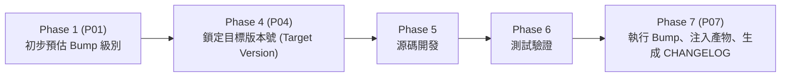

# 技術調研報告：版本號維護剛性與遞進機制

> 功能名稱：完善版本號系統  
> 建立日期：2026-08-23  
> 所屬主計畫：無  
> 狀態：Concluded  
> 擴充項目：none  
> 模板版本：v1.0  

---

## 1. 背景痛點與調研核心目標 (Problem Statement & Objectives)

在模組化工具庫體系（如 `ys-codebase`）中，版本號不僅僅是一串顯示用的字串，更是**模組依賴相容性檢查、升級遷移 Hook (`_migration.py`) 觸發條件、產物發布追溯以及自引用 (Dogfooding) 同步**的核心依據。

### 現存四大核心痛點：
1. **分散定義與同步失真 (Multi-point Declaration & Drift)**：
   - 模組版本號可能同時出現在 `manifest.json`、`__init__.py`、`yscb_core.py`、`README.md`、`config.project.json` 及全域 `yscb_config.json`。手動維護極易造成各處版本不一致。
2. **靜默程式碼漂移 (Silent Code Drift)**：
   - 代碼或腳本進行了實質性功能修改（Feature / Fix / Refactor），但開發者或 Agent 忘記更新版本號，導致已安裝的模組無法感知更新，亦無法觸發版本遷移邏輯。
3. **語意遞進邊界模糊 (Semantic Ambiguity)**：
   - 缺乏將「變更範疇（Breaking / Feature / Patch）」剛性映射到「SemVer (Major / Minor / Patch)」的標準化判定公理，容易憑感覺隨意跳號或倒退。
4. **跨模組相依連鎖斷裂 (Cascading Dependency Breakage)**：
   - 底層模組（如 `core`）升級重大版本後，依賴端（如 `agents-workflow`）的相依宣告（`dependencies`）未同步調整，安裝時缺乏即時相容性校驗。

### 本調研核心問題：
> **如何建立一套機制，確保每一次「有效更新」都能嚴格、剛性、自動化地遞進正確的版本號，杜絕漏改、錯改與分散失真？**

---

## 2. 業界主流版本管理典範橫向對比 (Industry Benchmark)

| 典範模式 | 代表工具 | 運作機制 | 優點 | 缺點 / 本專案適用性 |
| :--- | :--- | :--- | :--- | :--- |
| **A. Git 提交驅動 (Commit-Centric)** | Semantic Release, standard-version | 解析 Conventional Commits (`feat:`, `fix:`, `feat!:`)，在 CI/CD 階段自動計算下個版本並 Tag。 | 高度自動化，無需人工介入。 | 依賴嚴格的 commit 格式；在 Agent 輔助單機/離線開發且未頻繁 commit 的場景下覆蓋不足。 |
| **B. 變更意圖聲明 (Changeset-Centric)** | Changesets (pnpm/monorepo), Cargo-release | 每次 PR/任務建立獨立變更宣告檔（包含 bump 級別與說明），合併時由工具彙整並 Bump。 | 意圖明確、支援 Monorepo 多模組聯動。 | 需額外建立特定格式暫存檔，若無流程約束易被略過。 |
| **C. 設定檔/檔案替換 (File/Config-Centric)** | bumpver, bump2version, poetry version | 定義 regex 樣式，單一 CLI 指令同時搜尋並替換多個檔案中的版本字串。 | 解決多處硬編碼問題，容易理解。 | 僅解決「替換」問題，無法自動防呆「是否該改」與「改哪一級」。 |
| **D. SOP/計畫驅動 (Plan-Driven Agentic)** | **ys-codebase 定制方案 (推薦)** | 將版本宣告整合進 **Dev Plan 生命週期** (P00/P01 識別 ➔ P04 鎖定 ➔ P07 自動 Bump) + **Dogfooding 流水線守門** (`verify_plan.py` + build hook)。 | 深度契合專案 SOP、零外部依賴、全流程剛性追溯、無縫聯動 `CHANGELOG.md`。 | 需要在 SOP 工作流中建立剛性 Checkpoint。 |

---

## 3. 保證版本號剛性維護與正確遞進的五大機制 (Core Mechanisms)

```text
+---------------------------------------------------------------------------------------+
|                              ys-codebase 版本剛性體系                                   |
+---------------------------------------------------------------------------------------+
| 1. SSOT 單一來源機制  : manifest.json 為唯一真值，Build/Runtime 自動向下派發            |
| 2. 剛性映射矩陣      : Plan 類型 + API 變更 ➔ 剛性推導 MAJOR / MINOR / PATCH           |
| 3. SOP 生命週期閉環  : P01 宣告 ➔ P04 鎖定 ➔ Phase 7 自動 Bump & CHANGELOG 關聯         |
| 4. 多層防呆守門閘門  : verify_plan.py 檢測 + Dogfooding Stage 2 Build 檢查 + CLI 驗證  |
| 5. 相依版本解析引擎  : yscb_core 內建 SemVer 解析器，支援 ^, ~, >=, <= 相容性校驗      |
+---------------------------------------------------------------------------------------+
```

### 機制 ①：SSOT 單一來源 (Single Source of Truth) 與 Build 注入
- **原則**：每個模組內部**僅允許一個地方**手動聲明或儲存靜態版本號 —— **`source/<module>/manifest.json` 的 `version`**。
- **派發機制**：
  - **Python 代碼層**：`yscb_core` 與模組禁止在 `.py` 檔案硬編碼 `__version__ = "x.y.z"`，改為：
    1. 在 build 打包時由 Installer 根據 `manifest.json` 自動生成/替換 `_version.py`；或者
    2. 由 `yscb_core.ProjectContext` 動態從已安裝模組的 `manifest.json` 讀取。
  - **文檔層**：`README.md`、`STANDARDS.md` 中的版本展示一律由 `python yscb_cli.py version sync` 或 build 腳本同步更新。

---

### 機制 ②：變更範疇與 SemVer 剛性映射矩陣 (專案適配定義)

嚴格定義語意化版本號（SemVer 2.0.0：`MAJOR.MINOR.PATCH`）在本專案的適配公理：

| Plan 類型 / 程式碼變更範疇 | 核心定義與典型特徵 | 剛性 Bump 級別 | `_migration.py` 需求 | 版本遞進規則 |
| :--- | :--- | :---: | :---: | :---: |
| **全域使用者心智 / 典範轉移** | • 專案根目錄調用方式發生根本性重構<br>• 工具庫架構典範轉移（如從單體腳本轉為多模組系統）<br>• 全面重寫核心哲學 *(本專案平時極少觸發)* | **`MAJOR`** | **必要**<br>(專案級升級指南) | `1.x.x` ➔ `2.0.0`<br>*(Minor 與 Patch 歸零)* |
| **資料格式 / Schema 變更** | • `config.project.json` / `yscb_config.json` 結構重組或欄位遷移<br>• `manifest.json` 規範 Schema 升級<br>• 知識庫文檔結構或 Plan 模板結構產生不相容變更 *(需 Migration)* | **`MINOR`** | **必要**<br>(撰寫 `_migration.py` 自動轉移) | `2.0.3` ➔ `2.1.0`<br>*(Patch 歸零)* |
| **日常功能遞增 / 內部修復** | • 新增 CLI 子指令、新增可選參數<br>• 新增 Public API、工具函式、SOP 擴充 (`sop_ext`)<br>• 內部 Bug 修復、效能優化、代碼重構、文檔更新 *(零 Migration)* | **`PATCH`** | **不需要**<br>(直接熱更新/覆蓋) | `2.0.0` ➔ `2.0.1` |

---

### 機制 ③：SOP 生命週期閉環流轉 (Lifecycle Integration)

版本號的遞進不應在最後一刻由開發者「拍腦袋決定」，而應貫穿 Dev Plan 的標準生命週期：



1. **Phase 1 需求轉譯**：在 `P01_requirements_spec.md` 中明確標註本次 Plan 預計的 **「版本變更等級 (Target Bump Level)」**（Major / Minor / Patch / None）。
2. **Phase 4 最終定稿**：在 `P04_implementation_plan.md` 中核對 API 衝擊，鎖定**目標新版本號（如 `2.0.0 ➔ 2.1.0`）**。
3. **Phase 7 結案自動化**：
   - 執行 `python yscb_cli.py version bump <module> --level <major|minor|patch>`（或指定具體版本）。
   - 自動將變更同步寫入 `project://CHANGELOG.md` 與計畫自身 `changelog.md`。
   - 觸發 Dogfooding Stage 2 Build，自動將新版本注入編譯產物。

---

### 機制 ④：多層防呆守門閘門 (Defense-in-Depth Quality Gates)

為防範「有實質代碼更新，但漏改版本號」的情況，設計三重守門機制：

#### 閘門 1：`verify_plan.py` 抽象插件式合規稽核 (Pluggable Extension Hook)
- **通則零污染公理**：`verify_plan.py` 保持 100% 純淨通用，不硬編碼任何專案特化邏輯。
- **動態 Hook 調用**：通則讀取 Plan Header 宣告的 `> 擴充項目：<ext1>, <ext2>`，自動掃描 `sop_ext://` 下是否存在對應的 `<ext_name>_verify.py`。
  - 若存在，自動以子程序調用 `python <ext_name>_verify.py <plan_dir>` 執行外掛式專案稽核。
  - 若不存在則安全略過，保證下游專案通用無阻。
- **本專案特化落地**：本專案在 `extensions/` 建立 `dogfooding_pipeline_verify.py`，專門於本專案開發時檢查「源碼修改是否有執行版本遞增」、「源碼 vs 建置 vs 安裝三態一致性」與「`CHANGELOG.md` 紀錄完整性」。

#### 閘門 2：Dogfooding Pipeline Build 守門（建置守門）
- 在 `yscb_installer.py build <module>` 時：
  - 檢查 `manifest.json` 的版本號格式是否嚴格合規（SemVer 正規化）。
  - 自動注入 ISO8601 時間戳 `built_at`。
  - 若偵測到源碼有修改（與前次 build snapshot 或 hash 比對），但 `manifest.json` 版本號未遞進，終端發出顯式 `[WARNING]` 或在 CI/Strict 模式下中斷。

#### 閘門 3：CLI 定式版本狀態巡檢（開發者可觀測性）
- 提供 `python yscb_cli.py version status` 指令：
  - 一覽所有模組的【源碼版本】、【建置版本】與【安裝版本】對照矩陣。
  - 一眼識別版本不一致 (Out-of-sync) 的模組。

---

### 機制 ⑤：相依版本解析引擎 (SemVer Engine & Dependency Constraints)

在 `yscb_core` 中實作純標準庫（零第三方依賴）的 SemVer 解析與比較器：

1. **語意版本結構 (`SemVer`)**：
   - 解析 `MAJOR.MINOR.PATCH[-PRERELEASE][+BUILD]`。
   - 支援富比較運算符（`<`, `<=`, `==`, `!=`, `>=`, `>`）。
2. **相依約束表達式 (`VersionConstraint`)**：
   - 支援常見語法：
     - 精確比對：`==1.2.0` 或 `1.2.0`
     - 區間比較：`>=1.0.0, <2.0.0`
     - 插入號相容 (Caret)：`^1.2.3`（允許 `1.x.x`，但不允許 `2.0.0`；若為 `^0.2.3` 則鎖定 `0.2.x`）
     - 波浪號相容 (Tilde)：`~1.2.3`（允許 `1.2.x`）
     - 任意版本：`*`
3. **Installer 相容性守門**：
   - 安裝模組時，解析 `manifest.json` 中的 `dependencies: ["core >= 2.0.0"]`。
   - 若已安裝的 `core` 版本為 `1.9.0`，立即終斷並提示版本衝突，防止執行時期崩潰。

---

## 4. 落地架構設計與 CLI 工具鏈提案 (Actionable Tooling Architecture)

### 4.1 核心模組職責劃分

```text
ys_codebase/source/
├── core/
│   ├── manifest.json              # 模組元數據 (SSOT 版本來源)
│   └── scripts/
│       ├── semver.py              # [NEW] 純標準庫 SemVer 解析、比較與 Constraint 引擎
│       ├── yscb_core.py           # 導出 SemVer, VersionConstraint, get_version()
│       └── cli.py                 # 整合 version status / check CLI 指令
├── agents-workflow/
│   ├── scripts/
│   │   ├── verify_plan.py         # [MOD] 增強版本號變更檢查守門
│   │   └── cli.py                 # 整合 version bump / sync 等定式指令
```

### 4.2 CLI 指令規劃清單

| 指令 | 說明 | 典型使用場景 |
| :--- | :--- | :--- |
| `python yscb_cli.py version status` | 列出全模組版本狀態矩陣（源碼 vs 建置 vs 安裝） | 開發中隨時掌握全專案版本現況 |
| `python yscb_cli.py version bump <module> <major\|minor\|patch>` | 依 SemVer 剛性遞進目標模組版本 | Phase 7 / 發布時一鍵遞進版本 |
| `python yscb_cli.py version check` | 校驗全專案模組相依性是否滿足約束 | CI、建置前或 Installer 安裝前守門 |
| `python yscb_cli.py version sync` | 將 `manifest.json` 的版本同步至文檔與子檔案 | 發布前多文檔一致性同步 |

---

## 5. 調研結論與後續落地建議 (Conclusion & Next Steps)

### 核心結論：
要保證每次有效更新都能正確更新版本號，關鍵在於**「消除多點手動維護 (SSOT)」+「流程生命週期鎖定 (SOP)」+「多層自動化守門 (Quality Gates)」**的三位一體架構：
1. **SSOT**：以 `manifest.json` 為唯一真實版本來源，其他地方一律動態讀取或 Build 時自動注入。
2. **SOP 閉環**：在 Phase 1 定義 Bump Level、Phase 4 鎖定 Target Version、Phase 7 自動執行 Bump 與 CHANGELOG 關聯。
3. **驗證守門**：`verify_plan.py` 與 `yscb_installer.py build` 雙重攔截未遞增版本號的代碼修改。
4. **SemVer 引擎**：在 `core` 內建純標準庫的 SemVer 與 Constraint 解析器，為模組相依性校驗與升級遷移提供底層支撐。

---

> 💡 **建議下一步**：
> 若您認同本調研方向，我們可將此結論收斂回填至 `P00_semantic_requirements.md`，並據此定義具體的使用情境與 API 規範，推進至 Phase 1。
