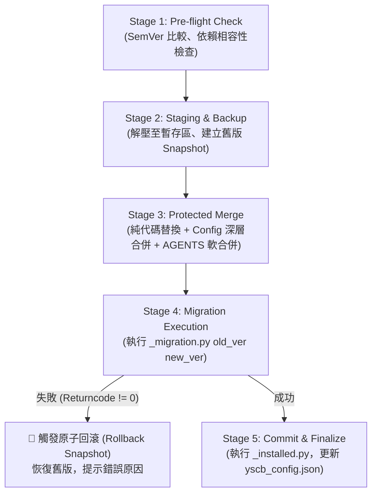

# 技術調研報告：版控系統、更新覆蓋機制與技術選型

> 功能名稱：完善版本號系統  
> 建立日期：2026-08-23  
> 所屬主計畫：無  
> 狀態：Concluded  
> 擴充項目：none  
> 模板版本：v1.0  

---

## 1. 背景痛點與調研核心目標 (Problem Statement & Objectives)

在多專案架構中，`ys-codebase` 作為上游通用工具庫與 SOP 引擎，被多個下游專案消費。當下游專案執行模組安裝、升級（`upgrade`）、重新建置或強制覆寫（`install --force`）時，面臨著極為嚴苛的**安全覆蓋、資料保護與發布傳輸**挑戰。

### 現存四大核心痛點：
1. **暴力覆蓋導致專案特化資產丟失 (Destructive Overwrites)**：
   - 下游專案通常已在 `config.project.json` 中配置了自訂目錄（如 `plans_dir`、`docs_dir`），或在 `AGENTS.md` 寫入專案特化的工程規範（第 4 節）。若升級時直接 `rmtree` 覆蓋，將造成災難性資料丟失。
2. **升級過程中斷與非事務性損毀 (Lack of Atomicity & Rollback)**：
   - 若升級執行到一半（例如網路中斷、檔案佔用鎖定、或 `_migration.py` 資料遷移報錯），舊版已被刪除但新版未安裝完整，會導致下游專案工具鏈直接癱瘓。
3. **發布來源傳輸協定的多樣性與環境依賴 (Distribution Protocol Portability)**：
   - 有些環境具備完整 Git CLI，有些受限環境僅有 Python 運行時或離線環境。需要確定一套高彈性、零第三方依賴的模組分發與更新獲取技術選型。
4. **增量配置合併的欄位沖刷 (Config Field Flattening)**：
   - 升級模組時，新版 `config.project.template.json` 可能新增了配置欄位（如新的 SOP 開關），如何在保留下游既有配置的前提下，自動、安全地補充新欄位？

### 本調研核心問題：
> **如何設計一套具備事務性備份回滾 (Atomic & Rollback)、資產分級保護 (Tiered Asset Protection)、非破壞性軟合併 (Non-destructive Soft-Merge) 的更新覆蓋機制，並完成發布源技術選型？**

---

## 2. 更新覆蓋策略：三大類資產分級保護體系 (Tiered Asset Protection)

針對專案內不同性質的資產，不能採用一刀切的覆蓋策略，必須劃分為三大防護等級：

```text
+-----------------------------------------------------------------------------------------------+
|                               三大類資產分級覆蓋與保護矩陣                                     |
+-------------------+---------------------------------------+-----------------------------------+
| 資產類別          | 涵蓋檔案/目錄                         | 覆蓋與合併策略                    |
+-------------------+---------------------------------------+-----------------------------------+
| 空間 A: 純代碼產物 | modules/<mod>/scripts/, /core/, SDK   | 100% 原子替換 (Atomic Replacement)|
| 空間 B: 結構化配置 | config.project.json, yscb_config.json | 範本增量深層合併 (Deep Merge)      |
| 空間 C: 半結構文檔 | AGENTS.md, 專案 SOP 指南             | 標記定界軟合併 (Soft-Merge Anchor)|
+-------------------+---------------------------------------+-----------------------------------+
```

### 空間 A：純代碼與靜態資源（100% 原子覆蓋）
- **範圍**：`modules/<mod>/scripts/`、`manifest.json`、內建靜態模板等。
- **原則**：視為編譯與發布產物，**下游專案嚴禁手動修改**。
- **策略**：升級時透過暫存目錄 (Staging) 進行整體驗證，驗證無誤後以原子替換方式直接覆蓋。

### 空間 B：結構化配置（2×2 模型範本增量合併）
- **範圍**：`config.project.json`、`yscb_config.json`。
- **原則**：**保留下游專案值優先，增量補充新範本欄位**。
- **策略**：
  ```python
  # 偽代碼：增量安全合併
  merged_config = deep_merge(new_template_config, user_existing_config)
  ```
  - 若新版本新增了 `paths.extensions_dir`，自動注入預設值。
  - 若下游已自訂 `paths.plans_dir: "my_plans"`，絕對不被覆蓋。
  - `config.local.json` 屬個人機密/本地偏好，升級過程**100% 唯讀保留，絕對禁止覆蓋**。

### 空間 C：半結構化文檔（定界標記軟合併）
- **範圍**：`AGENTS.md`。
- **原則**：**中央標準無損升級，專案特化規則 100% 保留**。
- **策略**：
  - 核心規範包裹於 `<!-- YSCB_AGENTS_BEGIN -->` 與 `<!-- YSCB_AGENTS_END -->` 之間。
  - 升級時只更新標記內的中央規範，標記之外（如第 4 節專案特化工程規範、Dogfooding 鐵律等）完全保持原樣。

---

## 3. 升級事務性與安全流水線 (The 5-Stage Safe Upgrade Pipeline)

為確保升級與覆蓋過程 100% 安全可控，設計標準五階段安全升級流水線：



### 3.2 鏈式增量遷移架構 (Sequential Incremental Migration Pipeline)

為避免跨版本升級時出現組合爆炸，且完全呼應「Minor 才是 Schema 遷移點，Patch 零 Migration」之公理，遷移步階採用 **Minor 代際標記（如 `1.1.x`、`1.2.x`）**，消除特定 Patch 版本的歧異：

```text
[升級路徑: v1.0.x ➔ v1.3.x]
舊版本 v1.0.x ──► Step(1.1.x) ──► Step(1.2.x) ──► Step(1.3.x) ──► 目標新版本 v1.3.x
                (套用 1.1.x 補丁) (套用 1.2.x 補丁) (套用 1.3.x 補丁)
```

#### 寫法範例：
```python
runner = MigrationRunner()

@runner.step("1.1.x")
def migrate_to_1_1(project_root: Path, module_dir: Path):
    """1.0.x -> 1.1.x: 遷移 config 結構"""
    pass

@runner.step("1.2.x")
def migrate_to_1_2(project_root: Path, module_dir: Path):
    """1.1.x -> 1.2.x: 新增預設 extensions 目錄"""
    pass
```

#### 核心演算法邏輯：
1. 模組維護按代際排序的遷移步階清單：`MIGRATION_STEPS = [("1.1.x", h1), ("1.2.x", h2), ...]`。
2. 當接收到 `_migration.py <old_version> <new_version>` 調用時：
   ```python
   # 偽代碼：鏈式增量遷移執行器
   current_ver = parse_semver(old_version)
   target_ver = parse_semver(new_version)

   for step_tag, handler in sorted_migration_steps:
       # 解析 step_tag (如 "1.1.x" 對應 1.1.0 基準點)
       step_base_ver = parse_step_base(step_tag)
       
       # 僅執行大於當前版本且不大於目標版本代際的步階
       if current_ver < step_base_ver and step_base_ver <= target_ver:
           print(f"[MIGRATION] 執行遷移步階: ➔ {step_tag}...")
           handler(project_root, module_dir)
           current_ver = step_base_ver
           
       if current_ver.major == target_ver.major and current_ver.minor >= target_ver.minor:
           break
   ```

---

### 3.3 一鍵檢查更新與智慧升級 CLI (One-Click Check-Update CLI)

提供極致流暢的終端開發者更新體驗：

1. **一鍵檢查更新 (`version check-update`)**：
   - 聯網/掃描遠端倉庫與本機源碼，輸出更新摘要清單：
     ```text
     | 模組名稱          | 當前安裝版本 | 最新可用版本 | 變更級別 | Migration 需求 |
     | :---              | :---         | :---         | :---     | :---           |
     | core              | v2.0.0       | v2.0.1       | PATCH    | 無 (直接覆蓋)   |
     | agents-workflow   | v1.0.1       | v1.1.0       | MINOR    | 需要 (1.1.x)   |
     ```
2. **一鍵安全升級 (`version update` / `installer upgrade`)**：
   - `python yscb_cli.py version update --all`：一鍵自動拉取最新版本並觸發五階段安全升級流水線（包含快照備份、增量合併與鏈式 migration）。

---

## 4. 發布源與傳輸協定技術選型 (Distribution Technology Selection)

下游專案如何獲取 `ys-codebase` 的更新？以下針對四種業界主流方案進行多維度權衡：

### 候選方案評估矩陣：

| 維度 / 特性 | 方案 1: Git CLI 拉取 (`git clone/pull`) | 方案 2: 純 Python HTTP Release (`zip/tar.gz`) | 方案 3: 本地目錄 Monorepo (`local_path`) | 方案 4: 輕量 Registry Index (`packages.json`) |
| :--- | :--- | :--- | :--- | :--- |
| **外部依賴** | 需系統安裝 Git binary | **0 依賴** (純 `urllib` + `zipfile`) | **0 依賴** (純 `pathlib` + `shutil`) | **0 依賴** (純 `urllib` + `json`) |
| **離線/內網支援** | 需設定內網 Git remote | 需內網 HTTP 伺服器或代理 | **100% 離線支援** (最快) | 需內網 HTTP 檔案伺服器 |
| **傳輸體積與速度** | 包含 `.git` metadata，相對較大 | 極小 (僅下載目標版本壓縮包) | 零網路傳輸 (秒級本機複製) | 極小 (依 Index 隨選下載) |
| **版本切換精度** | 支援 Branch / Commit / Tag | 支援精確 Tag / Release Asset | 依本機源碼為準 | 支援 SemVer 範圍自動匹配 |
| **實作成熟度** | 專案現已有基礎 `GitRemoteClient` | 可基於標準庫快速擴充 | 專案現已有完整支援 | 需額外維護 Index 發布管線 |

### 🛠️ 技術選型推薦決策：【多源適配器架構 (Multi-Source Adapter Engine)】

```text
                               ┌──► LocalSourceClient      (本機路徑 / Monorepo 聯調)
                               │
ProjectURI / Remote Specifier ─┼──► GitRemoteClient        (Git 倉庫 / Branch / Commit)
                               │
                               └──► HttpReleaseClient      (GitHub/Gitea Release zip 包)
```

1. **核心原則**：不綁定單一傳輸途徑，由 `yscb_installer.py` 提供統一抽象介面 `BaseSourceClient`。
2. **第一階段（當前標準）**：
   - **Local 模式**：本機目錄 / 聯調開發 (`--repo ./source` 或本機絕對路徑)，100% 離線可用。
   - **Git 模式**：支援標準 Git 遠端（GitHub / GitLab / Gitea），透過 `git clone --depth 1` 精確抓取。
3. **第二階段（未來擴充）**：
   - **HTTP Release 模式**：針對無 Git binary 環境，提供純 Python `urllib.request` 下載 GitHub Release `.zip` 包解壓更新，徹底貫徹 100% 零外部依賴公理。

---

## 5. 調研結論與後續實作指引 (Conclusion & Actionable Summary)

### 核心結論：
1. **資產分級是覆蓋安全的基石**：
   - 代碼產物原子覆蓋、設定檔深層增量合併、文檔標記定界軟合併，三者各司其職，從根本杜絕覆蓋事故。
2. **升級必須具備事務性 (Atomicity)**：
   - 引入 Stage 1~5 升級流水線，具備自動快照與 Migration 失敗回滾能力。
3. **多源發布架構**：
   - 保持 Local 與 Git 現有優勢，未來保留 HTTP Release 擴充槽位。

---

> 💡 **下一步建議**：
> 本調研報告完成後，我們已具備完整的「版本號語意剛性 (R01)」與「更新覆蓋與技術選型 (R02)」理論體系。
> 接下來可正式收斂回填至 `P00_semantic_requirements.md`，由您確認後完成 Phase 0，進入三大分流與後續規格設計！
