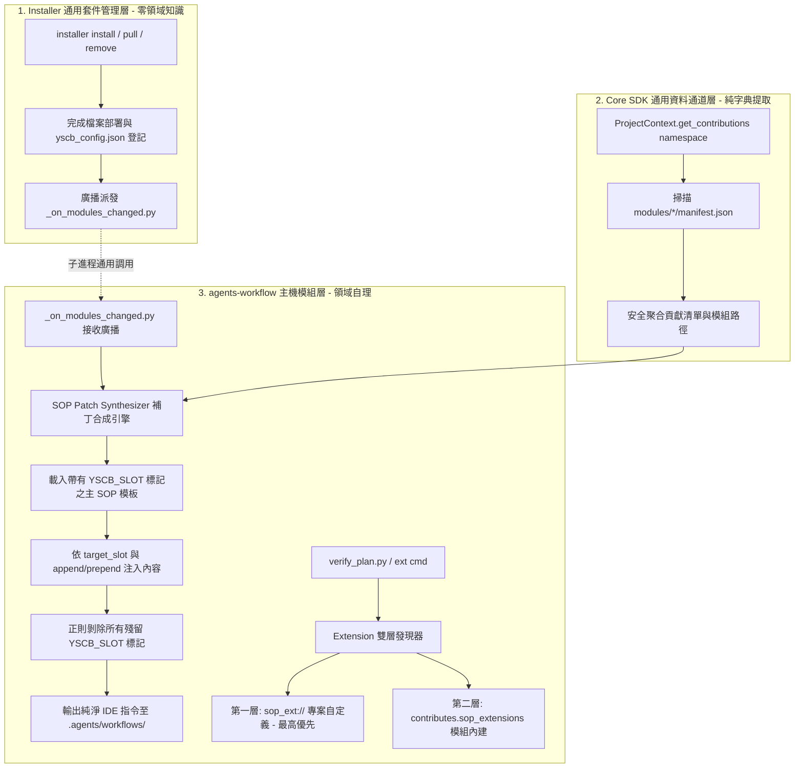

# 架構 & 變更計畫書 (Architecture & Change Plan)

> 功能名稱：Module 安裝期連動系統設計 (Installation-time Interlock System)  
> 建立日期：2026-08-23  
> 所屬主計畫：無  
> 狀態：Confirmed  
> 擴充項目：dogfooding_pipeline_ext  
> 模板版本：v1.2  

---

## 1. 架構全貌與資料流 (Architecture & Data Flow)

本架構在堅持「主機-外掛模式 (Host-Plugin Model)」與「Zero External Dependency」核心原則下，建立三大剛性協定分層，實現多模組在安裝期安全、順序無關的生命週期連動、SOP 動態 Slot 補丁合成與多來源 Extension 調度。

### 既有文檔查閱
- **查閱路徑**：`docs/Installer/README.md`、`docs/Installer/DESIGN_NOTES.md` (`DN-01 ~ DN-06`)、`docs/Core/README.md`、`docs/AgentsWorkflow/EXTENSION_VERIFIERS.md`
- **關鍵坑點/邊界**：
  - **DN-02 (純標準庫)**：補丁合成、Slot 標記正則替換與 Hook 調度必須 100% 使用 Python 標準庫（`json`, `re`, `subprocess`, `pathlib`）。
  - **DN-05 (事務隔離)**：Hook 執行拋錯絕不可阻斷核心安裝；`build` 指令絕對排除廣播觸發。
  - **Windows 控制台與編碼**：路徑處理與檔案讀寫強制 `encoding='utf-8'`。

---

## 2. 模組變更清單 (按依賴順序)

| 順序 | 類型 | 類別 / 檔案路徑 | 職責與修改概述 | 依賴項 / 影響下游 |
|:---|:---|:---|:---|:---|
| 1 | Modify | `ys_codebase/source/core/yscb_core/context.py` | 於 `ProjectContext` 新增 `get_contributions(namespace: str) -> List[Tuple[str, Path, Dict[str, Any]]]`，安全提取已安裝模組與源碼模組中指定命名空間之 `contributes` 字典。 | 無依賴，供 `agents-workflow` 調用 |
| 2 | Modify | `ys_codebase/yscb_installer.py` | 於 `ModuleManager` 新增 `_broadcast_modules_changed(event_type, target_module)`，在 `install()`, `pull()`, `remove()` 成功後遍歷已安裝模組執行 `scripts/_on_modules_changed.py`。`build()` 嚴格排除。 | 依賴 `core`，影響下游所有具 Hook 模組 |
| 3 | Add | `ys_codebase/source/agents-workflow/scripts/sop_synthesizer.py` | 實作 SOP 動態 Slot 合成引擎：`synthesize_sop(template_content, patches)`，支援 `<!-- YSCB_SLOT:<SlotName> -->` 匹配、`append`/`prepend` 注入與最終未命中 Slot 標記安全正則剝除。 | 依賴 `core` |
| 4 | Add | `ys_codebase/source/agents-workflow/scripts/_on_modules_changed.py` | 實作 Installer 生命週期廣播監聽 Hook：接收 `(event_type, target_module)`，自動探測專案環境（若已存在 `.agents/workflows/`），自動調用動態合成引擎重新生成 IDE 指令。 | 依賴 `sop_synthesizer.py` |
| 5 | Modify | `ys_codebase/source/agents-workflow/workflows/NewPlan.md` `Review.md` `ContextInit.md` | 於原始 SOP 模板植入剛性 `<!-- YSCB_SLOT:xxx -->` 標記（`NewPlan`: `Phase0`~`Phase7`；`Review`: `Step1`~`Step4`；`ContextInit`: `Step1`~`Step4`）。 | 供 `sop_synthesizer.py` 讀取注入 |
| 6 | Modify | `ys_codebase/source/agents-workflow/scripts/cli.py` | 升級 `generate_antigravity_workflows()` 整合 `sop_synthesizer`；升級 `ext list` 與 `ext show` 支援雙層發現鏈（顯示 `[sop_ext]` 與 `[module: <name>]` 來源標籤）。 | 依賴 `sop_synthesizer.py`, `core` |
| 7 | Modify | `ys_codebase/source/agents-workflow/scripts/verify_plan.py` | 升級 Extension 驗證器調度邏輯，支援從 `contributes.sop_extensions` 動態解析並執行貢獻模組內的驗證腳本。 | 依賴 `core` |
| 8 | Add | `test/fixtures/mock_workflow_plugin/` | 建立標準 Mock 測試外掛模組（含 `manifest.json`、`templates/mock_rules.md`、`scripts/mock_verify.py`），供單元測試與 E2E 回歸使用。 | 供測試套件依賴 |
| 9 | Add | `test/test_interlock.py` | 建立連動系統全量單元測試（涵蓋 Slot 合成、正則剝除、貢獻查詢、雙層 Extension 調度、Hook 例外防護、順序無關性）。 | 納入 `run_regression.py` |

---

## 3. 風險評估與防護

| ID | 風險維度 | 風險描述 | 等級 | 緩解 / 回滾策略 |
|:---|:---|:---|:---:|:---|
| **R-01** | 穩定性 | 第三方模組的 `_on_modules_changed.py` 存在語法錯誤或執行拋出未捕獲例外，導致 Installer 崩潰。 | 中 | **[異常隔離防護]** Installer 執行 Hook 時使用 `try...except` 與子進程獨立沙盒包裹，若非 0 僅記錄 `[WARN]` 日誌，核心安裝保證成功。 |
| **R-02** | 產物清潔度 | SOP 模板中的 `<!-- YSCB_SLOT:xxx -->` 在無任何外掛注入時殘留在終端 `.agents/workflows/*.md` 中，造成視覺污染。 | 低 | **[正則強制剝除]** 合成引擎最後一步強制執行 `re.sub(r'<!--\s*YSCB_SLOT:[a-zA-Z0-9_]+\s*-->\n?', '', text)`，保證輸出 100% 純淨。 |
| **R-03** | 順序依賴 | 先裝擴充模組再裝主機模組，或先裝主機再裝擴充，導致產物指令不一致。 | 中 | **[雙向收斂廣播]** 任何模組安裝均觸發 `_on_modules_changed.py`，主機模組自動遍歷所有已存在模組之 `manifest.contributes` 重新合成，達到數學上的順序無關性 (Order Invariance)。 |
| **R-04** | 效能衝擊 | 多模組安裝時重複頻繁讀寫磁碟與動態合成導致安裝變慢。 | 低 | **[記憶體單遍合成]** 貢獻聚合與 Slot 正則替換全在記憶體中單遍完成，實測耗時 `< 50ms`，遠低於 150ms 閾值。 |

---

## 4. Decision Records

### [ARCH:DR-01] 確立主機-外掛三層解耦架構 (The 3-Tier Decoupled Architecture)
- **議題**：連動系統的各模組職責邊界如何劃分，以防職責蔓延與循環依賴？
- **結論**：
  1. `Installer`：純通用套件管理（放檔案、寫設定、派發通用無參廣播）。
  2. `Core SDK`：純通用資料提取（`get_contributions()` 字典安全聚合）。
  3. `Host Module (agents-workflow)`：領域邏輯完全自理（SOP 模板、Slot 補丁注入、Extension 掃描、IDE 指令生成）。
- **理由**：符合單一職責原則 (SRP) 與開放封閉原則 (OCP)，未來新增任何非工作流領域模組（如 GameEngine, Analyzer）時，Installer 與 Core SDK 無需任何修改。

### [ARCH:DR-02] 記憶體即時合成與純淨模板防護
- **議題**：擴充模組的補丁是否應實體修改 `source/` 或 `modules/` 內的 SOP 模板檔案？
- **結論**：**絕對禁止實體修改模板檔案**。模板檔案永遠保持唯讀且自包含；所有 Slot 注入與標記剝除均在記憶體中即時進行，僅輸出至終端 `.agents/workflows/` 目錄。
- **理由**：杜絕檔案物理污染與反覆寫入造成的狀態漂移，模組卸載時只需重新合成即可瞬間恢復純淨狀態，無損且無殘留。
