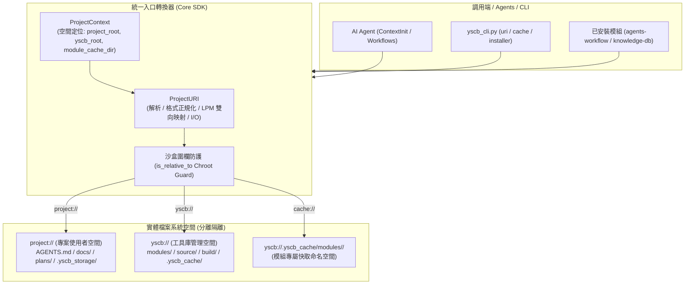

# 架構 & 變更計畫書 (Architecture & Change Plan)

> 功能名稱：fix_yscb_root_path_isolation (Module 檔案系統、快取儲存與 yscb:// 統一路徑轉換器完備性架構)  
> 建立日期：2026-08-23  
> 所屬主計畫：無  
> 狀態：Confirmed  
> 擴充項目：dogfooding_pipeline_ext  
> 模板版本：v1.2  

---

## 1. 架構全貌與資料流 (Architecture & Data Flow)

本計畫重構 Core Runtime SDK (`yscb_core`)、Installer (`yscb_installer.py`) 與 CLI 路由器 (`yscb_cli.py`) 的路徑處理拓撲，建立分層清晰、命名空間隔離且具備沙盒邊界保護的檔案系統體系：

### 既有文檔查閱
- **查閱路徑**：`docs/Installer/DESIGN_NOTES.md`、`docs/Core/README.md`、`docs/_project/ARCHITECTURE.md`
- **關鍵坑點/邊界**：
  - `DN-01`：Windows 控制台 UTF-8 編碼保護（避免特殊符號輸出崩潰）。
  - `DN-02`：堅持 Zero External Dependency（100% 使用純標準庫）。
  - `DN-03`：Windows 長路徑與遞迴目錄清理時 `ignore_errors=True` 保護。
  - `DN-07`：`build` 嚴格排除生命週期廣播副作用。
  - `DN-08`：SOP 標記正則清除零殘留。

---

## 2. 模組變更清單 (按依賴順序拓撲排序)

| 順序 | 類型 | 類別 / 檔案路徑 | 職責與修改概述 | 依賴項 / 影響下游 |
|:---:|:---:|:---|:---|:---|
| **1** | **Modify** | `ProjectContext` ([`ys_codebase/source/core/scripts/context.py`](file:///d:/repos/ys_codebase/ys_codebase/source/core/scripts/context.py)) | 1. 修正 `get_yscb_root()` 正確解析 `paths.yscb_root` 相對路徑 2. 修正 `get_module_dir()` 移除硬編碼 `"ys_codebase"`，改自 `get_yscb_root()` 查找 3. 新增 `get_module_cache_dir(mod)` 自動建立並回傳 `yscb://.yscb_cache/modules/<mod>/` 4. 新增 `get_cache_root()` 回傳 `yscb://.yscb_cache` | 底層 SDK，被所有上層依賴 |
| **2** | **Modify** | `ProjectURI` ([`ys_codebase/source/core/scripts/uri.py`](file:///d:/repos/ys_codebase/ys_codebase/source/core/scripts/uri.py)) | 1. 擴充保留協議（含 `cache`, `storage`, `temp`） 2. `resolve()` 支援泛型 `cache://`、`storage://` 與沙盒圍欄 `is_relative_to` 防護 3. 新增 `validate()` 完備度校驗 4. `to_uri()` 重構為最長前綴匹配 (LPM) 5. 新增 `exists/is_file/is_dir/read_text/write_text` 高階 I/O API | 依賴 `ProjectContext`，提供全專案語意路徑轉換 |
| **3** | **Modify** | `ConfigManager` ([`ys_codebase/source/core/scripts/config.py`](file:///d:/repos/ys_codebase/ys_codebase/source/core/scripts/config.py)) | 支援在 `load()` 時遞迴偵測並調用 `ProjectURI.resolve()` 展開設定字典中的語意 URI | 依賴 `ProjectURI` |
| **4** | **Modify** | `ModuleManager` / `ConfigManager` ([`ys_codebase/yscb_installer.py`](file:///d:/repos/ys_codebase/ys_codebase/yscb_installer.py)) | 1. `ConfigManager.get_yscb_root()` 修正為動態解析 `paths.yscb_root` 2. `ModuleManager` 安裝、源碼、建置、快取與快照備份路徑 100% 收斂至 `get_yscb_root()` 3. 模組卸載 `remove` 連動清理 `cache://<module>/` | 依賴 `core` 概念，負責工具庫安裝 |
| **5** | **Modify** | CLI 路由器 ([`ys_codebase/yscb_cli.py`](file:///d:/repos/ys_codebase/ys_codebase/yscb_cli.py)) | 1. 模組發現與 Core 探索改用 `ProjectContext.get_yscb_root()`，移除硬編碼 2. 新增 `cache clean [module] [--all]` 與 `cache status` 子指令 3. 擴充 `uri check` 一鍵健康度與越界診斷指令 | 統一調度轉接器 |
| **6** | **Modify** | `IDECacheTracker` ([`ys_codebase/source/agents-workflow/scripts/ide_sync.py`](file:///d:/repos/ys_codebase/ys_codebase/source/agents-workflow/scripts/ide_sync.py)) | 快取檔案改存至 `ProjectContext.get_module_cache_dir("agents-workflow")`，並執行舊版快取檔案自動平滑遷移 | 依賴 `core` |
| **7** | **New** | 測試套件 ([`test/test_uri_completeness.py`](file:///d:/repos/ys_codebase/test/test_uri_completeness.py)) | 覆蓋 FT-01~08、ET-01~07 與 PT-01 全量功能、邊界與效能測試 | 依賴所有上述元件 |

---

## 3. 風險評估與防護

| ID | 風險維度 | 風險描述 | 等級 | 緩解 / 回滾策略 |
|:---|:---|:---|:---:|:---|
| **R-01** | **向後相容性** | 舊版下游專案已在根目錄產生 `.yscb_cache/ide_manifest_*.json`，升級後若無法讀取會導致 IDE 指令殘留孤兒 | **中** | 在 `ide_sync.py` 啟動時偵測舊版路徑，若存在則自動移動 (move) 遷移至新命名空間目錄，保證 100% 無損銜接。 |
| **R-02** | **空間隔離誤傷** | 若下游專案配置 `yscb_root = "."`（同層），路徑計算可能出現非預期相對路徑解析錯誤 | **低** | 在 `ProjectContext.get_yscb_root()` 加入同層判定與單元測試 (ET-07)，確保同層模式平滑向下相容。 |
| **R-03** | **Windows 長路徑與越界誤判** | Windows 符號連結或大小寫不一致可能導致 `is_relative_to` 誤判為越界逃逸 | **中** | 在圍欄檢查前統一透過 `resolve()` 解析符號連結與大小寫正規化（Windows 環境比對小寫字串），杜絕誤殺。 |
| **R-04** | **Dogfooding 閉環風險** | 修改 `source/` 後若未同步覆蓋 `yscb_*.py` 與 `modules/`，會產生自引用版本發散 | **高** | 強制納入 `dogfooding_pipeline_ext` 擴充，嚴格遵循 Stage 1~4 流水線，透過 `run_regression.py` 與 `version status` 雙重守門。 |

---

## 4. Decision Records

### [ARCH:DR-01] 統一路徑轉換器唯一入口鐵律
- **議題**：模組在處理路徑時容易自行拼接相對路徑，當 `yscb_root` 或工作目錄變更時頻繁崩潰。
- **結論**：全專案所有模組凡涉及檔案路徑定位與存取，**100% 必須經由 `ProjectURI` / `ProjectContext` 統一轉換器**；轉換器接口內建格式正規化、合法性斷言與 `is_relative_to` 沙盒圍欄防護。
- **理由**：從架構源頭消除散落各處的硬編碼路徑與目錄逃逸漏洞。
- **排除方案**：允許模組自行解析相對路徑（排除原因：容易發生跨平台路徑分隔符號錯誤與路徑混淆）。

### [ARCH:DR-02] 泛型模組命名空間快取 (`cache://`) 與生命週期連動
- **議題**：各模組的中繼檔案與快取缺乏標準存放位置，散落於根目錄或模組目錄內。
- **結論**：統一收斂至 `yscb://.yscb_cache/modules/<module_name>/`，以 `cache://<module>/<subpath>` 動態解析，並於模組卸載時自動連動清理。
- **理由**：實現模組間快取徹底隔離，防止命名衝突與 Git 污染，簡化 CI/CD 清理成本。
