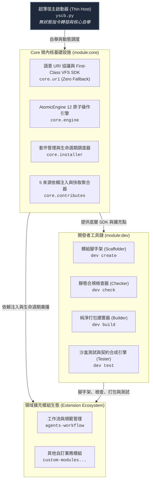

# YS-Codebase 系統架構與全域知識地圖 (System Overview & Architecture Map)

> 歡迎查閱 **YS-Codebase** 核心架構知識庫！  
> 本專案為 100% Python 標準庫、零第三方依賴構建之現代化模組化微內核系統。

---

## 1. 系統宏觀分層架構 (High-Level Architecture)

---

## 2. 全域知識庫導覽地圖 (Knowledge Base Index)

| 核心維度 | 知識手冊路徑 | 說明 |
| :--- | :--- | :--- |
| **維度 2：核心規範** | [STANDARDS.md](./_project/STANDARDS.md) | 全專案四大空間協議、2x2 組態邊界、Dogfooding 自引用三層空間與標準閉環流水線 |
| **維度 2：核心內核** | [core/README.md](./core/README.md) | Core 微內核架構、AtomicEngine 12 原子操作、First-Class VFS SDK 與套件管理 |
| **維度 3：專題手冊** | [core/uri_protocols.md](./core/uri_protocols.md) | 語意 URI 協議規範、`project://` 零 Fallback 阻斷與中介快照動態解算機制 |
| **維度 3：專題手冊** | [core/lifecycle_and_hooks.md](./core/lifecycle_and_hooks.md) | 命名空間 Hook 對接規範 (`hook.{emit_module}.py`)、`ExecutionContext` 介面與例外隔離 |
| **維度 5：工程妥協** | [core/DESIGN_NOTES.md](./core/DESIGN_NOTES.md) | Core 微內核關鍵工程決策與設計註記 (`DN-01` ~ `DN-06`)，含宿主組態解耦 (DN-05) 與常數自定位零猜測阻斷 (DN-06) |
| **維度 2：開發工具** | [dev/README.md](./dev/README.md) | Dev 工具鏈架構、Scaffold 模組建立、Checker 規範檢驗、Builder 純淨打包 |
| **維度 3：專題手冊** | [dev/testing_guide.md](./dev/testing_guide.md) | `YSCBTestCase` 隔離沙盒生命週期、Auto-Contract 自動契約合成與兩階段測試 |
| **維度 5：工程妥協** | [dev/DESIGN_NOTES.md](./dev/DESIGN_NOTES.md) | Dev 開發者工具鏈關鍵設計註記 (`DN-DEV-01`) |

---

## 3. 模組生態總覽 (Module Registry)

| 模組名稱 | 版本 | 職責定位 | 主要進入點 |
| :--- | :---: | :--- | :--- |
| **`core`** | `1.0.0` | 系統微內核、VFS 檔案系統、套件生命週期、依賴注入與 Hook 派發 | `modules/core/scripts/cli.py` |
| **`dev`** | `1.0.0` | 開發者工具箱：腳手架、靜態檢查、純淨套件打包、單元/契約測試引擎 | `modules/dev/scripts/cli.py` |
