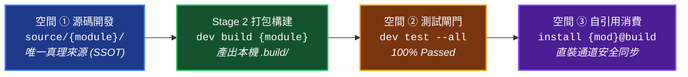

# 全專案核心工程規範與邊界架構 (Project Standards & Boundary Architecture)

> 本文件為 YS-Codebase 全專案的最高工程規範與架構準則，定義空間協議、組態矩陣與開發防呆邊界。

---

## 1. 語意空間協議清單 (Semantic Space Protocols)

系統嚴格劃分四大核心空間與開發專屬空間，杜絕脆弱的相對路徑與環境漂移：

| 語意 URI 協議 | 實體解析路徑 | 空間定義與職責 | Git 追蹤政策 |
| :--- | :--- | :--- | :---: |
| **`project://`** | 由 `config/core/config.project.json` 之 `project_root` 解算 | **宿主專案空間**（如外部被管理的專案根目錄） | 專案自行管理 |
| **`yscb://`** | 由 `yscb.config.json` 之 `yscb_root` 定位 | **YS-Codebase 工具庫根目錄** | ✅ 受追蹤 |
| **`module.root://`** | `yscb://.modules/` | **本地模組運行端根目錄** | 🚫 忽略 |
| **`module://`** | `yscb://.modules/{module}/` | **特定模組之運行端純淨代碼目錄** | 🚫 忽略 |
| **`config.root://`** | `yscb://config/` | **全域模組設定檔根目錄** | ✅ 受追蹤 |
| **`config://`** | `yscb://config/{module}/` | **特定模組專屬設定檔目錄** | ✅ 受追蹤 |
| **`cache.root://`** | `yscb://.cache/` | **全域模組編譯快取與中介產物根目錄** | 🚫 忽略 |
| **`cache://`** | `yscb://.cache/{module}/` | **特定模組專屬快取目錄** | 🚫 忽略 |
| **`mirror://`** | `yscb://.mirror/` | **本地端模組鏡像庫（版本化備份）** | 🚫 忽略 |
| **`temp://`** | `yscb://.temp/` | **系統隔離暫存區（含鎖與測試沙盒）** | 🚫 忽略 |
| **`snapshot://`** | `yscb://.snapshots/` | **組態快照備份目錄（用於災難恢復）** | 🚫 忽略 |
| *(開發)* **`module.source.root://`** | `yscb://source/` | **模組原始碼開發空間根目錄** | ✅ 受追蹤 |
| *(開發)* **`module.source://`** | `yscb://source/{module}/` | **特定模組原始碼開發空間** | ✅ 受追蹤 |
| *(開發)* **`module.build.root://`** | `yscb://.build/` | **本地開發完整建置產物空間根目錄** | 🚫 忽略 |
| *(開發)* **`module.build://`** | `yscb://.build/{module}/{version}/` | **特定模組之完整建置產物版本包** | 🚫 忽略 |
| **`yscb.venv://`** | `yscb://.venv/` | **YSCB 私有微虛擬環境空間根目錄** | 🚫 忽略 |

---

## 2. 2x2 組態矩陣邊界規範 (Configuration Matrix)

全系統設定檔嚴格依據「專案 vs 本地」與「全域 vs 模組」進行 2x2 邊界劃分：

| 範圍維度 | 專案層級 (`config.project.json`) ✅ **受 Git 追蹤 (Team Shared)** | 本地個人層級 (`config.local.json`) 🚫 **Git 忽略 (Machine Specific)** |
| :--- | :--- | :--- |
| **全域層級** | `yscb.config.json`：宣告 `yscb_root`、預設 `default_provider` 與 `installed_modules` 清冊。 | `yscb.config.local.json`：本機覆蓋設定。 |
| **模組層級** | `yscb://config/{module}/config.project.json`：模組專案層級設定（如 `core` 的 `project_root`）。 | `yscb://config/{module}/config.local.json`：模組本機層級覆蓋。 |

### 🛡️ 組態管理三項鐵律
1. **SSOT 原則**：模組預設值宣告於 `contribute.json`，專案層級覆蓋於 `config.project.json`，個人特化於 `config.local.json`。
2. **Git 政策防護**：`config.local.json` 嚴禁入庫；`config.project.json` 必須入庫共享。
3. **無損寫入保證**：透過 `core.config` 修改組態時，自動執行原子備份快照至 `snapshot://`。

---

## 3. 模組開發與 Dogfooding 閉環流程 (Dogfooding Cycle)

### 🚨 三大空間隔離禁令
1. **源碼空間 (`source/`) 為唯一 SSOT**：所有功能修改 100% 必須在 `source/` 進行。
2. **禁止直接修改運行端 (`.modules/`)**：`.modules/` 視為編譯與部署產物，嚴禁手動直接修改。
3. **測試未通過嚴禁發布**：實機測試未 100% 通過前，嚴禁將 `.build/` 產物同步至 `.modules/`。
