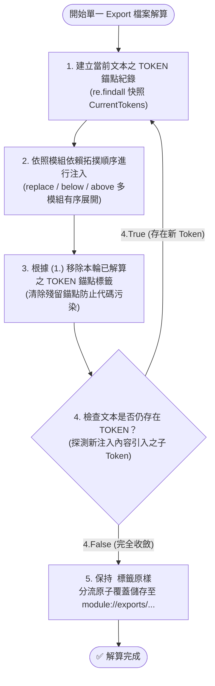

# 協議產物工廠化與宣告式依賴注入手冊 (Protocol Artifact Factory)

本手冊詳解 `agents-workflow` 中的宣告式 Contributes 註冊與 5-Step 多輪遞迴解算狀態機。

---

## 1. 宣告式 Contributes Schema

任何模組皆可於 `manifest.json` 中向 `agents-workflow` 註冊資產：

### 1.1 `export`（資產導出）
```json
{
  "type": "standard | workflow | template",
  "source": "module.root://<mod>/assets/<type>/<file>.md",
  "description": "說明文字"
}
```

### 1.2 `insert`（錨點注入）
```json
{
  "type": "const | uri",
  "token": "TARGET_TOKEN",
  "value": "注入文字內容 或 module.root://... 語意路徑",
  "mode": "replace | below | above"
}
```

### 1.3 `token`（元數據註冊）
```json
{
  "value": "TARGET_TOKEN",
  "description": "說明此錨點用途"
}
```

---

## 2. 5-Step 多輪遞迴解算狀態機



1. **Step 1 (建立錨點快照)**：掃描目標文本中所有 `<!-- __TOKEN__ -->` 標籤。
2. **Step 2 (依拓撲順序注入)**：走訪所有匹配錨點的 `insert`（支援多模組以 below/above 連續追加）。
3. **Step 3 (移除已解算標籤)**：將本輪已完成解算之錨點標籤乾淨抹除。
4. **Step 4 (遞迴收斂檢查)**：若注入片段新引入子 Token，回到 Step 1 啟動下一輪解算，直至 100% 收斂。
5. **Step 5 (分流儲存)**：保持 `<!-- __URI(...)__ -->` 標籤原樣不解算，儲存至 `module://exports/{standards|workflows|templates}/`。
