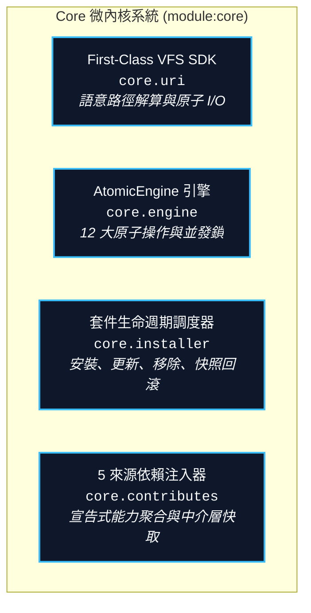

# Core 微內核架構手冊 (Core Microkernel Overview)

> 模組名稱：`core`  
> 模組版本：`1.0.0`  
> 職責定位：YS-Codebase 系統微內核基礎設施、套件生命週期、VFS 檔案系統與依賴注入引擎。

---

## 1. Core 微內核架構設計 (Microkernel Architecture)

`core` 模組由四大核心子系統組成：



---

## 2. First-Class VFS SDK (`core.uri`)

`core.uri` 提供系統標準的虛擬檔案系統介面，原生支援所有語意 URI（如 `config://`、`cache://`、`temp://`）：

```python
from core import uri

# 1. 檔案讀寫（自動建立父目錄、原子安全寫入）
uri.write_text("config://custom.txt", "Hello YSCB")
content = uri.read_text("config://custom.txt")

uri.write_json("config://settings.json", {"debug": True}, indent=2)
data = uri.read_json("config://settings.json")

# 2. 目錄操作
uri.makedirs("temp://my_sandbox/", exist_ok=True)
files = uri.listdir("module.root://")
uri.copy("module.source://core/", "temp://core_backup/")
uri.rmtree("temp://my_sandbox/")

# 3. 狀態判斷與路徑反查
if uri.exists("config://settings.json"):
    print("實體絕對路徑：", uri.resolve("config://settings.json"))
    print("語意反查 URI：", uri.to_uri(r"h:\UseFolder\...\config\core\settings.json"))
```

---

## 3. AtomicEngine 12 原子操作生命週期 (`core.engine`)

`AtomicEngine` 嚴格將系統狀態變更分解為 12 項不可分割的原子操作：

| 操作代碼 | 操作名稱 | 目標空間 | 職責說明 |
| :--- | :--- | :--- | :--- |
| **ACT-01** | `INIT` | 宿主環境 | 建立 `yscb_root`、寫入初始 `yscb.config.json` 與基礎目錄。 |
| **ACT-02** | `DOWNLOAD` | `mirror://` | 自本地或遠端抓取指定模組之純淨產物包至鏡像庫。 |
| **ACT-03** | `DELETE` | `mirror://` | 自鏡像庫實體刪除指定模組版本。 |
| **ACT-04** | `REGISTER` | `yscb.config.json` | 登記或更新模組元數據（`installed_modules`）。 |
| **ACT-05** | `UNREGISTER`| `yscb.config.json` | 移除指定模組之清冊登記。 |
| **ACT-06** | `SOLVE_DEPS`| 相依求解 | 讀取 manifest 求解相依拓撲與版本相容性。 |
| **ACT-07** | `PREPARE` | 狀態同步 | 遍歷清冊模組，確認鏡像狀態並調用 `DOWNLOAD`。 |
| **ACT-08** | `RELOAD` | `module.root://` | 運行端調和：清空 `modules/` ➔ 物化載入 ➔ 組態自動分發與增量補齊 ➔ 依賴注入 ➔ 事件廣播。 |
| **ACT-09** | `FETCH` | 傳輸通道 | 依協定（Local/HTTP/Git）獲取模組產物包或 manifest。 |
| **ACT-10** | `SNAPSHOT` | `snapshot://` | 執行破壞性操作前備份當前組態狀態點。 |
| **ACT-11** | `RESTORE_SNAPSHOT` | `snapshot://` | 倒回覆蓋最近或指定之歷史快照點。 |
| **ACT-12** | `DISPATCH_CLI` | 模組進入點 | 宿主探測並委派執行目標模組之 `scripts/cli.py`。 |

---

## 4. 套件管理 CLI 指令速查 (`core.installer`)

```bash
# 安裝模組（支援指定版本與來源）
python yscb.py install <module_name>[@version] [--provider="<source>"] [--force]

# 更新模組至最新版本
python yscb.py update [<module_name>] [--provider="<source>"]

# 移除已安裝模組（保護 core 不可移除）
python yscb.py remove <module_name> [--clean]

# 列出已安裝模組清單
python yscb.py list

# 系統健康狀態診斷巡檢
python yscb.py status

# 災難恢復快照回滾
python yscb.py rollback [<snapshot_id>]

# 運行端環境調和與依賴注入刷新
python yscb.py reload
```
