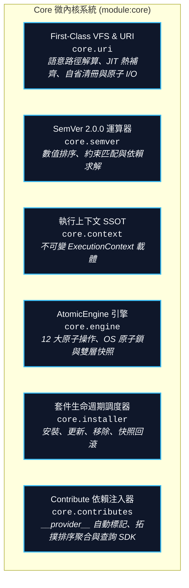

# Core 微內核架構手冊 (Core Microkernel Overview)

> 模組名稱：`core`  
> 模組版本：`1.0.0`  
> 職責定位：YS-Codebase 系統微內核基礎設施、套件生命週期、VFS 檔案系統、語意 URI 系統、SemVer 運算與依賴注入引擎。

---

## 1. Core 微內核架構設計 (Microkernel Architecture)

`core` 模組由六大核心子系統組成：



---

## 2. 語意 URI 協定與 First-Class VFS SDK (`core.uri`)

YS-Codebase 透過 `core.uri` 提供標準化虛擬檔案系統介面，實現實體路徑與語意抽象的完全解耦：

### 2.1 六大核心空間語意協議表
| 空間類型 | 根空間協議 (Root) | 模組專屬空間協議 (Scoped) | 實體預設位置 |
| :--- | :--- | :--- | :--- |
| **工具庫核心** | `yscb://` | - | 工具庫安裝根目錄 |
| **運行端空間** | `module.root://` | `module://` | `yscb://.modules/{module}/` |
| **源碼端空間** | `module.source.root://` | `module.source://` | `yscb://source/{module}/` |
| **建置端空間** | `module.build.root://` | `module.build://` | `yscb://.build/{module}/` |
| **發布端空間** | `module.release.root://` | `module.release://` | `yscb://release/{module}/` |
| **鏡像端空間** | `module.mirror.root://` | `module.mirror://` | `yscb://.mirror/{module}/` |
| **組態空間** | `config.root://` | `config://` | `yscb://config/{module}/` |
| **快取空間** | `cache.root://` | `cache://` | `yscb://.cache/{module}/` |
| **持久儲存** | `storage.root://` | `storage://` | `yscb://storage/{module}/` |
| **暫存/快照** | `temp://` / `snapshot://` | - | `yscb://.temp/` / `yscb://.snapshots/` |
| **專案宿主** | `project://` | - | `config.project.json` (core: `project_root`) |

### 2.2 JIT `!undefined` 熱更新補齊機制
當 `uri.resolve()` 遇到未配置或為 `!undefined` 的協議時，會在互動 TTY 環境自動彈出熱補齊選單：
- `-y <path>`：輸入路徑（以 `yscb://` 為相對基準，支援 `../` 或語意協議），自動原子寫回 `config.project.json` 並熱刷新快取繼續運行。
- `-n`：安全終止操作。
- `--help`：展開全系統可用協議清冊與狀態。
- **非 TTY / 靜態檢查**：直接拋出結構化 `UndefinedURIError`。

---

## 3. 微內核 Contribute 依賴注入與查詢 SDK (`core.contributes`)

### 3.1 `__provider__` 拓撲聚合
在微內核搜集 donor 模組 contributes 時，自動為 Dict 與 List[Dict] 項目注入 `"__provider__": donor_name`，並依模組安裝之拓撲排序有序合併。

### 3.2 標準查詢 SDK
```python
from core import contributes, uri

# 1. 查詢特定目標模組之已合併 Contributes
all_contribs = contributes.get("core")
schemes = contributes.get("core", "uri_schemes", default=[])

# 2. 自動在當前 module_scope 下查詢本模組 Contributes
with uri.module_scope("core"):
    my_contribs = contributes.get_for_current_module()
```

### 3.3 JIT 變更嗅探與熱自愈 (JIT Freshness Gate)
`core.contributes.get()` 內建 $< 2\text{ms}$ 檔案指紋嗅探閘門。當任何模組的 `contributes/<target>.json` 或專案級 `config/<target>/contribute.json` 被編輯修改時，下次調用 `get()` 會自動感知 dirty 並原地重新執行 `scan_and_inject()`，徹底消除手動執行 `python yscb.py reload` 的負擔。

### 3.4 安裝來源 12 小時節流版本探測 (`core.update_checker`)
微內核提供 `UpdateChecker` 服務，維護 `cache://core/update_check.json`。每隔 12 小時以 2 秒短超時輕量檢查一次 Provider 端之版本資訊；當有新版本可用時，在 CLI 執行完畢時輸出非阻塞友善提示，支援 `YSCB_NO_UPDATE_CHECK=1` 停用。

---

## 4. CLI 指令速查

```bash
# 1. 語意 URI 清冊自省與解析
python yscb.py uri list                     # 列出全系統已註冊語意協議清冊 (含原始設定與解析路徑)
python yscb.py uri resolve <path_or_uri>    # 解析特定語意 URI 為實體絕對路徑
python yscb.py uri to-uri <abs_path>        # 將實體路徑反查轉換為語意 URI
python yscb.py uri check                    # 全量語意協議健康檢查

# 2. 套件生命週期管理
python yscb.py install <module>[@version] [--provider="<source>"] [--force]
python yscb.py update [<module>] [--provider="<source>"]
python yscb.py remove <module> [--clean]
python yscb.py list
python yscb.py status
python yscb.py rollback [snapshot_id]
python yscb.py reload
```
