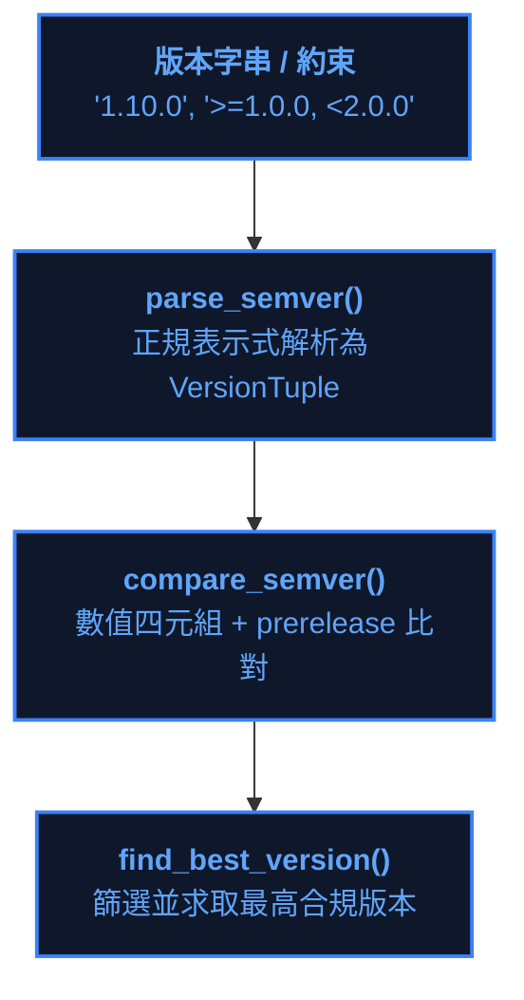

# SemVer 2.0.0 版本運算器手冊 (Semantic Versioning Engine)

> 所屬模組：`module:core` (`source/core/core/semver.py`)  
> 依據規範：Semantic Versioning 2.0.0 (SemVer)  
> 依賴約束：100% Python 標準庫，零外部依賴 (Zero External Dependency)  

---

## 1. 核心定位與設計動機

YS-Codebase 套件管理系統要求支援語意化版本（SemVer 2.0.0），但在極簡微內核與零外部依賴約束下，禁止引入第三方 `packaging` 或 `semver` pip 套件。

`core.semver` 子模組提供純標準庫原生實作，徹底根除純字串排序下的經典缺陷（如 `"1.10.0" < "1.9.0"`），並賦能依賴求解器 (`act_solve_deps`) 與套件升級器 (`cmd_update`) 進行精確版本約束求解。



---

## 2. 資料結構與解析規格

### 2.1 版本數值四元組 (`VersionTuple`)
```python
from typing import NamedTuple

class VersionTuple(NamedTuple):
    major: int
    minor: int
    patch: int
    prerelease: str = ""
```

### 2.2 優先級與比較規則
1. **數值段優先**：依序比較 `(major, minor, patch)` 整數大小。
2. **正式版大於預發布版**：當三元組相等時，不帶 `prerelease` 之正式版優先級高於帶有 `prerelease` 之版本（即 `1.0.0 > 1.0.0-beta.1`）。
3. **預發布版識別碼比較**：逐段比較，數字識別碼按數值比，非數字識別碼按 ASCII 字典序比。

---

## 3. 約束範圍比對語法 (`match_constraint`)

支援以逗號分隔的多條件約束組合：

| 操作符 | 範例 | 說明 | 匹配判定 |
| :---: | :--- | :--- | :--- |
| `>=` | `>=1.0.0` | 大於或等於目標版本 | `compare_semver(v, '1.0.0') >= 0` |
| `>` | `>1.0.0` | 嚴格大於目標版本 | `compare_semver(v, '1.0.0') > 0` |
| `<=` | `<=2.0.0` | 小於或等於目標版本 | `compare_semver(v, '2.0.0') <= 0` |
| `<` | `<2.0.0` | 嚴格小於目標版本 | `compare_semver(v, '2.0.0') < 0` |
| `==` | `==1.2.0` | 精確相等 | `compare_semver(v, '1.2.0') == 0` |
| `!=` | `!=1.2.0` | 不相等 | `compare_semver(v, '1.2.0') != 0` |
| `~=` | `~=1.2.0` | 相容發布（同 major，版本不低於目標） | `>=1.2.0, <2.0.0` (0.x 則鎖定 minor) |
| `*` | `*` / `None` | 萬用匹配（接受任何合法版本） | `True` |
| 組合 | `>=1.0.0, <2.0.0` | 多條件 AND 組合 | 所有子約束皆必須成立 |

---

## 4. 公開 API 簽名與使用範例

```python
from core import semver

# 1. 解析版本
v = semver.parse_semver("1.10.0-rc.1")
print(v.major, v.minor, v.patch, v.prerelease) # 1 10 0 rc.1

# 2. 數值比較
res = semver.compare_semver("1.10.0", "1.9.0")
print(res) # 1 (1.10.0 > 1.9.0)

# 3. 約束匹配
is_match = semver.match_constraint("1.5.2", ">=1.0.0, <2.0.0")
print(is_match) # True

# 4. 尋找最高可用合規版本
candidates = ["1.0.0", "1.9.0", "1.10.0", "2.0.0-alpha"]
best = semver.find_best_version(candidates, "<2.0.0")
print(best) # "1.10.0"
```
