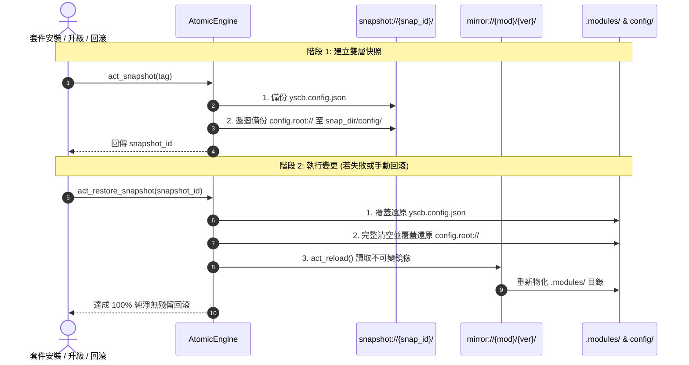

# 雙層組態快照與原子回滾手冊 (Dual-Layer Snapshot & Rollback)

> 所屬模組：`module:core` (`source/core/core/engine.py`)  
> 機制分類：維度 3（專題機制 / 狀態機與類事務管理）  

---

## 1. 核心定位與原子模型

YS-Codebase 的套件管理器採用「**不可變鏡像庫 (Immutable Mirror) + 雙層組態快照 (Dual-Layer Snapshot)**」的原子還原模型：

1. **不可變版本庫 (`mirror://<mod>/<ver>/`)**：所有下載或建置之模組產物一旦進入鏡像庫即不可被竄改。
2. **雙層組態快照 (`snapshot://<snap_id>/`)**：在進行任何可能變更系統狀態的操作（`install`, `update`, `remove`）前，原子備份宿主環境組態 (`yscb.config.json`) 與模組專屬設定目錄 (`config.root://`)。
3. **完美回滾閉環**：若安裝過程失敗或使用者調用 `rollback`，系統同步還原宿主設定與模組設定，並透過 `act_reload()` 自不可變鏡像庫重新物化 `.modules/` 運行目錄。



---

## 2. 快照目錄結構規範

每一次快照在 `snapshot://` (實體路徑 `<yscb_root>/.snapshots/`) 生成獨立子目錄：

```text
.snapshots/
  └── snap_1724578900/
      ├── yscb.config.json     # 宿主安裝模組清單與配置
      └── config/              # 各模組專屬 project/local 配置備份
          ├── core/
          │   ├── config.project.json
          │   └── config.local.json
          └── dev/
              └── config.project.json
```

---

## 3. CLI 指令與 API 介面

### 3.1 CLI 指令
```bash
# 檢視目前所有可用快照並回滾至最新快照
python yscb.py rollback

# 回滾至指定快照
python yscb.py rollback snap_1724578900
```

### 3.2 Python API
```python
from core.engine import AtomicEngine

engine = AtomicEngine()

# 1. 建立快照
snap_id = engine.act_snapshot("pre_operation_tag")

# 2. 還原快照
engine.act_restore_snapshot(snap_id)
```
