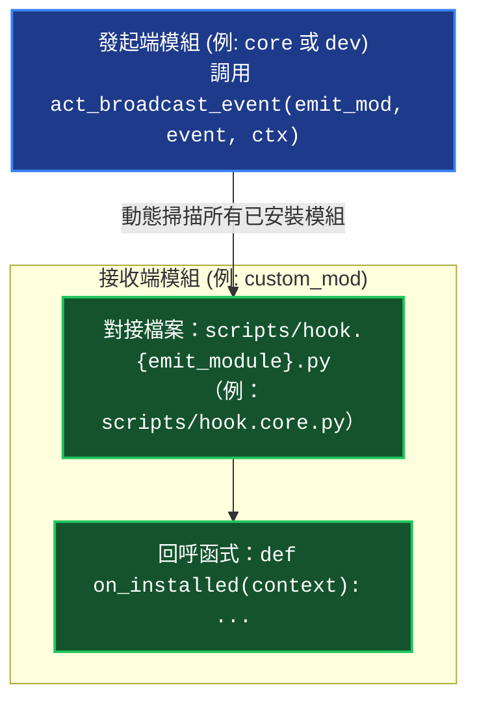

# 命名空間 Hook 與生命週期事件手冊 (Namespaced Hooks & Lifecycle Events)

> 本手冊為維度 3 中觀專題手冊，定義 YS-Codebase 精準命名空間 Hook 對接規範、`ExecutionContext` 介面與事件廣播調度機制。

---

## 1. 命名空間 Hook 對接模型 (Namespaced Hook Architecture)

為防止全域 Hook 名稱衝突與責任不清，系統嚴格採用「**以發起端模組為命名空間**」的檔案對接規範：



---

## 2. 接收端實作標準

若模組 `A` 想監聽來自模組 `B` 派發的生命週期事件，必須遵循以下兩大規則：
1. **檔案路徑**：`modules/{A}/scripts/hook.{B}.py`（原始碼中位於 `source/{A}/scripts/hook.{B}.py`）。
2. **函式定義**：函式名稱嚴格對齊事件名稱，接收唯一參數 `context: ExecutionContext`。

### 範例：對接 `core` 之生命週期事件 (`scripts/hook.core.py`)
```python
# source/my_module/scripts/hook.core.py
from core.uri import ExecutionContext

def on_installed(context: ExecutionContext) -> None:
    """當 core 完成本模組安裝或依賴安裝時觸發"""
    print(f"[my_mod] Received on_installed for: {context.args}")

def on_reload(context: ExecutionContext) -> None:
    """當 core 完成環境重構與依賴注入刷新時觸發"""
    print("[my_mod] Runtime environment reloaded.")

def on_update(context: ExecutionContext) -> None:
    """當 core 完成模組升級時觸發"""
    pass

def on_remove(context: ExecutionContext) -> None:
    """當 core 移除模組前觸發"""
    pass
```

---

## 3. `ExecutionContext` 介面定義

```python
from dataclasses import dataclass, field
from typing import Optional, List, Dict, Any

@dataclass(frozen=True)
class ExecutionContext:
    module_name: str                  # 發起或觸發事件的模組名稱
    command: Optional[str] = None     # 當前執行的子命令名稱
    args: List[str] = field(default_factory=list)      # 傳入命令或事件參數清單
    metadata: Dict[str, Any] = field(default_factory=dict) # 附帶之額外元數據
```

---

## 4. 異常隔離與強健性防護 (Fault Isolation)

Core 在遍歷調度各模組的 Hook 函式時，實施嚴格的例外捕獲防護：

```python
# core.engine 調度邏輯虛擬碼
try:
    handler_fn(context)
except Exception as e:
    print(f"[core:events] Warning: Hook '{mod}:hook.{emit_module}.py' failed on '{event_name}': {e}", file=sys.stderr)
```

> [!IMPORTANT]
> **單一 Hook 崩潰零擴散**：任何單一模組的 Hook 執行異常（語法錯誤、執行期例外）只會記錄 stderr Warning，絕不中斷發起端的主生命週期操作（如安裝、更新、重載）。
