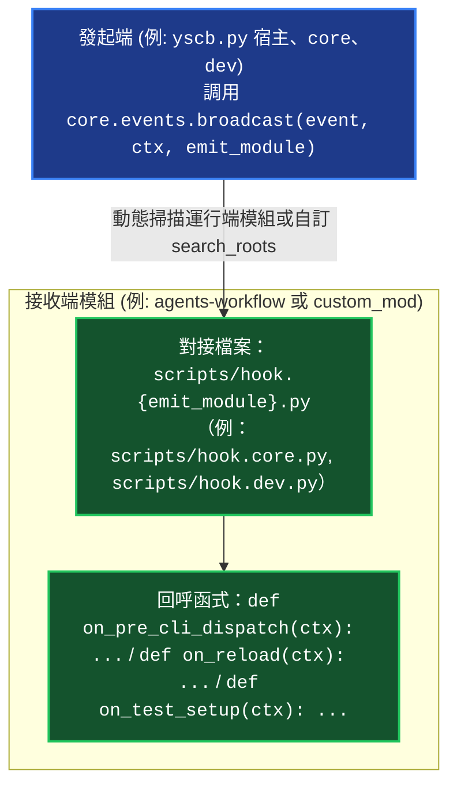

# 命名空間 Hook 與生命週期事件手冊 (Namespaced Hooks & Lifecycle Events)

> 本手冊為維度 3 中觀專題手冊，定義 YS-Codebase 精準命名空間 Hook 對接規範、`ExecutionContext` 介面、`core` 運行期事件廣播與 `dev` 測試前置 Hook (`scripts/hook.dev.py`) 調度機制。

---

## 1. 命名空間 Hook 對接模型 (Namespaced Hook Architecture)

為防止全域 Hook 名稱衝突與責任不清，系統嚴格採用「**以發起端模組為命名空間**」的檔案對接規範：



---

## 2. 接收端實作標準

若模組 `A` 想監聽來自發起端 `B`（預設為 `core`）派發的生命週期事件，必須遵循以下兩大規則：
1. **檔案路徑**：`.modules/{A}/scripts/hook.{B}.py`（原始碼中位於 `source/{A}/scripts/hook.{B}.py`）。
2. **函式定義**：函式名稱支援 `on_{event_name}` 與 `{event_name}` 雙向匹配，接收唯一參數 `context`（型別為 `ExecutionContext`）。

---

## 3. 核心發起端 Hook 規範

### 3.1 核心與宿主生命週期 Hook：`scripts/hook.core.py`
由 `yscb.py` 宿主與 `core` 模組在執行命令分發或模組生命週期操作時透過 `core.events.broadcast()` 廣播：
```python
# source/my_module/scripts/hook.core.py
from core.uri import ExecutionContext

def on_pre_cli_dispatch(context: ExecutionContext) -> bool:
    """在 CLI 命令分發前觸發，提供自癒與前置檢查（如 JIT 投影物化同步）"""
    return True

def on_post_cli_dispatch(context: ExecutionContext) -> None:
    """在 CLI 命令分發完成後觸發"""
    pass

def on_installed(context: ExecutionContext) -> None:
    """當 core 完成本模組安裝或依賴安裝時觸發"""
    print(f"[my_mod] Received on_installed for: {context.args}")

def on_reload(context: ExecutionContext) -> None:
    """當 core 完成環境重構與依賴注入刷新時觸發"""
    print("[my_mod] Runtime environment reloaded.")

def on_update(context: ExecutionContext) -> None:
    """當 core 完成模組升級時觸發"""
    pass

def on_remove(context: ExecutionContext) -> None:
    """當 core 移除模組前觸發"""
    pass
```

### 3.2 測試前置自治 Hook：`scripts/hook.dev.py`
由 `dev` 模組在 `SandboxProvisioner` (或 `dev op-mksb`) 建立微型虛擬沙盒時廣播：
```python
# source/core/scripts/hook.dev.py (或任意自訂模組)
from typing import Any

def on_test_setup(context: Any) -> None:
    """當微型虛擬環境建立時觸發，用於為沙盒配置該模組專屬初始設定"""
    context.set_module_config("core", "config.project.json", {
        "project_root": "../mock_downstream_project"
    })

def on_test_teardown(context: Any) -> None:
    """沙盒銷毀前清理 (選填)"""
    pass
```
> [!NOTE]
> `scripts/hook.dev.py` 會隨 `dev build` 完整保留在發布包中，允許第三方開發者在無源碼的發布環境下依然享有自治測試與環境初始化的能力。

---

## 4. `ExecutionContext` 介面定義

```python
from dataclasses import dataclass, field
from typing import Optional, List, Dict, Any

@dataclass(frozen=True)
class ExecutionContext:
    module_name: str                  # 發起或觸發事件的模組名稱
    command: Optional[str] = None     # 當前執行的子命令名稱
    args: List[str] = field(default_factory=list)      # 傳入命令或事件參數清單
    metadata: Dict[str, Any] = field(default_factory=dict) # 附帶之額外元數據
```

---

## 5. 異常隔離與強健性防護 (Fault Isolation)

Core 與 Dev 在遍歷調度各模組的 Hook 函式時，均實施嚴格的例外捕獲防護：

```python
try:
    handler_fn(context)
except Exception as e:
    print(f"[events] Warning: Hook '{mod}:hook.{emit_module}.py' failed on '{event_name}': {e}", file=sys.stderr)
```

> [!IMPORTANT]
> **單一 Hook 崩潰零擴散**：任何單一模組的 Hook 執行異常（語法錯誤、執行期例外）只會記錄 stderr Warning，絕不中斷發起端的主生命週期操作（如安裝、更新、重載、測試啟動）。

---

## 6. 模組資料三位一體與生命週期治理 (`--purge`)

YS-Codebase 確立三大資料空間語意與版本控制原則：
1. **`storage://` (持久化/Git 追蹤)**：業務資料與發布清冊（`storage/agents-workflow/release_manifest.json`），卸載時預設安全保留。
2. **`config://` (專案設定/Git 追蹤)**：專案設定檔（`config/core/config.project.json`），卸載時預設安全保留。
3. **`cache://` (快取暫存/Git 忽略)**：編譯快照、沙盒環境（`cache://dev/sandbox/`）與程序鎖（`cache://.yscb.lock`），卸載與重載時自動清空。

### 6.1 卸載治理行為
- **標準卸載 (`python yscb.py core remove <module>`)**：
  - 自動物理清空 `cache://{module}/`。
  - 安全保留 `storage://{module}/` 與 `config://{module}/`。
- **深度清除 (`python yscb.py core remove <module> --purge`)**：
  - 強制物理銷毀 `storage://{module}/`、`config://{module}/` 與 `cache://{module}/`。
  - 具備目錄邊界防護（EC-04），禁止逃逸出 `storage` 或 `config` 根空間。
