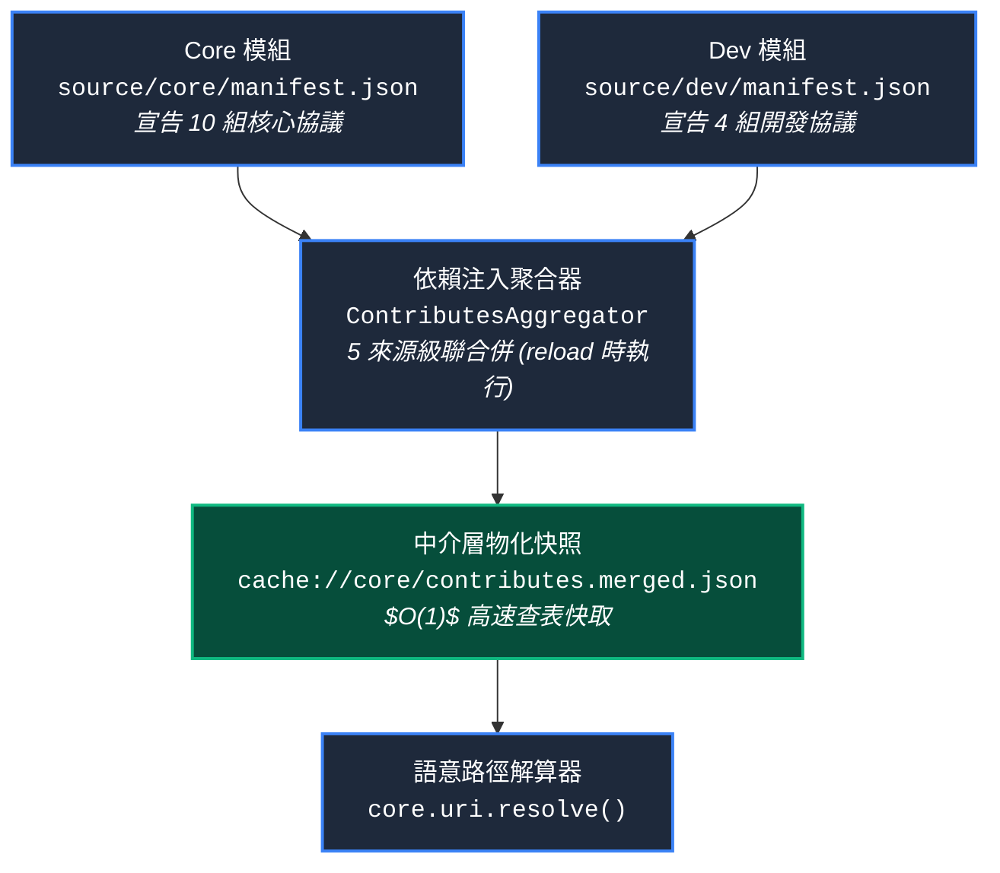

# 語意 URI 協議與動態解析專題手冊 (Semantic URI Protocol & Dynamic Resolution)

> 本手冊為維度 3 中觀專題手冊，詳細定義 YS-Codebase 語意 URI 協議、自宣告注入機制與 `project://` 零 Fallback 阻斷規範。

---

## 1. 語意 URI 核心原則與自宣告注入架構



---

## 2. 14 組自注入標準 URI 協議清單

| 協議 Token | 注入來源 | 類型 | 宣告值 (Value Template) | 說明 |
| :--- | :---: | :---: | :--- | :--- |
| **`yscb://`** | `core` | `const` | `{yscb_root}` | 工具庫根目錄 |
| **`mirror://`** | `core` | `const` | `yscb://.mirror/` | 本地模組鏡像庫 |
| **`temp://`** | `core` | `const` | `yscb://.temp/` | 系統隔離暫存區 |
| **`snapshot://`** | `core` | `const` | `yscb://.snapshots/` | 組態歷史快照目錄 |
| **`module.root://`** | `core` | `const` | `yscb://modules/` | 模組運行端根目錄 |
| **`module://`** | `core` | `const` | `yscb://modules/{module}/` | 特定模組運行端專屬目錄 |
| **`config.root://`** | `core` | `const` | `yscb://config/` | 模組設定檔根目錄 |
| **`config://`** | `core` | `const` | `yscb://config/{module}/` | 特定模組設定檔目錄 |
| **`cache.root://`** | `core` | `const` | `yscb://.cache/` | 模組快取根目錄 |
| **`cache://`** | `core` | `const` | `yscb://.cache/{module}/` | 特定模組快取目錄 |
| **`module.source.root://`** | `dev` | `const` | `yscb://source/` | 模組源碼開發根目錄 |
| **`module.source://`** | `dev` | `const` | `yscb://source/{module}/` | 特定模組源碼目錄 |
| **`module.build.root://`** | `dev` | `const` | `yscb://build/` | 純淨安裝產物根目錄 |
| **`module.build://`** | `dev` | `const` | `yscb://build/{module}/` | 特定模組純淨產物目錄 |

---

## 3. `project://` 顯式配置與零 Fallback 阻斷規範

### 3.1 解算規則
`project://` 不在自舉最小集中，專門用於跨層級定位被管理專案的根目錄：
- **唯一配置來源**：`yscb://config/core/config.project.json` 中配置之 `project_root` 鍵。
- **預設值**：`"!undefined"`。
- **相對路徑基準**：相對於宿主目錄（包含 `yscb.config.json` 之目錄）。

### 3.2 阻斷行為 (Zero Speculation)
```python
# 若未宣告 project_root 或值為 "!undefined"：
uri.resolve("project://AGENTS.md")

# 立即拋出顯式例外：
# ValueError: 'project://' is undefined. Please configure 'project_root' in config://config.project.json (core)
```
> [!CAUTION]
> **完全禁止 Fallback 猜測**：微內核絕對禁止在 `project_root` 未定義時自行 Fallback 猜測當前工作目錄（`os.getcwd()`），以徹底避免跨不同作業系統與 IDE 環境時的路徑漂移。

---

## 4. 動態佔位符與中介快照載入機制

1. **`{module}` 佔位符動態替換**：
   - 當 URI 包含 `{module}` 且未傳入 `current_module` 時，優先讀取執行期上下文 `get_module_context()`，預設為 `"core"`。
2. **`type: "config"` 動態組態解算**：
   - 支援將 URI 指向 `config.project.json` 中的巢狀鍵（例：`"paths.plans_dir"`），自動展開為絕對實體路徑。
3. **中介層物化快照 (`cache://core/contributes.merged.json`)**：
   - `core.uri` 動態自快取區讀取預先編譯好的協議表，達成 $O(1)$ 的前綴比對與路徑解析。

---

## 5. `yscb://` 常數確定性自定位與 Host Context 注入 (Zero Speculation)

### 5.1 `yscb://` 常數自定位
`yscb://` 為整個 VFS 的最底層絕對錨點，其路徑直接基於 `core.uri` 模組自身的檔案位置（`__file__` 往上 3 層）確定性常數計算得出，**完全不需要依賴、也不需要讀取 `yscb.config.json`**，徹底終結向上動態爬目錄與 `os.getcwd()` 猜測。

### 5.2 宿主 Context 注入
- 宿主 `yscb.py` 在派發子程序時自動注入 `os.environ["YSCB_HOST_DIR"]`。
- Python SDK 提供 `core.uri.set_host_dir(path)` / `get_host_dir()` 作為程式碼調用通道。
- `core.engine` 內部直接依賴 `host_dir` 讀寫 `yscb.config.json`，徹底與 `project://` 解耦。

