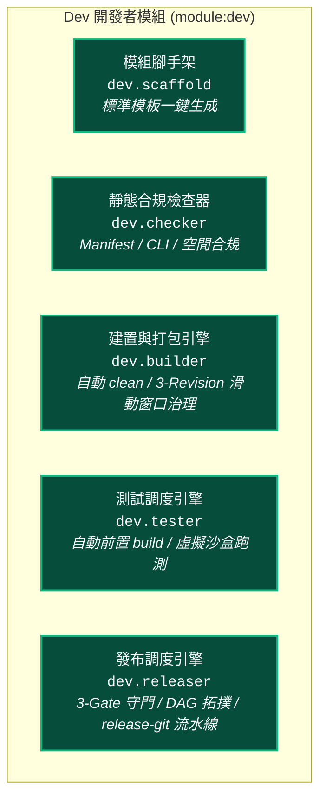

# Dev 開發者工具鏈概覽手冊 (Developer Toolchain Overview)

> 模組名稱：`dev`  
> 模組版本：`1.0.0`  
> 職責定位：YS-Codebase 官方開發者工具箱（模組腳手架、靜態合規檢查、開發與純淨發布套件打包、時序滑動窗口產物治理、端到端沙盒測試引擎與安全版本發布流水線）。

---

## 1. Dev 工具鏈五大核心引擎

---

## 2. CLI 指令矩陣快速索引

| 指令群組 | 指令語法 | 核心職責說明 |
| :--- | :--- | :--- |
| **模組建立** | `python yscb.py dev create <name> [--desc="..."]` | 一鍵生成標準模組骨架與設定 |
| **合規檢查** | `python yscb.py dev check [name \| --all]` | 驗證 `manifest.json`、`scripts/cli.py` 語法與規範 |
| **開發建置** | `python yscb.py dev build [name \| --all]` | 自動清空目標目錄，打包 `<ver>.build.zip`（保留 `tests/`） |
| **版本管理** | `python yscb.py dev bump-[major\|minor\|patch\|revision] <name>` | 對模組 `manifest.json` 版本號進行單向遞增 |
| **發布預檢** | `python yscb.py dev release-check <name> [--force\|-f]` | 獨立執行 3-Gate 發布就緒校驗（合規、不可變、單調性，支援 force 放行同版本） |
| **純淨發布** | `python yscb.py dev release [name \| --all] [--force\|-f]` | 通過 3-Gate 後純淨打包（排除 `tests/` 與 `.yscbignore`），支援 `--force` 原地覆蓋同版本 |
| **安全發布** | `python yscb.py dev release-git <name> "<msg>" [--force\|-f]` | 智慧感應：未發布則打包，已發布自動略過打包（加 `--force` 重新覆蓋），接續本地 git commit & tag（🚨 嚴禁 remote push） |
| **沙盒測試** | `python yscb.py dev test [name \| --all] [--quiet] [--no-build] [--sync] [opts]` | 自動前置 build ➔ 配置沙盒 ➔ 跑測 ➔ 銷毀環境（支援 `--quiet` / `-q` 節流單行輸出、`--sync` 測試通過自動直裝 `@build` 本地產物） |
| **原子操作** | `python yscb.py dev op-mksb [--dir=<path>]` | 手動建立微型虛擬沙盒（除錯用） |
| **原子操作** | `python yscb.py dev op-test [name \| --all] [opts]` | 原地執行單元測試（無沙盒） |

---

## 3. 模組文件導航

- [架構規格手冊 (architecture.md)](./architecture.md)：五層分層架構、3-Gate 守門模型與 3-Revision 滑動窗口演算法。
- [完整使用手冊 (user_guide.md)](./user_guide.md)：CLI 指令詳細用法、參數說明與範例。
- [發布產物治理專題手冊 (topics/release_governance.md)](./topics/release_governance.md)：時序滑動窗口原理、跨三元組收斂、實體 SSOT 索引機制。
- [沙盒測試指南 (testing_guide.md)](./testing_guide.md)：沙盒架構、測試發現與契約測試規範。
