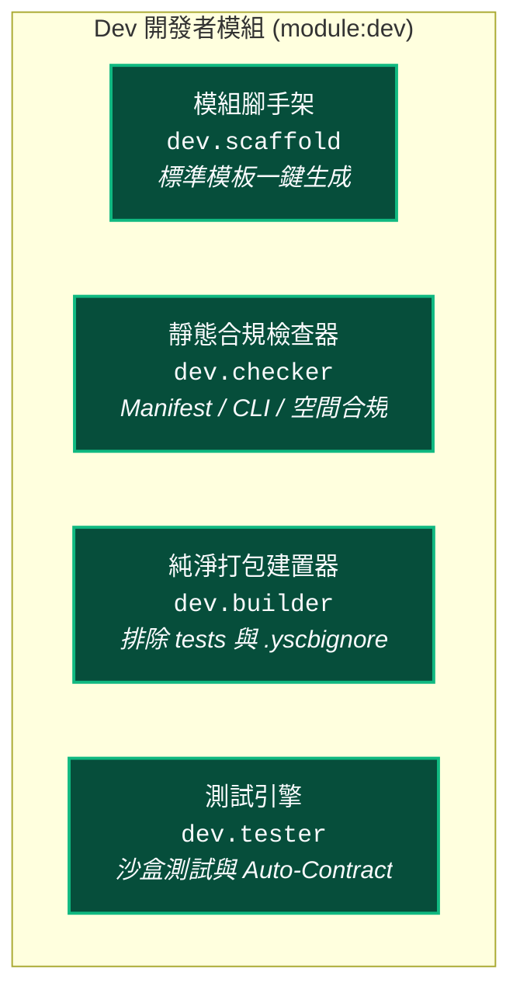

# Dev 開發者工具鏈架構手冊 (Developer Toolchain Overview)

> 模組名稱：`dev`  
> 模組版本：`1.0.0`  
> 職責定位：YS-Codebase 官方開發者工具箱（模組腳手架、靜態合規檢查、純淨套件打包、單元/契約測試引擎）。

---

## 1. Dev 工具鏈架構 (Toolchain Architecture)



---

## 2. CLI 指令手冊

### 2.1 建立新模組 (`dev create`)
```bash
# 在 source/ 目錄下一鍵生成符合規範的模組骨架
python yscb.py dev create <module_name> [--description="..."]
```
- 自動生成檔案：`manifest.json`、`scripts/cli.py`、`{module}/__init__.py`、`.yscbignore`、`tests/test_basic.py`。

### 2.2 靜態合規檢查 (`dev check`)
```bash
# 檢查單一模組
python yscb.py dev check <module_name>

# 檢查 source/ 下所有模組
python yscb.py dev check --all
```
- 驗證清單：
  1. `manifest.json` 是否存在且符合 SemVer 規範；
  2. `scripts/cli.py` 是否存在、具備 `main(argv)` 函式且 Python 語法無錯誤；
  3. `.yscbignore` 是否存在。

### 2.3 純淨套件打包 (`dev build`)
```bash
# 打包單一模組至 build/<module>/<version>/
python yscb.py dev build <module_name> [--clean]

# 打包 source/ 下所有模組
python yscb.py dev build --all [--clean]
```
- 打包行為：
  1. 自動排除 `tests/`、`__pycache__/` 與 `.yscbignore` 中定義之模式；
  2. 在輸出之 `manifest.json` 自動打上 `built_at` ISO 時間戳記；
  3. 自動掃描並更新 `build/{module}/index.json` 版本清冊（`name`, `description`, `versions: [...]` SemVer 升序排列），供遠端或本地 Provider 清單檢索與相依求解。

### 2.4 執行測試與沙盒操作 (`dev test` / `dev op-mksb` / `dev op-test`)
```bash
# 【高階端到端】自動建立沙盒 ➔ 執行測試 ➔ 自動銷毀
python yscb.py dev test --all --verbose
python yscb.py dev test <module_name>
python yscb.py dev test --all --contract-only

# 【原子操作：環境工廠】手動建立微型虛擬沙盒（供互動除錯）
python yscb.py dev op-mksb [--dir=<custom_path>]

# 【原子操作：原地執行】在當前環境原地執行單元測試（零沙盒、零遞迴）
python yscb.py dev op-test [module_name | --all] [--type=<logic|host_cli|network>] [-k <pattern>]
```

