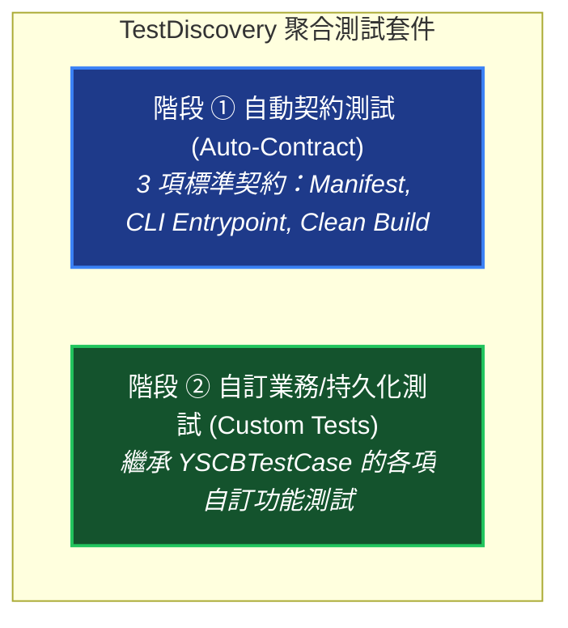

# Dev 測試框架與沙盒指南 (Testing Framework & Sandbox Guide)

> 本手冊為維度 3 中觀專題手冊，定義 YS-Codebase 測試體系、`YSCBTestCase` 隔離沙盒生命週期與 Auto-Contract 自動契約測試機制。

---

## 1. 兩階段測試架構 (Two-Phase Testing Architecture)



---

## 2. 核心測試基類：`YSCBTestCase`

所有 YS-Codebase 測試案例均應繼承 `dev.testing.YSCBTestCase`，具備開箱即用的隔離沙盒環境：

```python
from dev.testing import YSCBTestCase
from core import uri

class TestMyFeature(YSCBTestCase):
    def test_isolated_sandbox_io(self):
        # 1. 每個測試方法自動擁有獨立的 temp://sandbox_<uuid> 空間
        test_file = f"{self.sandbox_uri}/data.json"
        
        uri.write_json(test_file, {"status": "ok"})
        self.assertFileExists(test_file)
        self.assertJsonEquals({"status": "ok"}, test_file)
        
        # 2. 測試通過時標記，以觸發 tearDown 安全自動清理
        self.mark_passed()
```

### 2.1 沙盒生命週期與除錯防呆
- **`setUp()`**：自動建立 `temp://sandbox_<uuid>` 實體目錄，並備份 `sys.path` 與 `os.environ`。
- **`tearDown()`**：
  - 若測試呼叫了 `self.mark_passed()` 且未開啟保留開關，則**自動清理刪除該沙盒**。
  - 若測試失敗（AssertionError / Exception），則**自動保留現場並在終端輸出沙盒路徑**，供開發者實機除錯！
- **環境變數控制**：
  - `YSCB_TEST_KEEP_SANDBOX=1`：強制保留所有測試沙盒目錄。

---

## 3. Auto-Contract 自動契約測試機制

為杜絕傳統專案「只測功能、不測打包與進入點」的盲區，Dev 測試引擎會在執行期自動為所有模組動態合成 3 項契約測試：

| 契約編號 | 契約名稱 | 驗證標準 |
| :--- | :--- | :--- |
| **Contract 1** | `test_contract_manifest_schema` | 驗證 `manifest.json` 必填欄位完整，且 `version` 嚴格符合 SemVer 2.0.0 規範。 |
| **Contract 2** | `test_contract_entrypoint_valid` | 驗證 `scripts/cli.py` 存在、無語法錯誤，且具備 `def main(argv: List[str]) -> int:` 進入點。 |
| **Contract 3** | `test_contract_clean_build` | 呼叫 `Builder` 執行純淨打包，驗證產物輸出至 `build/{mod}/{ver}/`，且 `tests/` 確實被排除。 |

---

## 4. 斷言輔助庫 (Assertion Helpers)

`YSCBTestCase` 提供語意化斷言輔助函式：

```python
# 斷言 CLI 回傳碼為 0
self.assertSuccess(returncode, "Command failed")

# 斷言終端輸出包含特定文字
self.assertInOutput("Healthy", stdout)

# 斷言實體路徑或語意 URI 存在
self.assertFileExists("config://config.project.json")

# 斷言 JSON 內容精準相等
self.assertJsonEquals({"project_root": "./"}, "config://config.project.json")

# 斷言執行期耗時小於特定秒數
with self.assertExecutionTime(max_seconds=0.05):
    uri.resolve("config://settings.json")
```
