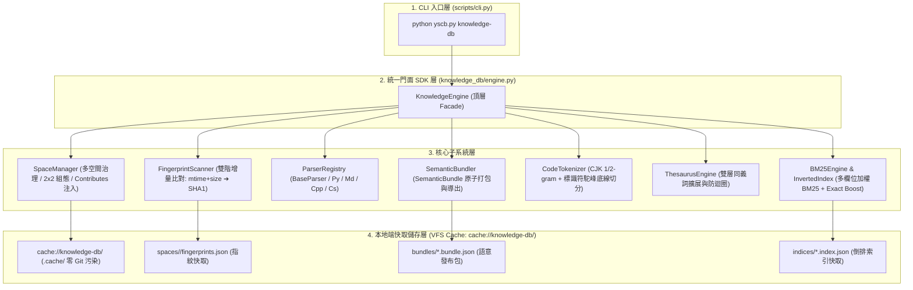
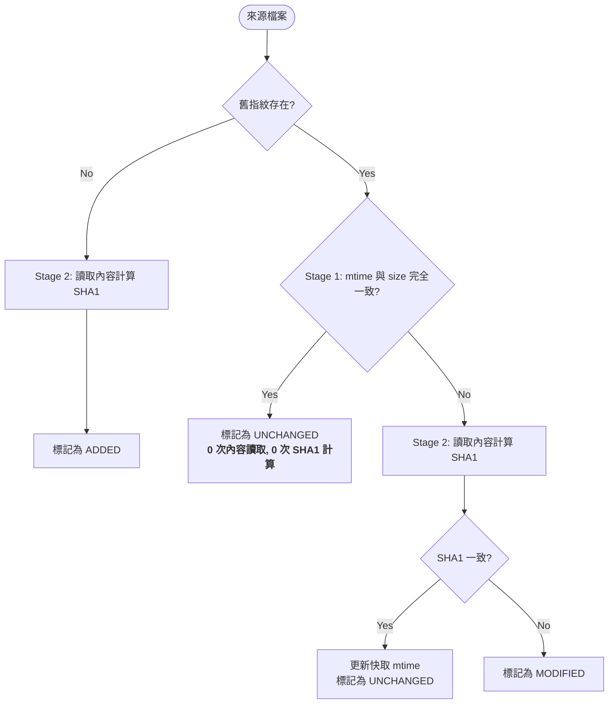

# knowledge-db 全系統整合架構設計 (System Architecture)

> 本文件說明 `knowledge-db` 模組的完整系統架構分層、頂層統一門面 (`KnowledgeEngine`)、空間治理、語意打包與多欄位加權 BM25 檢索機制。

---

## 1. 全系統架構分層 (System Layering Architecture)

---

## 2. 空間管理與雙階增量比對 (Space & Fingerprint)

### 2.1 雙軌來源聚合 (Dual-Track Aggregation)
1. **軌道 ① 模組聯動注入 (Module Contributes)**：搜集所有安裝模組之 `contributes.knowledge-db.json` 或 `manifest.json`。
2. **軌道 ② 2x2 組態矩陣宣告 (Config Matrix)**：讀取 `config.project.json` (專案層級) 與 `config.local.json` (本機層級)。

### 2.2 全空間聯集處理模型 (Union Scope Model)
`knowledge-db` 廢除單一 `default_space` 的限制，全系統以所有註冊空間之聯集作為全域處理範圍：
$$\text{Scope} = \bigcup_{i=1}^{N} \text{Space}_i$$

### 2.3 雙階增量指紋比對引擎 (Two-Stage Fingerprint Engine)

---

## 3. 多欄位加權 BM25 檢索與自動懶索引 (Retrieval & Lazy Indexing)

### 3.1 多欄位權重矩陣
| 欄位 | 權重 | 說明 |
| :--- | :---: | :--- |
| **`Name`** | **3.5** | 符號名稱或 Markdown 標題 (最高優先級) |
| **`Signature`** | **2.0** | 函式/類別簽名 (含參數與型別) |
| **`Members`** | **2.0** | 類別公開成員方法與屬性清單 |
| **`Docstring`** | **1.5** | 註解說明與文檔段落內文 |

### 3.2 評分增強機制
- **平滑 IDF**：$\ln(1 + \max(0, \frac{N - n + 0.5}{n + 0.5}))$，防止高頻詞出現負權重。
- **Exact Match Boost**：查詢詞完全精確匹配符號名稱時，賦予 **2.0x 置頂加權**。
- **透明懶加載 (Lazy Indexing)**：呼叫 `search()` 時若目標空間索引尚未建立，系統自動透明觸發增量打包與索引建置，免除使用者手動初始化的負擔。
