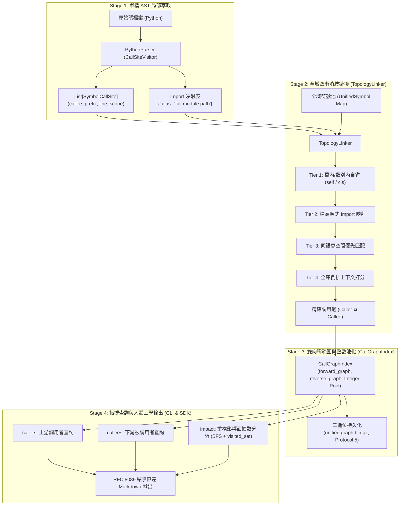

# 符號調用圖譜與引用拓撲索引專題手冊 (Call Graph & Reference Index)

> 模組：`knowledge-db`  
> 核心組件：`linker.py` (`TopologyLinker`), `graph.py` (`CallGraphIndex`), `engine.py`, `scripts/cli.py`  
> 版本：`1.0.0.0` (sub_13)  

---

## 1. 架構全景與核心機制 (Architecture & Principles)

本專題為 `knowledge-db` 注入全域符號調用圖譜 (Call Graph) 與引用依賴拓撲能力，解決過去僅能搜尋定義 (Definitions) 而無法感知「誰調用了我 (Callers)」與「我調用了誰 (Callees)」的痛點。



---

## 2. 四階消歧鏈接演算法 (4-Tier Disambiguation Cascade)

在缺乏 Runtime 動態型別的情況下，`TopologyLinker` 透過四階漸進式消歧策略實現 90%~95% 的靜態調用精準度：

1. **Tier 1 (Self / Class Scope)**：
   - 當調用前綴為 `self` 或 `cls` 時，優先在呼叫者所屬類別內部綁定同名方法。
   - 當調用為裸函式呼叫且同檔案內有定義時，直接綁定檔內符號。
2. **Tier 2 (Explicit Import Alias)**：
   - 查閱檔頭 `import` 映射（例如 `from knowledge_db.retrieval import InvertedIndex as LocalIndex`）。
   - 當呼叫 `LocalIndex.load_binary()` 時，精準定位到 `retrieval.py` 內的 `InvertedIndex.load_binary` 符號。
3. **Tier 3 (Same Space Scope)**：
   - 若無顯式 Import，優先在調用源所屬的語意空間（如 `project://` 或 `yscb://`）內搜尋同名符號，防止跨空間命名污染。
4. **Tier 4 (Global Context Scoring)**：
   - 當全庫存在多個同名候選者時，比對調用上下文前綴（`context_prefix`）與候選者所屬類別或模組名稱之相似度，選取最佳符號；無法確定時標記為動態未鏈接邊，永不拋出異常。

---

## 3. 雙向圖索引與二進位持久化 (`CallGraphIndex`)

- **整數池化 (Integer String Pool)**：
  - 符號字串 ID 映射為遞增整數 `int`，鄰接表僅以 `Dict[int, Set[int]]` 儲存出入度邊，全專案 5,000+ 條調用邊在記憶體中佔用 $< 5\text{ MB}$。
- **Protocol 5 + Gzip 高速寫盤**：
  - 持久化儲存於 `cache://knowledge-db/indices/unified.graph.bin.gz`，檔案體積 $< 150\text{ KB}$，反序列化載入耗時 $< 5\text{ ms}$。
- **JIT 增量熱修補 (`patch_incremental`)**：
  - 檔案變更時，差量拔除舊檔案作為 Caller 與 Callee 的雙向鄰接邊，重新注入新調用邊，端到端熱自愈耗時僅需 20~50ms。

---

## 4. CLI 工具指令說明

```bash
# 1. 查詢誰調用了目標符號 (Upstream Callers)
python yscb.py knowledge-db callers "InvertedIndex.load_binary" -s

# 2. 查詢目標符號內部調用了哪些底層符號 (Downstream Callees)
python yscb.py knowledge-db callees "KnowledgeEngine.build_unified_index" -s

# 3. 分析目標符號重構時的影響擴散半徑 (Blast Radius Impact)
python yscb.py knowledge-db impact "InvertedIndex.patch_incremental" --depth=2

# 4. 輸出結構化 JSON 格式 (供自動化工具鏈串接)
python yscb.py knowledge-db callers "InvertedIndex.load_binary" --json
python yscb.py knowledge-db impact "InvertedIndex.patch_incremental" --depth=3 --json
```
