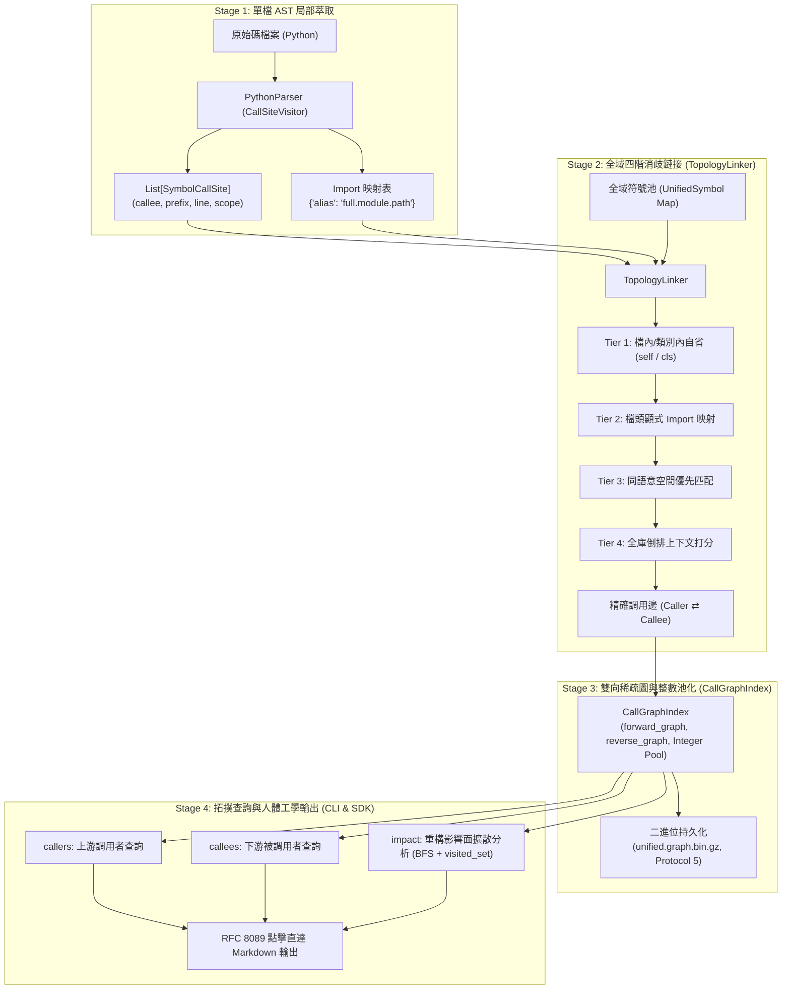

# 符號調用圖譜與引用拓撲索引專題手冊 (Call Graph & Reference Index)

> 模組：`knowledge-db`  
> 核心組件：`linker.py` (`TopologyLinker`), `graph.py` (`CallGraphIndex`), `engine.py`, `scripts/cli.py`  
> 版本：`1.0.0.0` (sub_13)  

---

## 1. 架構全景與核心機制 (Architecture & Principles)

本專題為 `knowledge-db` 注入全域符號調用圖譜 (Call Graph) 與引用依賴拓撲能力，解決過去僅能搜尋定義 (Definitions) 而無法感知「誰調用了我 (Callers)」與「我調用了誰 (Callees)」的痛點。



---

## 2. 四階消歧鏈接演算法 (4-Tier Disambiguation Cascade)

在缺乏 Runtime 動態型別的情況下，`TopologyLinker` 透過四階漸進式消歧策略實現 90%~95% 的靜態調用精準度：

1. **Tier 1 (Self / Class Scope)**：
   - 當調用前綴為 `self` 或 `cls` 時，優先在呼叫者所屬類別內部綁定同名方法。
   - 當調用為裸函式呼叫且同檔案內有定義時，直接綁定檔內符號。
2. **Tier 2 (Explicit Import Alias)**：
   - 查閱檔頭 `import` 映射（例如 `from knowledge_db.retrieval import InvertedIndex as LocalIndex`）。
   - 當呼叫 `LocalIndex.load_binary()` 時，精準定位到 `retrieval.py` 內的 `InvertedIndex.load_binary` 符號。
3. **Tier 3 (Same Space Scope)**：
   - 若無顯式 Import，優先在調用源所屬的語意空間（如 `project://` 或 `yscb://`）內搜尋同名符號，防止跨空間命名污染。
4. **Tier 4 (Global Context Scoring)**：
   - 當全庫存在多個同名候選者時，比對調用上下文前綴（`context_prefix`）與候選者所屬類別或模組名稱之相似度，選取最佳符號；無法確定時標記為動態未鏈接邊，永不拋出異常。

---

## 3. NetworkX 雙向有向圖與二進位持久化 (`CallGraphIndex`)

- **NetworkX DiGraph 工業級圖模型**：
  - 採用 `networkx.DiGraph` 作為核心拓撲資料結構，節點為符號 ID，邊保存 `call_sites` 調用點資料。
  - 直接透過 `G.predecessors(v)` 與 `G.successors(u)` 達成 sub-毫秒級雙向檢索。
- **Protocol 5 + Gzip 高速寫盤**：
  - 持久化儲存於 `cache://knowledge-db/indices/unified.graph.bin.gz`，檔案體積 $< 150\text{ KB}$，反序列化載入耗時 $< 5\text{ ms}$。
- **JIT 增量熱修補 (`patch_incremental`)**：
  - 檔案變更時，差量拔除舊檔案作為 Caller 與 Callee 的雙向邊，重新注入新調用邊，端到端熱自愈耗時僅需 20~50ms。

---

## 4. 全方位 AST 符號結構化選擇器 (SymbolSelector)

CLI 指令（`callers`, `callees`, `impact`, `search`）支援更完備的結構化微型語法，調用者可提供精確層次資訊定位目標：

| 語法模式 | 範例 | 說明 |
| :--- | :--- | :--- |
| **名稱** | `foo` | 任何名為 `foo` 的符號節點 |
| **範疇.名稱** | `Foo.bar` | 在 `Foo` 範疇（類別/模組/父節點）中名為 `bar` 的節點 |
| **可調用尾碼** | `run()` / `Worker.run()` | 限定符號類型為可調用（Function / Method）之節點 |
| **類型前綴** | `class Foo` | 限定為類別節點 |
| | `struct Point` | 限定為結構節點 |
| | `interface IService` | 限定為介面節點 |
| | `enum Color` | 限定為列舉節點 |
| | `fn init()` / `def init()` | 限定為函式/方法 |
| | `type ID` / `const MAX` / `var count` | 限定為別名、常數或變數 |
| **正交複合** | `class Engine.setup()` | 在 `Engine` 類別內名為 `setup` 的可調用方法 |
| | `struct Point.x` | 在 `Point` 結構內名為 `x` 的成員 |

---

## 5. 多語言調用拓撲協議 (LanguageTopologyProtocol)

系統透過 `LanguageTopologyProtocol` 抽象協議將各語言的 AST 調用點與 Import 映射萃取解耦，支援 Python、JavaScript/TypeScript、C/C++、C# 等語言外掛註冊至 `TopologyProtocolRegistry`。

---

## 6. CLI 指令人體工學輸出 (Ergonomic CLI Usage)

```bash
# 查詢誰調用了 TopologyLinker 的 resolve_call_site 方法 (支援 SymbolSelector)
python yscb.py knowledge-db callers "TopologyLinker.resolve_call_site()" --snippet

# 查詢特定結構的下游調用
python yscb.py knowledge-db callees "struct Point"

# 分析特定類別重構的多階擴散影響面
python yscb.py knowledge-db impact "class CallGraphIndex" --depth=2

# 輸出結構化 JSON 格式 (供自動化工具鏈串接)
python yscb.py knowledge-db callers "InvertedIndex.load_binary" --json
python yscb.py knowledge-db impact "InvertedIndex.patch_incremental" --depth=3 --json
```
