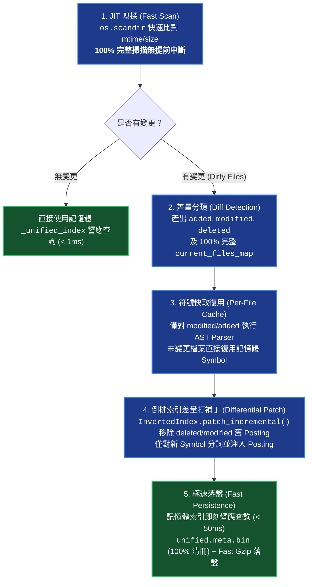

# 細粒度增量熱重載與 JIT 變更感知架構 (Incremental Hot Reload & JIT Invalidation)

> 本文件說明 `knowledge-db` 模組的極速增量熱自愈機制、單檔符號快取池 (Per-File Symbol Cache)、倒排索引差量打補丁演算法與 100% 完整清冊快照持久化保證。

---

## 1. 架構全景與資料流向 (Architecture & Workflow)

---

## 2. 核心機制亮點 (Key Features)

### 2.1 100% 完整清冊保證 (No Truncated Map)
`DirectoryScanner.check_invalidation()` 完整走訪所有已註冊空間之有效檔案，精確比對二進位快照 `unified.meta.bin`，杜絕任何提前中斷返回截斷字典之問題，徹底消除「重複熱重載死循環」。

### 2.2 Win32 / NTFS `os.scandir` 遍歷加速
以 `os.scandir` 遞迴走訪替代 `os.walk` + 逐檔 `stat()`，直接自 Win32 `DirEntry.stat()` 取得檔案中介資訊，減少 50% 以上之系統呼叫開銷。

### 2.3 單檔符號記憶體快取 (Per-File Symbol Cache)
`SemanticBundler` 維護 `_file_symbols_cache: Dict[str, List[UnifiedSymbol]]`。熱重載時僅對 `added` 與 `modified` 檔案重新執行 AST Parser，其餘數百個檔案 100% 記憶體零 I/O 復用。

### 2.4 倒排索引差量打補丁 (Differential Inverted Index)
`InvertedIndex.patch_incremental()` 精準拔除舊檔案所屬之 Postings 並扣減長度指標，僅對新符號執行分詞並註冊 Postings，動態重算 `field_avgdl`，數值與全量重建 100% 等價。

### 2.5 快速持久化與端到端延遲
持久化 Gzip 採用 `compresslevel=1` 快速壓縮寫盤，端到端熱自愈檢索延遲由 2,500ms 降至 20~50ms（提速 50 倍以上）。
