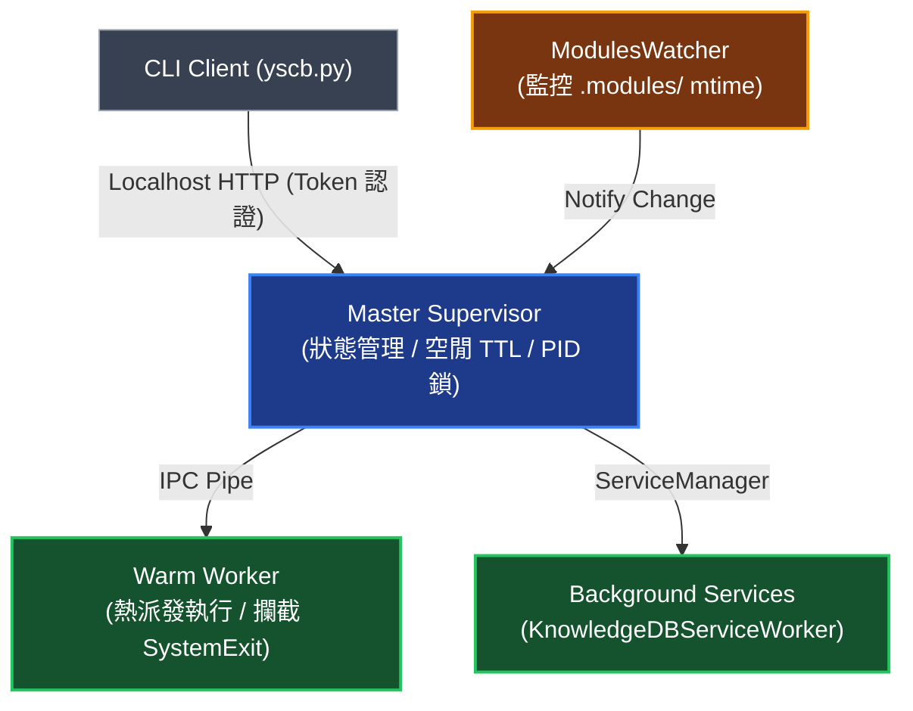

# 熱重載與常駐 Worker 架構專題 (Service Workers & Hot Reload Architecture)

> 本手冊定義 YS-Codebase 生態系中常駐守護中樞、Warm Worker 派發、領域背景服務掛載與雙軌自動熱重載之架構拓撲與協調機制。

---

## 1. 常駐守護架構與中樞模型 (Unified Server & Worker Topology)

全生態系常駐守護進程、預熱 Warm Worker、以及各領域模組之背景服務（如 `KnowledgeDBServiceWorker`），均由 `server` 模組統一承載與調度：



- **Master Supervisor**：負責管理 Localhost HTTP 服務、安全 Token、PID 鎖與空閒自毀（Idle TTL）。
- **Warm Worker**：常駐預熱進程，序列化執行派發任務並攔截 `SystemExit` 保證進程穩定。
- **Background Services**：領域模組透過 `BaseServiceWorker` 介面註冊至 `server`，享有統一的啟動、健康檢查與退場生命週期治理。

---

## 2. Modules Watcher 變更感知與雙軌熱重載 (ModulesWatcher Dynamics)

`ModulesWatcher` 以輕量級 `mtime` 快照監聽專案部署目錄（`.modules/`），當模組完成安裝、更新或重編譯（如 `@build`）時自動觸發雙軌重載：

| 變更模組類型 | 重載動作 | 機制說明 |
| :--- | :--- | :--- |
| **領域業務模組** (如 `knowledge-db`, `dev`) | **重啟 Warm Worker** | 優雅終止舊 Worker 並啟動全新 Worker 進程，100% 刷新代碼記憶體且不中斷 Master。 |
| **核心平台模組** (`server`, `core`) | **重啟整個 Server** | 優雅關閉所有背景服務與 Worker，由 Master 自我重啟，確保通訊與底層協議完全一致。 |

---

## 3. 背景服務掛載協議 (Service Worker Protocol)

領域模組若需常駐背景監聽或非同步索引，可實作 `server.service.BaseServiceWorker` 協議：

```python
class BaseServiceWorker(ABC):
    @property
    @abstractmethod
    def name(self) -> str:
        """服務唯一識別名稱"""
        pass

    @abstractmethod
    def start(self, context: Dict[str, Any]) -> None:
        """啟動背景任務與監聽線程"""
        pass

    @abstractmethod
    def stop(self) -> None:
        """優雅停止服務並釋放資源"""
        pass

    @abstractmethod
    def health_check(self) -> bool:
        """回傳服務是否健康運行"""
        pass
```

### 3.1 實例：Knowledge-DB Service Worker
`knowledge-db` 模組透過 `KnowledgeDBServiceWorker` 掛載於 `server` 中樞：
- **500ms 防抖監聽**：透過 Watchdog 監控工作區檔案變更，防抖聚合 Burst Save 事件。
- **增量全棧修補**：呼叫 `IndexingPipeline.hot_patch_unified_index`，一次性完成 AST、倒排索引 (BM25)、調用圖譜 (Graph) 與向量嵌入 (Vector) 之差量更新。
- **零前台阻塞**：前台 CLI 查詢直接讀取已更新之記憶體/磁碟快取，零推論延遲。

---

## 4. 運行期狀態可觀測性 (Runtime Observability)

系統提供結構化 HTTP API 與 CLI 指令，即時觀測 Server、Worker、Watcher 與背景服務狀態：

### 4.1 CLI 狀態檢視
```bash
python yscb.py server status
```

輸出範例：
```text
======================================================================
YS-Codebase Server Daemon Status
======================================================================
[*] State         : READY
[*] Master PID    : 26138
[*] Worker PID    : 26145 (Alive)
[*] Port          : 42939
[*] Workspace Root: /workspace/ys-codebase/ys_codebase
[*] Tasks Handled : 1
[*] Idle TTL Left : 899.9s
[*] Modules Watcher: ACTIVE (Monitoring .modules/)
======================================================================
```

### 4.2 HTTP 狀態端點 (`GET /api/status`)
回傳之 JSON 負載包含完備之 `watcher` 狀態字典：
```json
{
  "status": "running",
  "state": "ready",
  "pid": 26138,
  "worker_pid": 26145,
  "port": 42939,
  "watcher": {
    "enabled": true,
    "active": true,
    "monitored_dir": "/workspace/ys-codebase/ys_codebase/.modules"
  },
  "services": [
    {
      "name": "knowledge-db-worker",
      "provider": "knowledge-db",
      "alive": true
    }
  ]
}
```

---

## 5. 日常維運與管理操作 (Operations Cheatsheet)

```bash
# 啟動常駐 Server (自動掛載所有已註冊之背景服務)
python yscb.py server start

# 手動熱重載 Worker (刷新業務代碼)
python yscb.py server reload

# 檢視運行狀態與可觀測性指標
python yscb.py server status

# 優雅停止常駐服務
python yscb.py server stop
```
