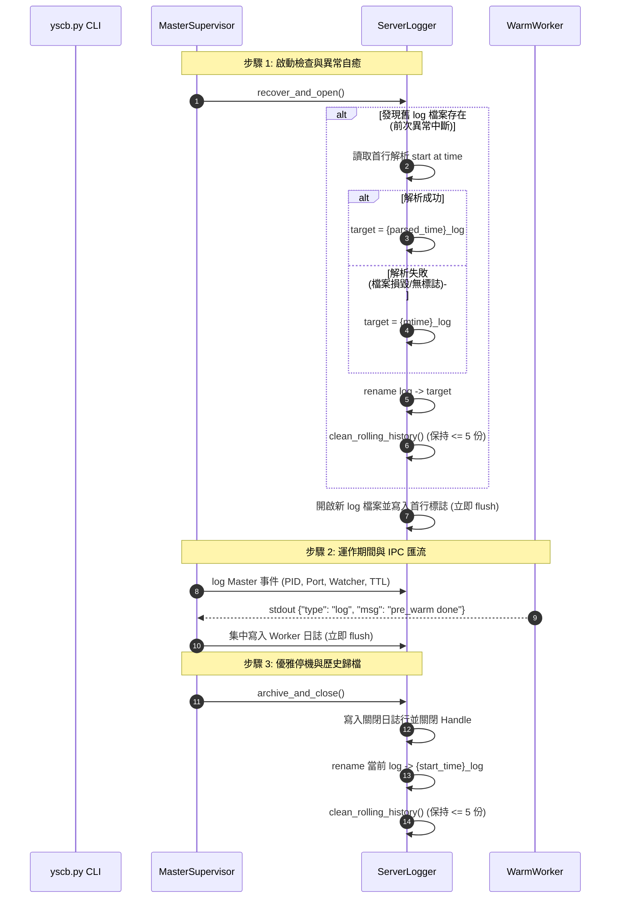

# Server 即時 Flush 日誌與歷史滾動自癒指南 (Realtime Logging & Crash Recovery)

> 適用模組：`server` (`v1.0.0+`)  
> 核心類別：`server.logger.ServerLogger`、`server.master.MasterSupervisor`

---

## 1. 架構概述 (Architecture Overview)

Server 模組自此版本起導入即時 flush 日誌與啟動歷史自癒機制，以滿足後台守護進程的運維可觀測性、除錯追蹤與極限中斷下的日誌完整性：

1. **即時 Flush (Zero-Buffered Disk Write)**：
   - 當前運行中日誌固定存放於語意路徑 `cache://server/log`（實體路徑為 `.cache/server/log`）。
   - 所有日誌行在寫入時強制調用 `file.flush()`，直接將用戶空間緩衝刷入作業系統 Page Cache，杜絕 `kill -9`、進程崩潰或斷電時的日誌丟失。
2. **啟動歷史自癒 (Crash Recovery Archival)**：
   - 新 Server 啟動時，若偵測到目錄下遺留未正常歸檔之舊 `log` 檔案，在建立新日誌前會優先將其歸檔為歷史日誌 `{YYYY}_{MM}_{DD}_{HH}.{MM}.{SS}_log`。
   - 時間戳判定優先解析舊日誌首行的啟動標誌；若首行損毀或無標誌則安全退化為該檔案之最後修改時間 (`mtime`)。
3. **歷史檔案 5 份滾動保留 (Rolling Retention <= 5)**：
   - 歷史檔案嚴格以正則 `^\d{4}_\d{2}_\d{2}_\d{2}\.\d{2}\.\d{2}_log$` 進行比對過濾。
   - 每次產生新歷史檔案（無論優雅關閉或異常自癒）後，自動保留最新 5 份，刪除超額之最舊檔案，杜絕磁碟空間無限膨脹。
4. **單一寫入權威與 IPC 匯流 (Master-Only Handle & Worker IPC)**：
   - 僅由 Master Supervisor 掌管檔案寫入 Handle。
   - Warm Worker 子進程與任務若有需記錄之日誌，透過 stdout 串流發送 `{"type": "log", "level": "...", "msg": "..."}` 封包，由 Master 集中攔截並寫入，徹底根絕跨進程競爭與 Windows 檔案佔用鎖死問題。

---

## 2. 日誌格式規範 (Log Format Specification)

### 2.1 啟動起始標誌 (Start Banner)
新日誌建立後，首行固定寫入時間基準錨點：
```text
server start at time "{YYYY}_{MM}_{DD}_{HH}.{MM}.{SS}"
```
*範例：`server start at time "2026_09_07_12.55.30"`*

### 2.2 標準平衡級日誌行 (Standard Balanced Log Line)
```text
[{YYYY}-{MM}-{DD} {HH}:{MM}:{SS}.{fff}] [{PID}] [{LEVEL}] [{COMPONENT}] {MESSAGE}
```
*範例：*
```text
[2026-09-07 12:55:30.145] [53891] [INFO] [master] Starting MasterSupervisor (PID: 53891, Root: /workspace/ys-codebase, Idle TTL: 900.0s)
[2026-09-07 12:55:30.160] [53891] [INFO] [master] HTTP Server listening on dynamic port 127.0.0.1:41923
[2026-09-07 12:55:30.185] [53891] [INFO] [worker] Warm worker pre_warm completed in 12.3ms (PID: 53902)
[2026-09-07 12:55:35.210] [53891] [INFO] [master] Task dispatch requested: module='knowledge-db', args=['search', 'core']
[2026-09-07 12:55:35.245] [53891] [INFO] [master] Task dispatch finished: module='knowledge-db', exit_code=0, duration=34.8ms
[2026-09-07 12:55:35.246] [53891] [INFO] [master] HTTP POST /api/dispatch -> 200 (36.1ms)
```

### 2.3 優雅停機標誌 (Shutdown Banner)
```text
[2026-09-07 13:10:30.500] [53891] [INFO] [master] Server stopped gracefully at time "2026_09_07_13.10.30"
```

---

## 3. 生命週期與自癒循序圖 (Lifecycle & Self-Healing Sequence)


