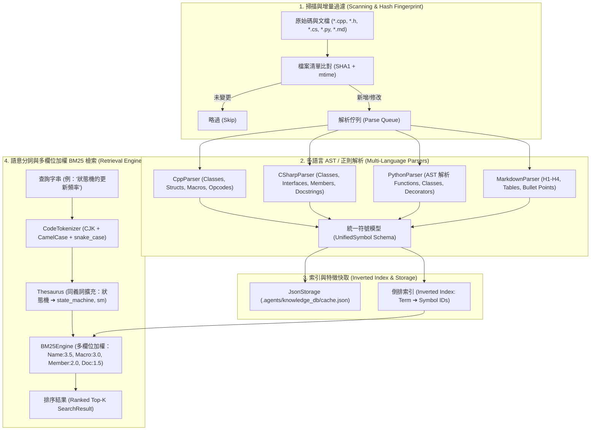

# 技術調研報告：前身知識庫系統架構剖析與模組化演進方案 (Knowledge System Reference)

> 功能名稱：語意化 Codebase 知識庫模組開發 (Codebase Knowledge Module)  
> 建立日期：2026-08-23  
> 所屬主計畫：無  
> 狀態：Concluded  
> 擴充項目：none  
> 模板版本：v1.0  

---

## 📌 1. 調研背景與參考標的

本專案旨在將跨語言、語意化代碼圖譜與全文檢索能力正式封裝為 YS-Codebase 工具庫官方模組。我們針對參考專案 [`GC_VEX_V5`](https://github.com/ysnaive/GC_VEX_V5.git) 中已驗證的原型（`.agents/knowledge_db/`）進行深入源碼逆向工程與架構評估，以提取其成功實踐並規劃標準模組化演進路徑。

---

## 🏛️ 2. `GC_VEX_V5` 前身系統架構深度剖析



### 關鍵子系統分析

| 子系統模組 | 實作檔案 | 核心技術與亮點 |
| :--- | :--- | :--- |
| **資料模型 (Schema)** | `src/schema.py` | 定義 `UnifiedSymbol`、`MemberInfo`、`FileMetadata`、`IndexCache`。抽象層次高，跨語言一致性良好。 |
| **代碼解析 (Parsers)** | `src/parsers/*.py` | 涵蓋 C++、C#、Python (標準庫 AST)、Markdown。支援巨集註冊（如 `REGISTER_OPCODE`）與公開成員提取。 |
| **分詞與同義詞 (NLP)** | `src/retrieval/tokenizer.py`<br>`src/retrieval/thesaurus.py` | 純標準庫分詞器，混合切分 `camelCase`、`snake_case`、數字與 CJK 中文字元；同義詞詞庫支援中文術語精確映射到代碼識別碼。 |
| **檢索評分 (BM25)** | `src/retrieval/bm25_engine.py` | 倒排索引優化版 BM25，多欄位差異加權（`Name: 3.5`, `Macro: 3.0`, `Member: 2.0`, `Doc: 1.5`, `Base: 2.0`），查詢耗時 `< 10ms`。 |
| **增量快取 (Storage)** | `src/storage/json_storage.py` | 以 `cache.json` 固化，利用 `SHA1` 指紋快速過濾未修改檔案，全庫增量掃描耗時 `< 50ms`。 |

---

## ⚖️ 3. 方案優勢 vs. 既有缺點 (Pros & Cons)

### ✅ 前身系統的極大優勢 (Preserve & Retain)
1. **100% 免外部相依 (Zero External Dependency)**：完全基於 Python 3.8+ 標準庫（`re`, `ast`, `hashlib`, `math`, `argparse`），不依賴 PyTorch/ChromaDB/OpenAI API，極度輕量、安全且秒級啟動。
2. **多語言標準化 (Unified Schema)**：跨越 C++、C#、Python 與 Markdown，輸出格式一致。
3. **中文同義詞映射能力 (Thesaurus)**：解決 LLM / 開發者使用自然語言中文檢索英文 Codebase 時關鍵字失配的問題。
4. **亞毫秒級檢索與增量更新**：無龐大向量維度計算開銷，本機執行飛快。

### ⚠️ 前身系統的不足與痛點 (Refactor & Elevate)
1. **單一專案硬編碼 (Hardcoded Paths)**：硬編碼路徑 `.agents/knowledge_db/`，無法作為獨立通用模組分發。
2. **缺乏 2×2 設定矩陣規範**：未整合 `config.project.json`（專案級規則：包含/排除目錄）與 `config.local.json`（個人本機快取路徑）。
3. **未整合 Core SDK 與統一 CLI**：使用獨立的 `cli.py`，無法直接透過 `python yscb_cli.py <module>` 路由調度。
4. **缺乏與安裝期連動協定 (Interlock) 結合**：無法向 `agents-workflow` 自動提供擴充補丁或驗證外掛。

---

## 🚀 4. YS-Codebase 模組化升級方案設計

### 4.1 模組劃分與目錄架構
建議在 `source/` 下建立官方一等模組 **`codebase-knowledge`**（或 `knowledge-db`）：

```text
source/codebase-knowledge/
├── manifest.json                       # 模組元數據 (name: "codebase-knowledge", version: "1.0.0")
├── config.project.template.json        # 2x2 專案配置 (掃描目錄 sources, docs, excludes, 巨集正則)
├── config.local.template.json          # 2x2 本機配置 (快取檔案位置、搜尋偏好)
├── README.md                           # 模組手冊
├── scripts/
│   ├── cli.py                          # CLI 進入點 (search, index, status, export)
│   ├── _installed.py                   # 安裝後置 Hook
│   └── _on_modules_changed.py          # 生命週期連動 Hook
└── codebase_knowledge/                 # Python 核心 Package
    ├── __init__.py                     # 導出 KnowledgeEngine, UnifiedSymbol
    ├── engine.py                       # 核心調度門面 (KnowledgeEngine)
    ├── schema.py                       # UnifiedSymbol, MemberInfo, IndexCache
    ├── parsers/                        # base.py, cpp.py, csharp.py, python.py, markdown.py
    ├── retrieval/                      # bm25.py, tokenizer.py, thesaurus.py
    └── storage/                        # json_storage.py
```

### 4.2 統一 CLI 路由器整合
支援透過 `yscb_cli.py` 統一調度：
```bash
# 1. 語意搜尋
python yscb_cli.py codebase-knowledge search -q "狀態機更新" --top 5

# 2. 建立 / 增量更新索引
python yscb_cli.py codebase-knowledge index [--full]

# 3. 檢視健康狀態
python yscb_cli.py codebase-knowledge status

# 4. 導出全專案架構能力地圖 (Markdown)
python yscb_cli.py codebase-knowledge export-docs [output_path]
```

### 4.3 連動協定整合 (Interlock with AgentsWorkflow)
透過 `manifest.json` 宣告 `contributes.agents-workflow`：
- 在 `ContextInit` / `Research` 等 SOP 中注入知識庫快查說明與擴充命令。

---

## 🎯 5. 調研結論與後續建議

1. **結論**：`GC_VEX_V5` 前身之架構非常成熟、高內聚且零外部相依，完全具備升級為 YS-Codebase 官方一等模組的條件。
2. **模組命名建議**：建議命名為 **`codebase-knowledge`**，以清晰表達「Codebase 代碼圖譜與知識庫」之領域職責。
3. **建議分流軌道**：建議採用 **Level 1 (Full Track)** 推進，完整定義 P01 需求規格、P02 架構設計、P03 API 簽名、P04/P06 測試計畫，並依 4-Stage Dogfooding 管線完成建置與發布。
