# 技術調研報告：YS-Codebase 現有檔案系統與快取儲存架構調研 (Existing Filesystem Survey)

> 功能名稱：Module 檔案系統與快取/儲存擴充 (Module File System & Storage Extension)  
> 建立日期：2026-08-23  
> 所屬主計畫：無  
> 狀態：Concluded  
> 擴充項目：none  
> 模板版本：v1.0  

---

## 📌 1. 調研背景與目標

隨著 YS-Codebase 生態系統的演進，各模組（如 `agents-workflow` 的 IDE 快取、即將建立的 `knowledge-db` 倒排索引快取與同義詞庫、以及未來的自訂編譯/分析模組）對「快取 (Cache)」、「持久化儲存 (Storage/Data)」與「中繼產物 (Artifacts)」的管理需求急劇上升。

本調研報告對當前系統現有的**目錄拓撲、Core SDK 路徑 API、語意 URI 協定、2×2 設定矩陣與 Installer 生命週期**進行地毯式盤點，分析痛點並提出標準化的模組檔案系統擴充演進方案。

---

## 🏛️ 2. 現有檔案系統四層拓撲與盤點矩陣

```mermaid
flowchart TD
    subgraph L1 ["層級 ①：專案根目錄與全域配置空間 (Project Root)"]
        ProjRoot["專案根目錄 (project://)"]
        GlobalConfig["yscb_config.json / yscb_config.local.json"]
        AgentsMD["AGENTS.md"]
        ProjRoot --> GlobalConfig & AgentsMD
    end

    subgraph L2 ["層級 ②：模組源碼、發布與自引用空間 (Codebase Runtime Space)"]
        SourceDir["source/<module>/ (yscb://source/)"]
        BuildDir["build/<module>/ (發布物)"]
        ModulesDir["modules/<module>/ (安裝運行物)"]
        ProjRoot --> SourceDir & BuildDir & ModulesDir
    end

    subgraph L3 ["層級 ③：語意化業務空間 (Semantic Domain Space)"]
        PlansDir["plans/ (plans:// 活躍計畫)"]
        ArchiveDir["archive_plans/ (archive:// 封存計畫)"]
        DocsDir["docs/ (docs:// 知識庫)"]
        ExtDir["extensions/ (sop_ext:// 自定義擴充)"]
        ProjRoot --> PlansDir & ArchiveDir & DocsDir & ExtDir
    end

    subgraph L4 ["層級 ④：中繼快取與暫存空間 (Cache & Ephemeral Space)"]
        CacheDir[".yscb_cache/ (受 .gitignore 忽略)"]
        GitCache[".yscb_cache/git_cache/ (遠端 Git 快取)"]
        BackupSnap[".yscb_cache/backup/ (模組升級快照)"]
        IDEManifest[".yscb_cache/ide_workflow_manifest.json (agents-workflow 快取)"]
        ProjRoot --> CacheDir
        CacheDir --> GitCache & BackupSnap & IDEManifest
    end
```



### 現有路徑與檔案職責清單

| 目錄 / 檔案路徑 | 所屬空間 | 讀寫模式 | 核心職責與現況行為 |
| :--- | :--- | :---: | :--- |
| `yscb_config.json` | 空間 ① | 讀寫 (Git 追蹤) | 記錄專案路徑 (`paths`)、遠端倉庫 (`remote`)、已安裝模組清單 (`installed_modules`)。 |
| `yscb_config.local.json` | 空間 ① | 讀寫 (Git 忽略) | 個人本機覆寫配置。 |
| `source/<module>/` | 空間 ② | 唯讀/開發 (Git 追蹤) | 模組源碼與單一事實來源 (SSOT)。 |
| `modules/<module>/` | 空間 ② | 讀寫 (Git 忽略) | 模組安裝運行空間（包含具體化 SOP 與 Hook 腳本）。 |
| `build/<module>/` | 空間 ② | 覆寫 (Git 追蹤) | `installer build` 封裝產物。 |
| `plans/` (`plans://`) | 空間 ③ | 讀寫 (Git 追蹤) | 進行中 Dev Plan 目錄（由 `config.project.json` 之 `paths.plans_dir` 定義）。 |
| `archive_plans/` (`archive://`) | 空間 ③ | 讀寫 (Git 追蹤) | 歷史計畫封存目錄（由 `config.project.json` 之 `paths.archive_dir` 定義）。 |
| `docs/` (`docs://`) | 空間 ③ | 讀寫 (Git 追蹤) | 專案客觀知識庫（由 `config.project.json` 之 `paths.docs_dir` 定義）。 |
| `extensions/` (`sop_ext://`) | 空間 ③ | 讀寫 (Git 追蹤) | 專案自定義 SOP Extension（由 `config.project.json` 之 `paths.extensions_dir` 定義）。 |
| `.yscb_cache/` | 空間 ④ | 讀寫 (Git 忽略) | 中繼快取總根目錄。目前包含 `git_cache/`、`backup/` 與 `ide_workflow_manifest.json`。 |

---

## 🔍 3. 現有路徑解析與語意協定機制剖析

### 3.1 Core SDK (`yscb_core.context.ProjectContext`)
目前 `ProjectContext` 提供的定位 API 包括：
- `get_project_root(start_dir) -> Path`：自動向上尋找 `yscb_config.json` 或 `.git`。
- `get_yscb_root(start_dir) -> Path`：定位工具庫根目錄。
- `get_module_dir(module_name) -> Path`：定位 `modules/<name>` 或 `source/<name>`。
- `resolve(rel_path) -> Path`：解析相對路徑或轉發語意 URI。
- `get_all_installed_manifests()` / `get_contributions(namespace)`：跨模組清單掃描。

### 3.2 語意 URI 系統 (`yscb_core.uri.ProjectURI`)
目前已註冊之協議包括：
- `project://<path>` ➔ `ProjectContext.get_project_root()`
- `yscb://<path>` ➔ `ProjectContext.get_yscb_root()`
- `plans://<path>` ➔ `agents-workflow` 之 `paths.plans_dir`
- `archive://<path>` ➔ `agents-workflow` 之 `paths.archive_dir`
- `docs://<path>` ➔ `agents-workflow` 之 `paths.docs_dir`
- `sop_ext://<path>` ➔ `agents-workflow` 之 `paths.extensions_dir`

---

## ⚠️ 4. 現況痛點與架構缺陷分析 (Pain Points & Gaps)

```text
[當前架構缺陷圖示]
.yscb_cache/
  ├── git_cache/                  ← Installer 專用
  ├── backup/                     ← Installer 專用
  └── ide_workflow_manifest.json  ← 🚨 agents-workflow 模組硬編碼寫入根目錄，未隔離！
  └── (knowledge_db_cache.json?) ← 🚨 即將面臨：各模組直接往 .yscb_cache 根目錄亂塞快取！
```

### 痛點 1：模組私有快取空間缺乏命名空間隔離 (Wildcat Caches)
- `agents-workflow` 目前在 `ide_sync.py` 中直接寫入 `proj_root / ".yscb_cache" / "ide_workflow_manifest.json"`。
- 當新增 `knowledge-db`（`cache.json`）或其他多個模組時，`.yscb_cache` 根目錄將充斥各模組散落的檔案，極易引發檔名命名碰撞，且無法依模組進行單獨清理。

### 痛點 2：Core SDK 缺乏 Module-Scoped 快取與儲存 API
- `ProjectContext` 僅提供 `get_module_dir(module_name)`（指向代碼安裝目錄 `modules/<module>/`）。
- 若模組把快取寫在 `modules/<module>/` 內，當執行 `installer update` 或 `installer install --force`（全量覆寫目錄）時，**快取資料將被意外刪除或沖刷**；反之，若寫在專案根目錄又會污染 Git。

### 痛點 3：語意 URI 缺乏 `cache://` 與 `storage://` 通道
- 開發者無法使用 `python yscb_cli.py uri resolve cache://knowledge-db/index.json` 直觀定位快取檔案。

### 痛點 4：生命週期與清理工具鏈缺位
- 缺乏標準的 `python yscb_cli.py cache clean [module] [--all]` 指令。
- 當執行 `installer remove <module>` 卸載模組時，無法自動或提示清理該模組遺留在 `.yscb_cache/` 的孤兒快取。

---

## 💡 5. 模組檔案系統擴充演進方案 (Architectural Proposals)

### 方案 A：集中式命名空間快取架構 (Recommended)
將 `.yscb_cache/` 內部嚴格劃分命名空間：

```text
.yscb_cache/
├── installer/                    # 安裝器專用 (git_cache/, backup/)
│   ├── git_cache/
│   └── backup/
└── modules/                      # 模組專屬快取空間 (Module Caches)
    ├── agents-workflow/          # agents-workflow 專用快取
    │   └── ide_manifest.json
    └── knowledge-db/             # knowledge-db 專用快取
        ├── index_cache.json
        └── hash_registry.json
```

#### API 設計演進：
```python
# 1. 取得模組快取目錄 (自動建立目錄，路徑：.yscb_cache/modules/<module_name>/)
cache_dir = ProjectContext.get_module_cache_dir("knowledge-db")

# 2. 取得模組持久化儲存目錄 (預設專案根目錄自訂路徑，或 storage/目錄)
storage_dir = ProjectContext.get_module_storage_dir("knowledge-db")

# 3. 取得系統全域快取根目錄 (.yscb_cache/)
cache_root = ProjectContext.get_cache_root()
```

#### 語意 URI 擴充：
- `cache://<module>/<path>` ➔ 自動解析至 `.yscb_cache/modules/<module>/<path>`
- `storage://<module>/<path>` ➔ 自動解析至專案持久化空間

---

## 🎯 6. 調研結論與後續建議

1. **必要性**：在正式實作 `knowledge-db` 之前，先完善 Core SDK 的模組檔案系統與快取 API 是完全正確的架構時機，可徹底避免 `knowledge-db` 走回硬編碼路徑的老路。
2. **影響範圍**：
   - `core` 模組：在 `ProjectContext` 與 `ProjectURI` 新增標準快取與儲存解析 API。
   - `agents-workflow` 模組：重構 `ide_sync.py` 改用 `ProjectContext.get_module_cache_dir("agents-workflow")`。
   - `yscb_installer.py`：新增快取管理工具（如 `cache clean`）與卸載時快取聯動清理。
3. **建議推進軌道**：建議採用 **Level 1 (Full Track)** 完整推進本檔案系統擴充。
