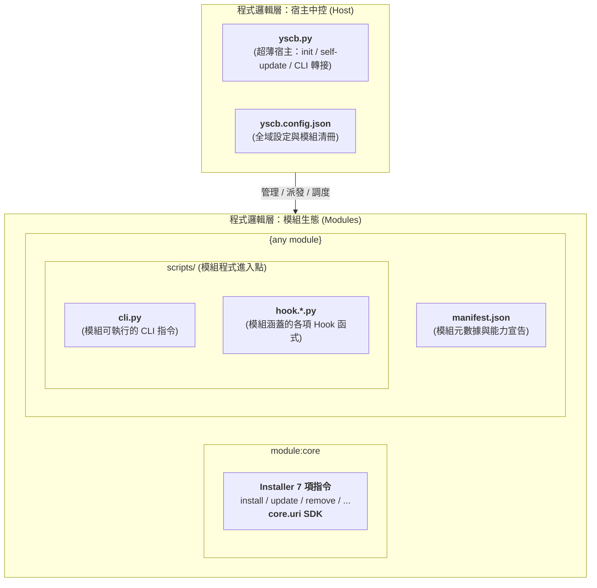

# 技術調研報告：模組化體系理想架構規範 (Module Architecture Specification)

> 功能名稱：模組化體系宏觀架構重構與規範白皮書  
> 建立日期：2026-08-23  
> 所屬主計畫：無  
> 狀態：Draft  
> 擴充項目：none  
> 模板版本：v1.0  

---

## 1. 程式邏輯架構規範 (Programmatic Logical Architecture)

> 本規範定義系統在**程式運行邏輯層面**的抽象架構模型，描述宿主中控與自治模組之間的邏輯拓撲與職責切分（尚不代表實體打包或部署架構）。

### 1.1 宿主中控邏輯職責 (Host Logical Role)
- **`yscb.py`**：程式唯一的超薄宿主（Ultra-Thin Bootstrapper），內建 2 項原生指令（`init`、`self-update`），其餘所有指令皆動態轉接至對應模組的 `scripts/cli.py`（約百餘行，100% 純原生零相依）。
- **`yscb.config.json`**：宿主層級的全域設定與模組安裝狀態紀錄清冊。

### 1.2 模組邏輯合約 (`{any module}`)
- **`manifest.json`**：模組宣告核心，定義模組元數據與具備之能力。
- **`scripts/cli.py`**：模組命令進入點，封裝並提供該模組對外的 CLI 指令。
- **`scripts/hook.*.py`**：模組事件響應進入點，涵蓋該模組包含的各項 Hook 函式。

---

## Ch.2 檔案結構架構規範 (File Structure Architecture Specification)

### 2.1 yscb.py 與 yscb.config.json 存放規範 (Host & Config Placement)
- `yscb.py` 與 `yscb.config.json` 必須放置於同一資料夾。
- 無其他強制位置規範（甚至可以、但不建議放置於 `project://` 層級之外）。

### 2.2 模組檔案結構規範 (Module File Structure Specification)
對於任何 module，檔案與空間協議規範定義如下：
- **專屬空間協議定義**：
  - `module://`：常數 `const="yscb://modules/{module}/"`，運行端空間（父層目錄為 `module.root://` ➔ `yscb://modules/`）。
  - `module.source://`：由**開發者模組**提供，常數 `const="yscb://source/{module}/"`，原始碼空間（父層目錄為 `module.source.root://` ➔ `yscb://source/`）。
  - `module.build://`：由**開發者模組**提供，常數 `const="yscb://build/{module}/"`，純淨安裝產物空間（輸出為版本化目錄 `module.build://{version}/`；父層目錄為 `module.build.root://` ➔ `yscb://build/`）。
- **必須檔案**：
  - `module://manifest.json`：模塊安裝資訊。
- **條件必須檔案**：
  - `module://contributes.format.md`：當該 module 具備注入功能時必須提供，供其他模組參閱其擴充格式。
- **可選檔案**：
  - `module://scripts/cli.py`：cli 功能擴充。
  - `module://scripts/hook.*.py`：特定 hook 橋接擴充。
  - `module://contributes.{module}.json`：靜態指向性貢獻注入檔。
  - `config://config.local.json`：本地端設定，將被 git 忽略。
  - `config://config.project.json`：專案級設定。
  - `config://contributes.{module}.json`：專案級指向性貢獻注入檔。
