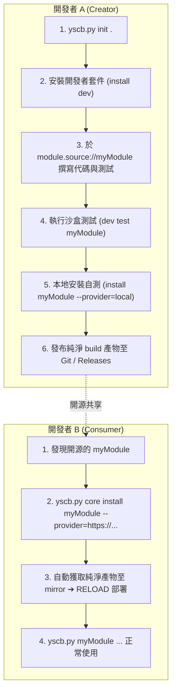

# 技術調研報告：開發者生態與重構遷移策略 (Developer Ecosystem & Migration Strategy)

> 功能名稱：模組化體系宏觀架構重構與規範白皮書  
> 建立日期：2026-08-24  
> 所屬主計畫：無  
> 狀態：Draft  
> 擴充項目：none  
> 模板版本：v1.0  

---

## Ch.1 擴充開發者生態與標準旅程 (Developer & Consumer Journey)

本體系透過微內核、語意空間隔離與參數化抓取機制，實現「一般使用者」向「擴充開發者」的無縫漸進式升級，並支援第三方擴充的自由流通。

### 1.1 經典雙角色生態流 (The Creator & Consumer Story)



#### 流程詳細解析：
1. **開發者 A（生產者）**：
   - 透過 `yscb.py init` 初始化基礎環境；
   - 透過 `yscb.py core install dev` 安裝開發者工具模組（解鎖 `module.source://` 與 `module.build://` 協議及建置測試工具）；
   - 在 `module.source://myModule` 開發功能，使用 `dev test` 於隔離沙盒驗證；
   - 透過 `yscb.py core install myModule --provider=local` 觸發 `FETCH<local>`，將打包產物部署至本地 `mirror://` 並完成運行端調和驗證；
   - 將純淨 build 產物推播開源。
2. **開發者 B（消費者）**：
   - 執行 `yscb.py core install myModule --provider=https://github.com/DevA/myModule.git`；
   - 底層透過 `FETCH<remote_git>` 下載純淨產物至 `mirror://`，經 `SOLVE_DEPS` ➔ `REGISTER` ➔ `RELOAD` 一鍵安裝完成；
   - 立即以 `yscb.py myModule ...` 使用擴充功能。

### 1.2 生態四大架構優勢
- **來源協定對稱性 (Protocol Symmetry)**：不管是本地開發還是遠端消費，統一透過 `FETCH<source>` 處理，核心零特例。
- **產物零污染 (Zero Contamination)**：消費者僅獲取純淨 build 產物，生產者的測試、Git 歷史與草稿完全隔離。
- **漸進式能力揭露 (Progressive Disclosure)**：普通使用者環境極簡，僅在需要開發時安裝 `dev` 套件擴充空間。
- **天然解耦自引用 (Decoupled Self-Hosting)**：模組開發者使用與一般使用者相同的安裝管線進行本地調試。

---

## Ch.2 自引用解耦與三大防護屏障 (Dogfooding Decoupling & Firewalls)

為徹底終結 codebase 開發自身時常見的「自噬死鎖」、「代碼覆蓋脫節」與「測試環境污染」，系統落實三大防護屏障：

```text
【源碼開發空間】                     【測試守門空間】                      【運行調和空間】
source/core/ (SSOT) ──(打包)──>  temp://sandbox/ (100% 隔離) ──(通過)──> mirror:// ──> modules/
```

### 2.1 三大防護屏障

| 屏障層級 | 核心機制 | 防護效果 |
| :--- | :--- | :--- |
| **屏障 1：宿主零依賴逃生艙** | `yscb.py` 100% 依賴純 Python 標準庫，絕不靜態依賴 `core` 代碼。 | 即使 `modules/core` 崩潰或被刪除，宿主隨時能執行 `init` 或 `reload` 自癒，杜絕自噬死鎖。 |
| **屏障 2：測試空間絕對沙盒化** | `test/` 套件所有測試一律在系統暫存區 `temp://sandbox/` 動態建構虛擬專案執行。 | 測試任意失敗或斷點調試，專案本體的 `modules/` 與組態 0% 被污染。 |
| **屏障 3：單向產物流水線** | 嚴格規範 $\text{source/} \to \text{build/} \to \text{mirror/} \to \text{modules/}$ 單向流動。 | `source/` 為唯一編輯真理來源，`modules/` 視為可隨時重建之唯讀產物，杜絕代碼被覆蓋遺失。 |

### 2.2 自引用開發四步閉環流水線
1. **Step 1 (Edit)**：僅在 `source/core/` 編輯源碼。
2. **Step 2 (Sandbox Test)**：實機執行 `python test/run_tests.py`，於隔離沙盒驗證 12 大原子操作與 10 大指令管線。
3. **Step 3 (Build to Mirror)**：測試通過後，建置工具將 `source/core/` 打包為純淨產物寫入本地 `mirror/core/`。
4. **Step 4 (Dogfooding Reload)**：執行 `python yscb.py reload`，自 `mirror/` 重新載入運行端完成本機升級。

---

## Ch.3 專案重構遷移五階段路線圖 (Project Refactoring Roadmap)

為確保現有代碼庫平穩過渡至全新微內核體系，遷移過程分為五大嚴格階段：

```text
[階段 1: 隔離與備份] ➔ [階段 2: 源碼全新構建] ➔ [階段 3: 規範化測試重構] ➔ [階段 4: 沙盒自舉驗證] ➔ [階段 5: 正式切換與清理]
```

### 3.1 階段 1：隔離與現場備份 (Quarantine & Snapshot)
- **隔離非本期範疇**：將 `modules/agents-workflow/` 與 `source/agents-workflow/` 完整移入暫存隔離目錄（`.quarantine/`），防止舊 SOP 與工作流干擾本期核心建置。
- **備份歷史檔案**：備份現有 `yscb_cli.py`、`yscb_installer.py`、`yscb_config.json` 至備份區。

### 3.2 階段 2：源碼空間全新構建 (Greenfield Source Construction)
- **實作超薄宿主 `yscb.py`**：100% 原生實現 `init`、`self-update` 與 `DISPATCH_CLI` 核心自舉邏輯（約百餘行）。
- **實作核心基礎模組 `source/core/`**：
  - 實作 12 大原子操作引擎（`DOWNLOAD`, `DELETE`, `REGISTER`, `UNREGISTER`, `SOLVE_DEPS`, `PREPARE`, `RELOAD`, `FETCH<source>`, `SNAPSHOT`, `RESTORE_SNAPSHOT`）。
  - 實作語意 URI 系統（`ProjectURI` / `core.uri`）與 5 大來源 Contributes 聚合器。

### 3.3 階段 3：規範化測試套件重構 (Test Suite Re-architecture)
- **建立全新測試矩陣 (`test/`)**：
  - 單元測試：12 大原子操作獨立驗證。
  - 整合測試：7 大指令生命週期管線端到端驗證（`init` ➔ `install` ➔ `update` ➔ `remove` ➔ `reload` ➔ `rollback` ➔ `status` ➔ `list`）。

### 3.4 階段 4：沙盒自舉與 Dogfooding 驗證 (Sandbox E2E Verification)
- 在空白目錄僅放置單檔 `yscb.py`，實機執行 `python yscb.py init .`，驗證 100% 零依賴自舉。
- 驗證從 `mirror/` 載入 `core`、執行依賴注入與各指令管線。

### 3.5 階段 5：正式切換與結案 (Cutover & Follow-up Roadmap)
- 專案根目錄正式替換為新版單檔 `yscb.py` + `yscb.config.json`。
- 清理歷史遺留檔案（`yscb_installer.py`, `yscb_cli.py` 等）。
- 產出全流程 Walkthrough 驗證結案。
- **後續獨立計畫**：本期結案後，開立獨立後續計畫（如 `sub_agents_workflow_migration`），依據全新模組化規範重構適配並發布 `agents-workflow` 模組。

---

## Ch.4 開發者套件規格定義 (Developer Package: module:dev)

為維持 `core` 最小內核的純粹性，所有開發、建置、測試與合規檢查工具統一封裝於官方開發者套件 `module:dev` 中。

### 4.1 注入之專屬 URI 協議 (`contributes.core.uri_schemes`)
| 語意 URI 協議 | 常數映射目標 | 說明 |
| :--- | :--- | :--- |
| **`module.source://`** | `yscb://source/{module}/` | **源碼開發空間 (SSOT)**：供開發者編輯源碼與撰寫測試。 |
| **`module.build://`** | `yscb://build/{module}/` | **純淨打包產物空間**：建置工具過濾開發檔案後的版本化輸出目錄（`module.build://{version}/`）。 |

### 4.2 核心 CLI 指令集 (`yscb.py dev <subcommand>`)

1. **`dev create <module_name>`（模組腳手架建立）**
   - **極簡骨架**：僅於 `module.source://{module_name}/` 生成最小必要檔案：
     - `manifest.json`（名稱、初始版本 0.1.0、標準 `build_exclude`）
     - `scripts/cli.py`（命令進入點範本）
     - `tests/test_{module_name}.py`（基礎單元測試範本）
2. **`dev check [module]`（模組規範合規性靜態檢查）**
   - 驗證 `manifest.json` Schema 合法性。
   - 檢查若有 contributes 注入是否具備 `contributes.format.md` 說明書。
   - 檢查是否違規 hardcode 實體路徑（確保 100% 透過 `core.uri` 存取）。
3. **`dev test [module | --all]`（沙盒化單元測試）**
   - 在系統暫存區 `temp://sandbox/`（`yscb://.temp/sandbox/`）啟動隔離沙盒，自動執行 `source/{module}/tests/` 下的所有測試，0% 污染本地運行端。
4. **`dev build [module | --all]`（純淨產物打包）**
   - 依 `manifest.json` 之 `build_exclude` 規則（如 `["tests/**", "*.pyc", "__pycache__"]`）過濾開發檔案。
   - 依 `manifest.json` 之版本號，輸出完全獨立之純淨產物目錄至 `module.build://{version}/`（內含獨立快照之 `manifest.json` 並自動注入 `built_at` 時間戳）。
   - 更新/生成模組根目錄之 `index.json`（彙整通用元數據與已存在的版本號清冊供快速瀏覽與 SemVer 求解）。


