# 架構 & 變更計畫書 (Architecture & Change Plan)

> 功能名稱：超薄宿主單檔實現 (Ultra-Thin Host Bootstrapper)  
> 建立日期：2026-08-24  
> 所屬主計畫：[2026_08_23_2030_architecture_refactor](../umbrella_overview.md)  
> 依據 P01：[P01_requirements_spec.md](./P01_requirements_spec.md)  
> 狀態：Confirmed  
> 擴充項目：none  
> 模板版本：v1.2  

---

## 1. 架構全貌與資料流 (Architecture & Data Flow)

宿主 `yscb.py` 採用 4 層階梯式智能路由分發機制：

```mermaid
flowchart TD
    CLI["命令行輸入: python yscb.py <args>"] --> Router{"指令路由判斷"}
    
    Router -- "argv[1] == 'init'" --> InitFlow["1. 原生自舉流程 (FR-01)"]
    Router -- "argv[1] == 'self-update'" --> UpdateFlow["2. 宿主自更新流程 (FR-02)"]
    Router -- "argv[1] in CORE_COMMANDS" --> CoreForwardFlow["3. Core 指令智能轉發 (FR-03)"]
    Router -- "其餘任何指令" --> DispatchFlow["4. 泛用模組 CLI 派發 (FR-04)"]

    subgraph InitFlow["1. init {yscbRoot} [--provider]"]
        I1["檢查 yscb.config.json 防呆"] --> I2["建立根目錄與初始組態"]
        I2 --> I3["原生 HTTP 下載 core 純淨包至 mirror"]
        I3 --> I4["物化部署至 modules/core 並登記"]
        I4 --> I5["調用 core scripts/cli.py reload"]
    end

    subgraph UpdateFlow["2. self-update [--provider]"]
        U1["檢索遠端最新 yscb.py"] --> U2["版本比對 (已為最新則退出)"]
        U2 --> U3["下載至暫存並 ast.parse 語法驗證"]
        U3 --> U4["備份當前為 yscb.py.bak 後原子替換"]
    end

    subgraph CoreForwardFlow["3. install / update / remove / list / status / rollback / reload"]
        CF1["自動轉換為 target='core', args=argv[1:]"] --> CF2["執行派發至 modules/core/scripts/cli.py"]
    end

    subgraph DispatchFlow["4. yscb.py {module} {any}"]
        D1["讀取 yscb.config.json 錨定 yscb://"] --> D2["探測 modules/{module}/scripts/cli.py"]
        D2 --> D3["subprocess 派發透傳 argv[2:]"]
        D3 --> D4["透傳模組 Exit Code 回終端"]
    end
```



### 既有文檔與歷史參考
- **參考架構白皮書**：[R01 理想架構規範](../R01_module_architecture_survey.md)、[R02 yscb/core 職責總覽](../R02_yscb_responsibilities.md)、[R04 運行週期與調用流](../R04_lifecycle_invocation_flow.md)。
- **核心設計約束**：
  - 100% 依賴純 Python 標準庫，零外部套件；
  - 宿主體積維持在 150 行以內；
  - 內建 `CORE_COMMANDS = {"install", "update", "remove", "list", "status", "rollback", "reload"}` 靜態常數集合，提供零負擔智能轉發。

---

## 2. 模組變更清單

| 順序 | 類型 | 檔案路徑 | 職責與修改概述 | 依賴項 / 影響下游 |
| :---: | :---: | :--- | :--- | :--- |
| **1** | **Add** | `project://yscb.py` | 唯一超薄宿主起手單檔：原生實現 `init`、`self-update`、Core 7 大指令智能轉發與泛用模組 CLI 派發器。 | 產生 `yscb.config.json`，派發至 `modules/{module}/scripts/cli.py` |

---

## 3. 風險評估與防護

| ID | 風險維度 | 風險描述 | 等級 | 緩解 / 防護策略 |
| :--- | :--- | :--- | :---: | :--- |
| **R-01** | **自更新損壞風險** | `self-update` 若因網路中斷或腳本損壞導致 `yscb.py` 損毀無法執行。 | **高** | 1. 下載至暫存檔後使用 `ast.parse` 執行語法編譯檢查；<br/>2. 覆蓋前備份原腳本為 `yscb.py.bak`；<br/>3. 若驗證或覆蓋失敗立即還原。 |
| **R-02** | **跨平台派發相容性** | Windows 與 POSIX 環境下的路徑分隔符與子進程喚起差異。 | **中** | 1. 統一使用 `sys.executable` 喚起 Python 直譯器；<br/>2. 使用 `os.path.normpath` 與 `os.path.join` 處理路徑；<br/>3. 使用 `subprocess.run` 保證跨平台無鎖派發。 |
| **R-03** | **環境重入覆蓋風險** | 使用者在已初始化的環境重複執行 `init` 導致現有配置被覆蓋。 | **中** | 在 `init` 第一步嚴格檢查 `yscb.config.json` 是否已存在有效 `yscb_root`，若存在則立即退出阻斷。 |

---

## 4. Decision Records

### [P02:DR-01] 單檔結構與子進程派發模式
- **議題**：宿主派發模組 CLI 時，應使用 `importlib` 動態載入還是 `subprocess.run` 子進程派發？
- **結論**：採用 `subprocess.run([sys.executable, cli_path, *args])` 子進程派發。
- **理由**：
  1. 保證模組執行的**獨立進程生命週期**（Process Isolation），徹底避免模組間的記憶體污染與全域變數殘留；
  2. 子進程天然支援 Exit Code 的 100% 精確捕獲與無損透傳；
  3. 符合跨平台標準 CLI 工具慣用語意。

### [P02:DR-02] 階梯式路由與 Core 指令智能轉發 (Zero-Prefix Core Routing)
- **議題**：如何設計路由判斷邏輯以支援 Core 指令免前綴直呼？
- **結論**：在主路由中採用以下順序判定：
  ```python
  if cmd == "init":
      handle_init(args)
  elif cmd == "self-update":
      handle_self_update(args)
  elif cmd in CORE_COMMANDS:
      dispatch_module("core", sys.argv[1:])
  else:
      dispatch_module(cmd, sys.argv[2:])
  ```
- **理由**：既不增加程式複雜度（僅增加一行 `in CORE_COMMANDS` 判定），又能大幅提升使用者操作直覺性，同時保留底層 `core` 模組的完整獨立性。
