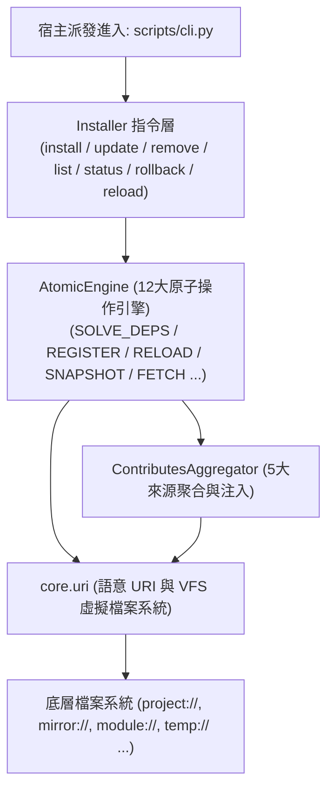

# 架構 & 變更計畫書 (Architecture & Change Plan)

> 功能名稱：核心微內核基礎設施模組 (Core Infrastructure Module)
> 建立日期：2026-08-24
> 所屬主計畫：[2026_08_23_2030_architecture_refactor](../umbrella_overview.md)
> 依據 P01：[P01_requirements_spec.md](./P01_requirements_spec.md)
> 狀態：Confirmed
> 擴充項目：none
> 模板版本：v1.2

---

## 1. 架構全貌與資料流 (Architecture & Data Flow)

`core` 模組定位為整個 YS-Codebase 的**核心微內核基礎設施 (Microkernel Infrastructure)**，負責語意路徑解算、VFS 檔案抽象、原子操作引擎、Contributes 注入與套件管理 CLI：

### 核心資料流演進：
1. **指令流**：`yscb.py` ➔ `source/core/scripts/cli.py` ➔ `Installer` ➔ `AtomicEngine` 調用原子行為 ➔ `core.uri` 執行 VFS 操作；
2. **RELOAD 調和重構流**：
   - **階段一（純淨物化）**：`AtomicEngine` 讀取 `yscb.config.json` ➔ 透過 VFS 自 `mirror://` 將純淨 build 檔案全量覆蓋至 `modules/` ➔ 徹底清除幽靈檔案；
   - **階段二（依賴注入）**：`ContributesAggregator` 掃描 5 大來源 contributes 宣告 ➔ 拓撲排序 ➔ 寫入注入結果 ➔ 廣播事件。

---

## 2. 模組變更清單 (按依賴順序)

| 順序 | 類型 | 類別 / 檔案路徑 | 職責與修改概述 | 依賴項 / 影響下游 |
| :---: | :---: | :--- | :--- | :--- |
| **1** | **Add** | `source/core/core/context.py` | 定義 `ExecutionContext` 極簡 3 欄位資料模型 (`module_name`, `command`, `args`) | 基礎資料模型 |
| **2** | **Add** | `source/core/core/uri.py` | 定義 `core.uri`：9 大協議解析、`{module}` 佔位符與一級 VFS 檔案操作 SDK | 全系統 I/O 基石 |
| **3** | **Add** | `source/core/core/contributes.py` | 定義 `ContributesAggregator`：5 大來源掃描、格式檢查、相依排序與靜態注入 | 依賴 `uri.py` |
| **4** | **Add** | `source/core/core/engine.py` | 定義 `AtomicEngine`：實作 12 大原子操作（`DOWNLOAD`, `RELOAD`, `SOLVE_DEPS`, `SNAPSHOT` 等） | 依賴 `uri.py`, `contributes.py` |
| **5** | **Add** | `source/core/core/installer.py` | 定義 `Installer`：實現 7 大套件管理子指令的高階業務管線 | 依賴 `engine.py`, `uri.py` |
| **6** | **Add** | `source/core/scripts/cli.py` | `core` 模組的對外 CLI 命令進入點，解析命令列並調度 `Installer` | 依賴 `installer.py` |
| **7** | **Add** | `source/core/manifest.json` | `core` 模組的能力宣告元數據檔（宣告版本、依賴與能力） | 模組安裝資訊 |

---

## 3. 風險評估與防護

| ID | 風險維度 | 風險描述 | 等級 | 緩解 / 回滾策略 |
| :--- | :--- | :--- | :---: | :--- |
| **R-01** | **循環相依風險** | 模組間相依關係若形成閉環導致 `SOLVE_DEPS` 進入死循環。 | **高** | 採用 Kahn 拓撲排序演算法並內建深度優先循環檢測 (Cycle Detection)，偵測到環路立即拋出明確錯誤並阻斷。 |
| **R-02** | **注入污染與髒狀態殘留** | 模組在多次 `RELOAD` 或增量注入後留下歷史殘留。 | **高** | 強制執行 `RELOAD` 兩階段鐵律：階段一必須 100% 清空重建物化純淨檔案，再執行階段二注入。 |
| **R-03** | **破壞性變更損壞** | 升級或移除模組時中途失敗導致環境損壞。 | **中** | 所有破壞性操作前強制觸發 `ACT-10 (SNAPSHOT)`，失敗時自動調用 `ACT-11 (RESTORE_SNAPSHOT)` 秒級復原。 |

---

## 4. Decision Records

### [P02:DR-01] VFS 檔案操作與實體解算職責合一
- **議題**：`core.uri` 應僅負責路徑字串解算，還是直接提供 VFS I/O 方法？
- **結論**：`core.uri` 本體直接提供一級 VFS 操作（`read_text`, `write_text`, `read_json`, `write_json`, `exists` 等），並維持類別方法/單例工具介面。同時保留 `resolve()` 作為外部命令調用之逃生艙。
- **理由**：大幅降低呼叫端複雜度，統一全系統檔案讀寫之編碼與目錄建立防呆。

### [P02:DR-02] 模組源碼封裝於 `source/core/` 規範
- **議題**：`core` 自身是否需要遵循標準模組目錄結構？
- **結論**：100% 遵循標準模組結構，包含 `manifest.json`、`scripts/cli.py` 與套件目錄 `core/`。
- **理由**：落實 Dogfooding 一致性，`core` 與其他模組在架構上一視同仁。
