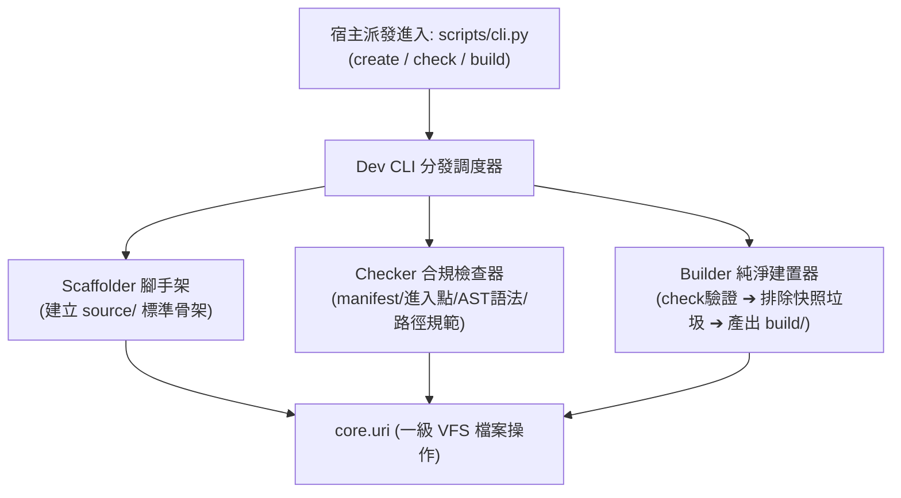

# 架構 & 變更計畫書 (Architecture & Change Plan)

> 功能名稱：開發者工具模組 (Dev Developer Tools Module)
> 建立日期：2026-08-24
> 所屬主計畫：[2026_08_23_2030_architecture_refactor](../umbrella_overview.md)
> 依據 P01：[P01_requirements_spec.md](./P01_requirements_spec.md)
> 狀態：Confirmed
> 擴充項目：none
> 模板版本：v1.2

---

## 1. 架構全貌與資料流 (Architecture & Data Flow)

`dev` 模組定位為 YS-Codebase 的**開發者工具箱與規範守門員**，負責模組骨架生成 (`create`)、合規與語法檢查 (`check`) 以及純淨建置發布 (`build`)：

### 核心資料流演進：
1. **`dev create <name>`**：`Scaffolder` 驗證命名 ➔ 透過 VFS 於 `module.source://<name>` 建立 `manifest.json`、`scripts/cli.py`、`<name>/__init__.py`、`tests/test_basic.py`；
2. **`dev check <name>`**：`Checker` 讀取 `manifest.json` 驗證欄位 ➔ 檢查 `scripts/cli.py` ➔ 遍歷所有 Python 檔案執行 `ast.parse` 語法與無硬編碼路徑檢查；
3. **`dev build <name>`**：`Builder` 前置調用 `Checker.check_module` ➔ 通過後建立 `module.build://<name>` ➔ 過濾排除 `__pycache__`、`*.pyc`、`*.tmp` ➔ 產出純淨發布目錄。

---

## 2. 模組變更清單 (按依賴順序)

| 順序 | 類型 | 類別 / 檔案路徑 | 職責與修改概述 | 依賴項 / 影響下游 |
| :---: | :---: | :--- | :--- | :--- |
| **1** | **Add** | `source/dev/manifest.json` | 宣告 `dev@1.0.0`，依賴 `core@>=1.0.0`，進入點 `scripts/cli.py` | 模組元數據 |
| **2** | **Add** | `source/dev/dev/scaffold.py` | 定義 `Scaffolder`：模組命名驗證、標準 3 層骨架與測試樣板生成 | 依賴 `core.uri` |
| **3** | **Add** | `source/dev/dev/checker.py` | 定義 `Checker`：元數據檢查、進入點驗證、AST 語法校驗與路徑檢查 | 依賴 `core.uri` |
| **4** | **Add** | `source/dev/dev/builder.py` | 定義 `Builder`：純淨建置管線、過濾排除垃圾快取、產出發布物 | 依賴 `checker.py`, `core.uri` |
| **5** | **Add** | `source/dev/dev/__init__.py` | 匯出 `Scaffolder`, `Checker`, `Builder` | 套件頂層匯出 |
| **6** | **Add** | `source/dev/scripts/cli.py` | 對外 CLI 命令進入點，解析 `create`, `check`, `build` 參數 | 依賴 `dev` 套件 |

---

## 3. 風險評估與防護

| ID | 風險維度 | 風險描述 | 等級 | 緩解 / 回滾策略 |
| :--- | :--- | :--- | :---: | :--- |
| **R-01** | **源碼誤覆蓋風險** | `dev create` 誤用已存在的模組名稱導致現有源碼被抹除。 | **高** | 執行建立前強制透過 `core.uri.exists('module.source://<name>')` 進行存在性檢驗，若已存在立即報錯終止。 |
| **R-02** | **帶髒建置風險** | 建置產物中混入開發者的本地暫存檔或 Python 快取。 | **中** | 建置時採用白名單過濾 + 黑名單清除雙重機制，過濾所有 `__pycache__`、`*.pyc`、`*.tmp`、`*.bak`。 |

---

## 4. Decision Records

### [P02:DR-01] 全面透過 core.uri 操作源碼與建置目錄
- **議題**：`dev` 模組在建立與建置檔案時應如何定址？
- **結論**：全面使用 `module.source://<name>` 與 `module.build://<name>` 語意協議進行 VFS I/O 操作。
- **理由**：落實路徑封裝與路徑無知性原則，不手動拼接作業系統絕對路徑。

### [P02:DR-02] 測試執行引擎歸屬於 sub_05 集中打造
- **議題**：`dev test` 測試引擎與基礎類別應於何處實作？
- **結論**：依架構討論決定，`dev create/check/build` 於 `sub_04` 完成；`dev test` 測試框架與沙盒引擎於 `sub_05` 集中全量打造。
- **理由**：確保測試框架作為核心基礎設施擁有完整且獨立的規劃與驗證週期。
