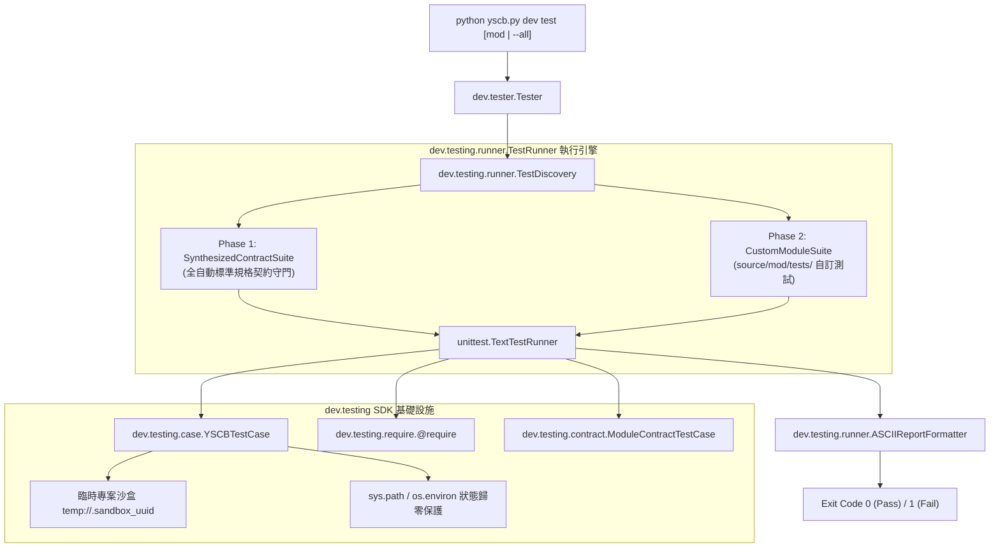
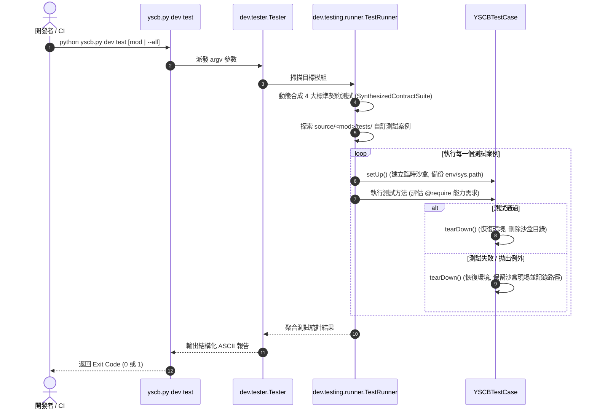

# 架構設計書 (Architecture Plan)

> 功能名稱：開發者測試框架與全自動契約回歸工作流 (Dev Testing Framework & Regression Workflow)
> 建立日期：2026-08-24
> 所屬主計畫：[2026_08_23_2030_architecture_refactor](../umbrella_overview.md)
> 依據 P01：[P01_requirements_spec.md](./P01_requirements_spec.md)
> 狀態：Draft
> 擴充項目：none
> 模板版本：v1.2

---

## 1. 系統架構拓撲 (System Architecture)

---

## 2. 模組分層與職責劃分 (Module Components)

| 模組 / 檔案路徑 | 職責定義 | 依賴關係 |
| :--- | :--- | :--- |
| [`source/dev/dev/testing/require.py`](file:///h:/UseFolder/CodeRepo/ys_codebase/ys_codebase/source/dev/dev/testing/require.py) | 定義 `Requirement` (Flag enum: `NONE`, `SANDBOX`, `HOST_CLI`, `NETWORK`) 與 `@require` 條件探測裝飾器。 | `unittest`, `functools` |
| [`source/dev/dev/testing/case.py`](file:///h:/UseFolder/CodeRepo/ys_codebase/ys_codebase/source/dev/dev/testing/case.py) | 實作 `YSCBTestCase`：自動沙盒管理、環境備份/恢復、失敗保留策略、專屬斷言庫與 `run_cli`。 | `unittest`, `tempfile`, `shutil`, `core.uri` |
| [`source/dev/dev/testing/contract.py`](file:///h:/UseFolder/CodeRepo/ys_codebase/ys_codebase/source/dev/dev/testing/contract.py) | 實作 `ModuleContractTestCase`：定義 Manifest、進入點、無未授權依賴、純淨建置 4 大契約驗證。 | `dev.testing.case`, `dev.checker`, `dev.builder` |
| [`source/dev/dev/testing/runner.py`](file:///h:/UseFolder/CodeRepo/ys_codebase/ys_codebase/source/dev/dev/testing/runner.py) | 實作 `TestDiscovery`、動態契約組裝器 `SynthesizedContractSuite`、ASCII 報告器與回歸測試執行器。 | `unittest`, `dev.testing.*` |
| [`source/dev/dev/testing/__init__.py`](file:///h:/UseFolder/CodeRepo/ys_codebase/ys_codebase/source/dev/dev/testing/__init__.py) | 匯出 `YSCBTestCase`, `require`, `Requirement`, `ModuleContractTestCase`。 | `dev.testing.*` |
| [`source/dev/dev/tester.py`](file:///h:/UseFolder/CodeRepo/ys_codebase/ys_codebase/source/dev/dev/tester.py) | 實作 `Tester` 業務分發類別，解析 CLI 參數並調用 `runner` 執行。 | `dev.testing.runner` |
| [`source/dev/scripts/cli.py`](file:///h:/UseFolder/CodeRepo/ys_codebase/ys_codebase/source/dev/scripts/cli.py) | 擴充 `dev test` 命令路由分發。 | `dev.tester.Tester` |

---

## 3. 測試執行流程時序 (Execution Flow)

---

## 4. 決策記錄 (Decision Records)

### [P02:DR-01] 兩階段動態測試組裝器 (Two-Phase Test Suite Synthesis)
- **架構決策**：`TestRunner` 執行時一律採用兩階段組裝：第一階段自動對 `source/` 下目標模組動態生成並執行 4 大標準契約測試；第二階段若存在 `tests/` 目錄則載入自訂測試案例。
- **效益**：確保全專案所有模組具備 100% 契約守門，同時支援業務自訂測試自由擴展。

### [P02:DR-02] 零重映射之原生沙盒隔離 (Zero-Remap Natural Sandbox)
- **架構決策**：`YSCBTestCase` 建立之 `self.sandbox_dir` 視為完整的原生專案空間，所有 `project://`、`temp://` 等 VFS 協議就地自然解析，嚴禁人為重映射偽造環境。
- **效益**：測試環境與使用者真實生產環境物理同構，達成零 Mock 偏差。
