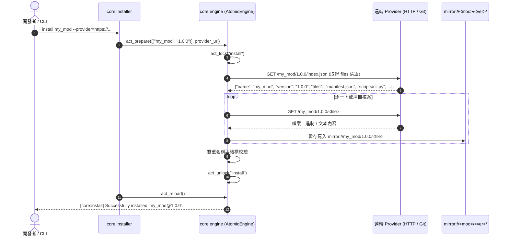

# 架構設計書 (Architecture Plan)

> 功能名稱：核心模組雜項功能完善與 Core/Dev 標準測試套件建立 (Core Misc Polish & Core/Dev Standard Tests)  
> 建立日期：2026-08-24  
> 所屬主計畫：[2026_08_23_2030_architecture_refactor](../umbrella_overview.md)  
> 依據 P01：[P01_requirements_spec.md](./P01_requirements_spec.md)  
> 狀態：In Progress  
> 擴充項目：none  
> 模板版本：v1.4  

---

## 1. 系統架構與套件目錄設計 (System Architecture & Layout)

```text
ys_codebase/
├── yscb.py                          # 宿主單檔：增補 self-update 原子更新邏輯
├── yscb_codebase/
│   ├── source/
│   │   ├── core/                    # [FR-01 ~ FR-06]
│   │   │   ├── manifest.json
│   │   │   ├── contributes.format.md # [FR-04] Core 貢獻格式規範說明書
│   │   │   ├── config.project.json  # [FR-05] 專案層級組態標準範本
│   │   │   ├── core/
│   │   │   │   ├── __init__.py
│   │   │   │   ├── uri.py           # VFS & URI 協議解析
│   │   │   │   ├── engine.py        # [FR-01, FR-03] 增補遠端批次下載與跨進程鎖
│   │   │   │   ├── installer.py     # [FR-02] 增補動態版本查詢與 Provider 優先級
│   │   │   │   └── contributes.py   # [FR-04] 5 大來源多層合併
│   │   │   ├── scripts/
│   │   │   │   └── cli.py
│   │   │   └── tests/               # [FR-06] Core 官方持久化標準測試套件
│   │   │       ├── __init__.py
│   │   │       ├── test_uri.py
│   │   │       ├── test_engine.py
│   │   │       ├── test_installer.py
│   │   │       └── test_contributes.py
│   │   │
│   │   └── dev/                     # [FR-07]
│   │       ├── manifest.json
│   │       ├── dev/
│   │       │   ├── builder.py       # Layer 1 排除 tests/ 與 .yscbignore
│   │       │   ├── checker.py
│   │       │   ├── scaffold.py
│   │       │   ├── tester.py
│   │       │   └── testing/         # 測試框架 SDK (YSCBTestCase, @require, ...)
│   │       ├── scripts/
│   │       │   └── cli.py
│   │       └── tests/               # [FR-07] Dev 官方持久化標準測試套件
│   │           ├── __init__.py
│   │           ├── test_scaffold.py
│   │           ├── test_checker.py
│   │           ├── test_builder.py
│   │           └── test_tester.py
```

---

## 2. 核心時序與流程設計 (Sequence & Flow Diagrams)

### 2.1 遠端 Provider 清冊批次下載時序 (`act_download`)



### 2.2 跨進程鎖與逾時自癒流程 (`act_lock` / `act_unlock`)

```mermaid
flowchart TD
    Start(["發起寫入操作 (install / update / reload)"]) --> TryLock["嘗試原子建立 temp://.yscb.lock<br/>(os.open O_CREAT | O_EXCL)"]
    TryLock -->|成功建立| WritePID["寫入 {pid, timestamp, operation}"]
    WritePID --> Execute["執行目標原子操作"]
    
    TryLock -->|檔案已存在| ReadLock["讀取既有 lock 檔案之 timestamp"]
    ReadLock --> CheckTimeout{"已超過 10s 逾時門檻?"}
    CheckTimeout -->|是 (殘留崩潰進程)| Overwrite["清除殘留鎖並重新獲取<br/>(記錄 Warning)"]
    Overwrite --> WritePID
    CheckTimeout -->|否 (正有其他進程執行)| Reject["拋出並發例外: Another yscb process is active"]
    Reject --> Error(["中斷操作"])

    Execute --> Success{"操作成功?"}
    Success -->|是| Unlock["刪除 temp://.yscb.lock 釋放鎖"]
    Success -->|否| Rollback["快照回滾 ➔ 刪除 temp://.yscb.lock"]
    Unlock --> Done(["✅ 操作完成"])
    Rollback --> Done
```

---

## 3. 模組邊界與雙階段驗證流水線 (Two-Stage Testing Protocol)

### 3.1 雙階段驗證流水線 (The Two-Stage Verification Protocol)

依據架構驗收鐵律，本次測試涵蓋未驗證的架構內容，Agent 必須強制執行兩階段驗證流程：

1. **第一階段：隔離沙盒前置試跑 (Stage 1: Sandbox Pre-flight Execution)**：
   - 原始碼修補完成後，先執行 `dev build --all` 並透過 `install <mod> --force`（或同步物化）部署至 `modules/` 運行端；
   - 將整份包含最新部署之 `yscb.py`、`yscb.config.json` 與 `ys_codebase/` 複製至 `./sandbox/` 隔離環境；
   - 於 `./sandbox/` 執行整套流程（主跑 test 框架與 GAP 1~5 核心修補驗證）；
   - 觀察與驗證無誤後，**正式完全移除臨時 `./sandbox/` 環境**。
2. **第二階段：正式開發環境全量驗收 (Stage 2: Formal Workspace Full Regression)**：
   - 確認正式環境之 `modules/` 已透過 `install --force` 物化部署為最新產物；
   - 於正式專案環境執行第二次自動化驗證；
   - 執行 `python yscb.py dev test --all`，主跑新建立之 `source/core/tests/` 與 `source/dev/tests/` 持久化測試套件，確保 100% 通過。

### 3.2 模組邊界與職責劃分 (Module Boundaries)

1. **`core.engine`**：
   - 負責純粹的 VFS 操作、遠端批次下載、快照備份還原與排他鎖控制。
   - 絕不直接處理命令列輸出或 sys.exit，所有錯誤皆以標準 Python 例外拋出。
2. **`core.installer`**：
   - 負責 CLI 參數解析、預設 Provider 階層解析（`CLI 參數` ➔ `config.project.json` ➔ `yscb.config.json`）、動態 SemVer 升級查詢與格式化報告。
3. **`source/core/tests/` & `source/dev/tests/`**：
   - 所有測試案例均繼承自 `dev.testing.YSCBTestCase`。
   - 遵守沙盒生命週期（測試通過自動清空沙盒，失敗完整保留現場）。

---

## 4. 決策紀錄 (Decision Records)

- **[sub_06:DR-01] 遠端下載協議對齊**：支援 Provider `index.json` 之 `files: [...]` 陣列進行清冊批次抓取。
- **[sub_06:DR-02] 跨進程檔案鎖設計**：於 `temp://.yscb.lock` 採用 `os.open` 搭配 `O_CREAT | O_EXCL` 實作原子建立，並記錄 PID 與時間戳記支援 10s 逾時清理。
- **[sub_06:DR-03] 標準測試套件持久化規範**：測試檔案存放於 `source/<mod>/tests/test_*.py`，統一繼承 `dev.testing.YSCBTestCase`。
- **[sub_06:DR-04] contributes.format.md 與 config.project.json 模板交付**：於 `source/core/contributes.format.md` 與 `source/core/config.project.json` 提供正式規範檔案。
