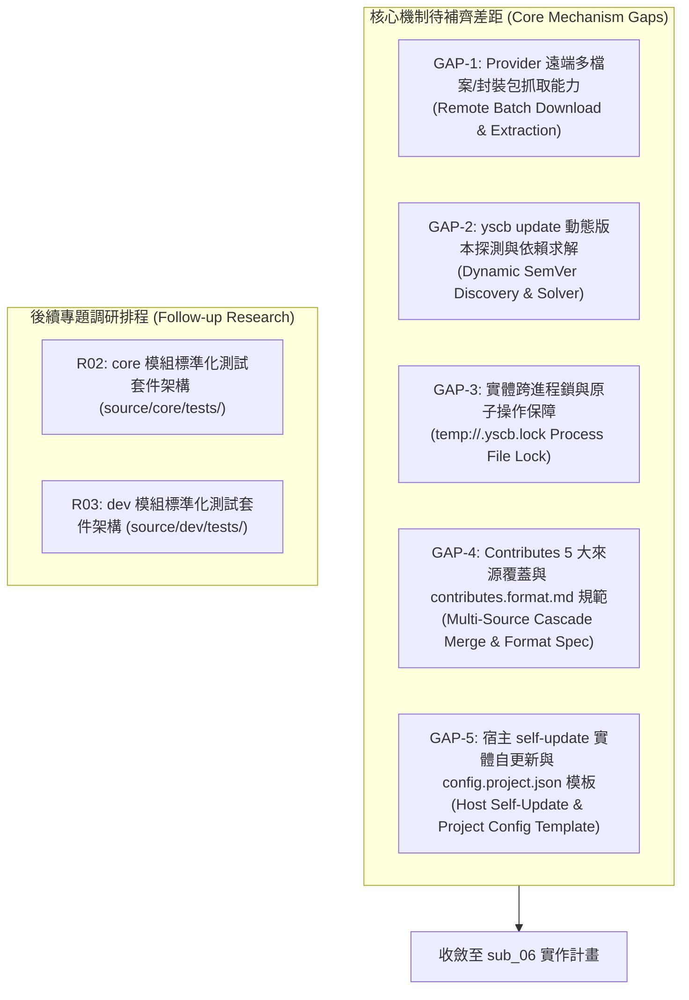

# 設計概念與當前實務狀況對齊調研報告 (R01: Design Concept vs Current Practice Survey)

> 功能名稱：核心模組設計概念與當前實務狀況對齊現況 (Core Design Concept vs Current Practice Alignment)  
> 建立日期：2026-08-24  
> 所屬主計畫：[2026_08_23_2030_architecture_refactor](../umbrella_overview.md)  
> 狀態：In Progress  
> 擴充項目：none  
> 模板版本：v1.3  

---

## 1. 調研背景與目標 (Background & Objectives)

在主計畫前期調研（`R01`~`R05`）與前五個子計畫（`sub_01`~`sub_05`）推進完成後，我們已具備微內核宿主、核心套件管理器、開發者工具鏈與沙盒測試引擎。

然而，在對齊主計畫設計藍圖（Blueprint）時，發現核心基礎設施仍有若干設計機制與規範產物尚未完全落實。

本調研聚焦於**核心功能與機制層面之 5 大關鍵差距 (Gap 1~5)**，並針對先前規範但尚未實體產出的 **`contributes.format.md` 規範說明書** 與 **`config.project.json` 專案組態模板** 進行深度盤點與補齊規劃。

> [!NOTE]
> 關於官方標準測試套件之設計，將拆分為後續專題調研深入論述：
> - **R02**：`core` 模組官方持久化標準測試套件設計 (`source/core/tests/`)
> - **R03**：`dev` 模組官方持久化標準測試套件設計 (`source/dev/tests/`)

---

## 2. 主計畫概念規格 vs. 當前實作狀況對齊矩陣 (Concept vs Practice Matrix)

| 架構維度 | 主計畫設計規格 (Blueprint / Specs) | 當前源碼實作現況 (Current Codebase) | 對齊狀態 | 差距代號 |
| :--- | :--- | :--- | :---: | :---: |
| **1. 遠端 Provider 下載** | 支援本地目錄、遠端 HTTP/Git 清冊批次下載與發布包解壓。 | 目前支援本地目錄；遠端僅能 fetch 單一 `index.json`，缺乏多檔案批次下載能力。 | 🟡 部分對齊 | **GAP-1** |
| **2. 動態版本升級求解** | `update` 向 Provider 查詢版本清冊，依 SemVer 約束自動升級至最新相容版本。 | `cmd_update` 固定升級至 `1.1.0` 假定版本，未動態向 Provider 查詢版本清單。 | 🟡 部分對齊 | **GAP-2** |
| **3. 跨進程互斥鎖** | `act_lock` / `act_unlock` 具備實體 OS 檔案鎖，防止多進程同時操作損毀環境。 | 目前僅為暫存/記憶體註記，未落實排他性 Lockfile 與逾時自癒機制。 | 🟡 部分對齊 | **GAP-3** |
| **4. Contributes 聚合機制** | 1. 5 大來源聚合優先級覆蓋。<br/>2. 模組根目錄提供 `contributes.format.md`。 | 1. 目前僅聚合 `manifest.json`。<br/>2. 尚未實體產出 `contributes.format.md` 規範定義檔。 | 🟡 部分對齊 | **GAP-4** |
| **5. 宿主自更新與專案組態** | 1. `yscb.py self-update` 下載覆蓋。<br/>2. 內建 `config.project.json` 模板。 | 1. `self-update` 僅輸出文字提示。<br/>2. 未提供標準 `config.project.json` 專案組態範本。 | 🟡 部分對齊 | **GAP-5** |

---

## 3. 核心差距深剖與待補齊項目 (Key Gaps Analysis)



### 🔴 GAP-1：遠端 Provider 多檔案/壓縮包下載與解包能力
- **現狀問題**：`act_download` 目前僅能處理本地目錄結構。若對接 GitHub Raw 或 HTTP 靜態站點時，無法下載模組的所有子目錄原始碼檔案。
- **補齊方案**：
  - 在 Provider 的 `index.json` 中宣告 `files: ["manifest.json", "scripts/cli.py", ...]` 檔案清單。
  - `act_download` 判斷若為 HTTP/HTTPS URL，則逐一發起 `act_fetch` 將檔案批次寫入鏡像目錄。

### 🟡 GAP-2：`yscb update` 動態版本探測與升級求解
- **現狀問題**：`Installer.cmd_update` 目前硬編碼目標版本為 `1.1.0`，未向 Provider 查詢最新可用版本。
- **補齊方案**：
  - 向 Provider 讀取 `index.json` 之 `versions` 陣列（或依 SemVer 排序的版本目錄清單）。
  - 自動比對已安裝模組版本，找出最新且相容的發布版本進行升級。

### 🟡 GAP-3：跨進程鎖 (`temp://.yscb.lock`) 與原子交易保護
- **現狀問題**：`act_lock` / `act_unlock` 未實作基於作業系統的跨進程排他鎖。
- **補齊方案**：
  - 於 `temp://.yscb.lock` 實作原子鎖檔案建立（支援逾時檢測與崩潰自癒清理），確保同一時間僅有單一 `install` / `update` / `remove` 進程修改環境。

### 🟡 GAP-4：Contributes 聚合覆蓋與 `contributes.format.md` 規範說明書
- **現狀問題**：
  1. 尚未實作主計畫 R03 規範之 `contributes.format.md` 說明書；
  2. `ContributesAggregator` 尚未整合獨立 `contributes.{module}.json` 與專案層級覆蓋。
- **`source/core/contributes.format.md` 完整規格範本**：
  ```markdown
  # Core 模組貢獻擴充格式說明書 (contributes.format.md)

  > 本文件定義其他模組在 `manifest.json` 或 `contributes.core.json` 中向 `core` 宣告擴充之標準格式。

  ## 1. 支援之擴充點清單 (Contribution Points)

  | 擴充鍵名 (Key) | 說明 | 格式型別 |
  | :--- | :--- | :--- |
  | **`path_placeholders`** | 註冊自訂路徑佔位符（用於 URI 解算，例 `{my_token}`） | `array[object]` |
  | **`uri_schemes`** | 註冊自訂語意 URI 協議（例 `plans://...`, `docs://...`） | `array[object]` |
  | **`events`** | 訂閱核心生命週期事件（例 `on_install`, `on_reload`） | `array[object]` |

  ## 2. Schema 定義與範例

  ### 2.1 路徑佔位符 (`path_placeholders`)
  ```json
  {
    "path_placeholders": [
      {
        "token": "workspace_id",
        "handler": "scripts/resolvers.py:resolve_workspace",
        "description": "解析當前工作區識別碼"
      }
    ]
  }
  ```

  ### 2.2 語意 URI 協議 (`uri_schemes`)
  ```json
  {
    "uri_schemes": [
      {
        "token": "plans",
        "type": "config",
        "value": "paths.plans_dir",
        "description": "指向專案活躍開發計畫目錄"
      },
      {
        "token": "docs",
        "type": "config",
        "value": "paths.docs_dir",
        "description": "指向專案知識庫文檔目錄"
      },
      {
        "token": "custom_cache",
        "type": "const",
        "value": "yscb://.cache/{module}/custom/",
        "description": "模組自訂暫存快取目錄"
      }
    ]
  }
  ```

  ### 2.3 生命週期事件訂閱 (`events`)
  ```json
  {
    "events": [
      {
        "event_name": "on_reload",
        "handler": "scripts/hooks.py:on_env_reloaded",
        "description": "當環境重構刷新完成時觸發"
      }
    ]
  }
  ```
  ```

---

### 🟡 GAP-5：宿主單檔 `self-update` 與 `config.project.json` 專案組態模板
- **現狀問題**：
  1. `yscb.py self-update` 僅為佔位文字；
  2. 專案根目錄缺乏標準 `config.project.json` 範本（僅有 `yscb.config.json`），導致 `type: "config"` 類型的 URI 協議無法動態讀取專案路徑設定。
- **`config.project.json` 標準範本**：
  ```json
  {
    "$schema": "./ys_codebase/modules/core/schemas/config.project.schema.json",
    "project_name": "my_project",
    "version": "1.0.0",
    "default_provider": "./ys_codebase/build",
    "paths": {
      "plans_dir": "plans",
      "docs_dir": "docs",
      "archive_dir": "archive_plans",
      "extensions_dir": "extensions"
    },
    "modules": {
      "core": {
        "auto_reload": true
      },
      "dev": {
        "default_test_type": "all",
        "preserve_sandbox_on_failure": true
      }
    },
    "contributes": {
      "core": {
        "uri_schemes": []
      }
    }
  }
  ```
- **補齊方案**：
  1. 實作 `yscb.py self-update`：自 Provider 下載最新版 `yscb.py` 至暫存檔，經過 `py_compile` 語法驗證後執行原子覆蓋；
  2. 在 `source/core/` 建立 `config.project.json` 標準範本，並於 `yscb.py init` 時若不存在則自動生成初始範本。

---

## 4. 落地行動藍圖 (Action Roadmap for sub_06)

```text
sub_06_misc_polish_and_tests/
├── R01_design_concept_vs_current_practice_survey.md  <-- [當前] 聚焦 GAP-1 ~ GAP-5 與規範模板盤點
├── R02_core_standard_test_suite_design.md           <-- [下一步] core 標準測試設計
├── R03_dev_standard_test_suite_design.md            <-- [下一步] dev 標準測試設計
├── P01_requirements_spec.md                         <-- 收斂 GAP-1~5 與 R02/R03 產出
└── ...
```
