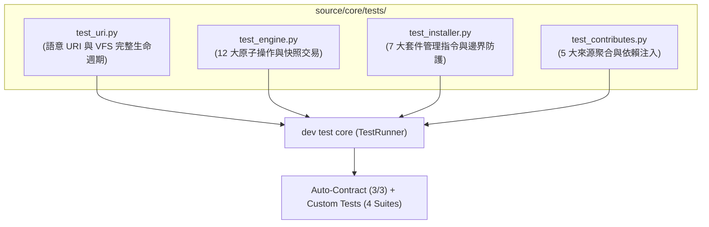

# 技術調研報告 (R02: Core Module Standard Test Suite Design)

> 功能名稱：Core 模組官方標準測試套件架構設計 (Core Standard Test Suite Design)  
> 建立日期：2026-08-24  
> 所屬主計畫：[2026_08_23_2030_architecture_refactor](../umbrella_overview.md)  
> 狀態：Confirmed  
> 擴充項目：none  
> 模板版本：v1.3  

---

## 1. 調研背景與目標 (Background & Objectives)

在 `sub_05` 中，我們成功交付了零外部依賴的測試框架 SDK (`dev.testing`) 與命令列測試引擎 (`dev test`)。

在 `sub_05` 驗收期間，為避免循環自引用相依，我們恪守零污染原則，未在 `source/core/tests/` 建立持久化測試。

本調研（R02）專注於為 **`core` 基礎設施模組** 規劃官方持久化標準測試套件架構，使 `core` 模組具備完整、健全、自包含的單元測試與沙盒整合測試。

---

## 2. 測試套件架構與測試案例矩陣 (Test Suite Architecture)



### 2.1 測試模組檔案職責劃分

| 測試檔案 | 涵蓋目標源碼 | 核心測試範疇與驗證要點 |
| :--- | :--- | :--- |
| **`test_uri.py`** | [`core/uri.py`](file:///h:/UseFolder/CodeRepo/ys_codebase/ys_codebase/source/core/core/uri.py) | 1. 15 大 VFS I/O 方法（`read_text`, `write_text`, `read_json`, `write_json`, `copy`, `move` 等）。<br/>2. 15 大語意 URI 協議雙向解析 (`resolve` / `to_uri`)。<br/>3. `{module}` 與自訂路徑佔位符代換。<br/>4. 原子寫入 (`.tmp` ➔ `replace`) 與異常隔離。<br/>5. 未支援協議 (`unknown://`) 之 `ValueError` 攔截。 |
| **`test_engine.py`** | [`core/engine.py`](file:///h:/UseFolder/CodeRepo/ys_codebase/ys_codebase/source/core/core/engine.py) | 1. 12 大原子操作 (`ACT-01` ~ `ACT-12`)。<br/>2. 快照建立 (`act_snapshot`) 與完整還原 (`act_restore_snapshot`)。<br/>3. 跨進程檔案鎖 (`act_lock` / `act_unlock`) 與逾時自癒。<br/>4. 兩階段純淨物化 (`act_reload`) 清除幽靈檔案。<br/>5. Provider 遠端清冊批次下載 (`act_download`) 與異常阻斷。 |
| **`test_installer.py`** | [`core/installer.py`](file:///h:/UseFolder/CodeRepo/ys_codebase/ys_codebase/source/core/core/installer.py) | 1. 7 大 Installer 指令：`install`, `update`, `remove`, `list`, `status`, `rollback`, `reload`。<br/>2. 預設 Provider 解析優先級（`CLI` ➔ `config.project.json` ➔ `yscb.config.json`）。<br/>3. 反向相依阻斷（拒絕刪除被相依之模組）。<br/>4. 狀態健康度診斷 (`Healthy`, `Incomplete`, `Degraded`)。 |
| **`test_contributes.py`** | [`core/contributes.py`](file:///h:/UseFolder/CodeRepo/ys_codebase/ys_codebase/source/core/core/contributes.py) | 1. 5 大來源檢索與深度字典合併優先級。<br/>2. 路徑佔位符動態 handler 呼叫與 `ExecutionContext` 傳遞。<br/>3. 語意 URI 協議動態注入 (`type: "const"` vs `type: "config"`).<br/>4. 生命週期事件訂閱與廣播 (`on_reload`, `on_install`)。 |

---

## 3. 詳細測試案例設計 (Detailed Test Cases Design)

### 3.1 `test_uri.py` 測試矩陣

```python
class TestCoreURI(YSCBTestCase):
    def test_protocol_resolution(self):
        """驗證 15 大語意 URI 協議解析出的絕對路徑正確性"""
        
    def test_vfs_atomic_io(self):
        """驗證 write_text / write_json 之原子寫入與唯讀讀取"""
        
    def test_vfs_directory_operations(self):
        """驗證 makedirs, listdir, rmtree, copy, move"""
        
    def test_unsupported_scheme_raises(self):
        """驗證未支援之協議 scheme 拋出 ValueError"""
```

### 3.2 `test_engine.py` 測試矩陣

```python
class TestCoreAtomicEngine(YSCBTestCase):
    def test_snapshot_and_rollback(self):
        """驗證快照備份與災難回滾之資料完整性"""
        
    def test_process_file_lock(self):
        """驗證 temp://.yscb.lock 之排他性與釋放"""
        
    def test_clean_reload_removes_ghost_files(self):
        """驗證 act_reload 階段一能徹底清除非清冊內的幽靈檔案"""
        
    def test_download_missing_package_raises(self):
        """驗證 Provider 找不到套件時嚴格拋出 FileNotFoundError"""
```

### 3.3 `test_installer.py` 測試矩陣

```python
class TestCoreInstaller(YSCBTestCase):
    def test_install_and_force_reinstall(self):
        """驗證模組標準安裝與 --force 強制覆蓋物化"""
        
    def test_remove_reverse_dependency_guard(self):
        """驗證反向相依阻斷（禁止刪除 core 或被依賴之模組）"""
        
    def test_status_health_diagnostics(self):
        """驗證 status 報告正確識別完整、損壞或缺失模組"""
```

### 3.4 `test_contributes.py` 測試矩陣

```python
class TestCoreContributes(YSCBTestCase):
    def test_contributes_manifest_scan(self):
        """驗證掃描 manifest.json 之 contributes 宣告並正確註冊"""
        
    def test_uri_scheme_injection_const_and_config(self):
        """驗證 const 型與 config 型 URI 協議注入解算"""
        
    def test_event_hook_invocation(self):
        """驗證事件訂閱 handler 於廣播時被正確呼叫"""
```

---

## 4. 落地驗收標準 (Acceptance Criteria)

1. **目錄結構**：`source/core/tests/` 包含 4 個測試模組檔案：
   - `test_uri.py`
   - `test_engine.py`
   - `test_installer.py`
   - `test_contributes.py`
2. **自動化探索與執行**：
   - 執行 `python yscb.py dev test core` 時，輸出：
     ```text
     [*] Module: core                                                   [PASS]
         |-- [Contract] Auto-Contract Suite ... (3/3)
         \-- [Custom]   Custom Tests ........... (16/16)
     ```
3. **零殘留沙盒隔離**：
   - 每個測試案例均繼承自 `YSCBTestCase`，在獨立臨時沙盒中運行，成功自動清除，失敗保留並輸出路徑。
