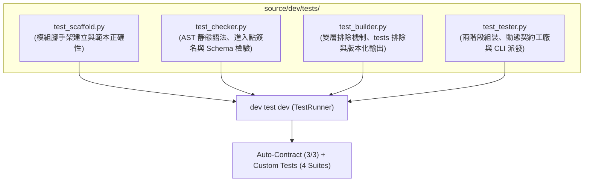

# 技術調研報告 (R03: Dev Module Standard Test Suite Design)

> 功能名稱：Dev 模組官方標準測試套件架構設計 (Dev Standard Test Suite Design)  
> 建立日期：2026-08-24  
> 所屬主計畫：[2026_08_23_2030_architecture_refactor](../umbrella_overview.md)  
> 狀態：Confirmed  
> 擴充項目：none  
> 模板版本：v1.3  

---

## 1. 調研背景與目標 (Background & Objectives)

在 `sub_04` 與 `sub_05` 中，我們依序實現了模組腳手架 (`Scaffolder`)、合規檢查器 (`Checker`)、純淨建置器 (`Builder`) 與測試引擎 (`Tester` / `dev.testing`)。

本調研（R03）專注於為 **`dev` 開發者工具模組** 規劃官方持久化標準測試套件架構（存放於 `source/dev/tests/`），確保開發者工具鏈的四大核心工具具備全面、自動化的單元與整合測試覆蓋。

---

## 2. 測試套件架構與測試案例矩陣 (Test Suite Architecture)



### 2.1 測試模組檔案職責劃分

| 測試檔案 | 涵蓋目標源碼 | 核心測試範疇與驗證要點 |
| :--- | :--- | :--- |
| **`test_scaffold.py`** | [`dev/scaffold.py`](file:///h:/UseFolder/CodeRepo/ys_codebase/ys_codebase/source/dev/dev/scaffold.py) | 1. 模組建立 `create_module(name, desc)` 生成完整目錄與範本檔案。<br/>2. 驗證 `manifest.json`、`scripts/cli.py`、`__init__.py`、`.yscbignore` 之有效性。<br/>3. 重複建立或無效名稱之例外與錯誤處理。 |
| **`test_checker.py`** | [`dev/checker.py`](file:///h:/UseFolder/CodeRepo/ys_codebase/ys_codebase/source/dev/dev/checker.py) | 1. `check_module` 驗證合法模組（回傳 `True, []`）。<br/>2. `manifest.json` 缺少必填欄位或 SemVer 格式錯誤之檢驗攔截。<br/>3. `scripts/cli.py` 語法錯誤或缺少 `main(argv)` 簽名之 AST 靜態攔截。<br/>4. `check_all` 全量掃描驗證。 |
| **`test_builder.py`** | [`dev/builder.py`](file:///h:/UseFolder/CodeRepo/ys_codebase/ys_codebase/source/dev/dev/builder.py) | 1. `build_module` 輸出至版本化目錄 `build/<name>/<version>/`。<br/>2. **Layer 1 全域排除斷言**：驗證 `tests/`、`tests/*`、`.yscbignore`、`__pycache__` 100% 被過濾。<br/>3. **Layer 2 自訂排除斷言**：驗證 `.yscbignore` 自訂規則生效。<br/>4. `clean=True` 乾淨建置驗證。 |
| **`test_tester.py`** | [`dev/tester.py`](file:///h:/UseFolder/CodeRepo/ys_codebase/ys_codebase/source/dev/dev/tester.py) & [`dev/testing/`](file:///h:/UseFolder/CodeRepo/ys_codebase/ys_codebase/source/dev/dev/testing/) | 1. `TestDiscovery` 兩階段測試組裝（Auto-Contract ➔ Custom Tests）。<br/>2. `make_contract_suite` 動態合成 3 大契約測試。<br/>3. `@require` 條件跳過與 `Requirement` 位元旗標。<br/>4. `Tester` 命令列參數解析（`--all`, `-k`, `--contract-only`, `--verbose`, `--type`）。<br/>5. `ASCIIReportFormatter` 跨平台格式化輸出。 |

---

## 3. 詳細測試案例設計 (Detailed Test Cases Design)

### 3.1 `test_scaffold.py` 測試矩陣

```python
class TestDevScaffolder(YSCBTestCase):
    def test_create_module_structure(self):
        """驗證 create_module 生成標準 4 大檔案 (manifest, cli.py, __init__.py, .yscbignore)"""
        
    def test_create_duplicate_module_fails(self):
        """驗證重複建立既有模組時正確報錯阻斷"""
        
    def test_invalid_module_name_rejected(self):
        """驗證特殊字元或空白模組名稱被拒絕"""
```

### 3.2 `test_checker.py` 測試矩陣

```python
class TestDevChecker(YSCBTestCase):
    def test_check_valid_module_passes(self):
        """驗證合規模組通過全部 3 大靜態檢驗"""
        
    def test_check_missing_manifest_fields(self):
        """驗證 manifest.json 缺少 version/entry 時準確回報錯誤清單"""
        
    def test_check_invalid_cli_entrypoint(self):
        """驗證 cli.py 語法錯誤或缺少 main(argv) 時被 AST 攔截"""
```

### 3.3 `test_builder.py` 測試矩陣

```python
class TestDevBuilder(YSCBTestCase):
    def test_build_versioned_directory(self):
        """驗證建置產物輸出至 build/<name>/<version>/ 拓撲"""
        
    def test_global_ignores_tests_and_yscbignore(self):
        """驗證 tests/ 目錄與 .yscbignore 檔案 100% 不出現在 build 產物中"""
        
    def test_custom_yscbignore_rules(self):
        """驗證模組 .yscbignore 內宣告之自訂排除規則生效"""
```

### 3.4 `test_tester.py` 測試矩陣

```python
class TestDevTester(YSCBTestCase):
    def test_auto_contract_synthesis(self):
        """驗證 make_contract_suite 為目標模組動態生成契約測試"""
        
    def test_two_phase_discovery(self):
        """驗證兩階段測試探索（契約測試 + 自訂測試）正確統計"""
        
    def test_cli_argument_dispatch(self):
        """驗證 Tester 支援 --all, -k pattern, --contract-only 等參數"""
        
    def test_require_condition_skip(self):
        """驗證 @require 條件未滿足時觸發 SkipTest"""
```

---

## 4. 落地驗收標準 (Acceptance Criteria)

1. **目錄結構**：`source/dev/tests/` 包含 4 個測試模組檔案：
   - `test_scaffold.py`
   - `test_checker.py`
   - `test_builder.py`
   - `test_tester.py`
2. **自動化探索與執行**：
   - 執行 `python yscb.py dev test dev` 時，輸出：
     ```text
     [*] Module: dev                                                    [PASS]
         |-- [Contract] Auto-Contract Suite ... (3/3)
         \-- [Custom]   Custom Tests ........... (16/16)
     ```
3. **全量回歸守門驗收**：
   - 執行 `python yscb.py dev test --all`，`core` 與 `dev` 兩大模組之 Contract Tests + Custom Tests **100% 全部通過**！
