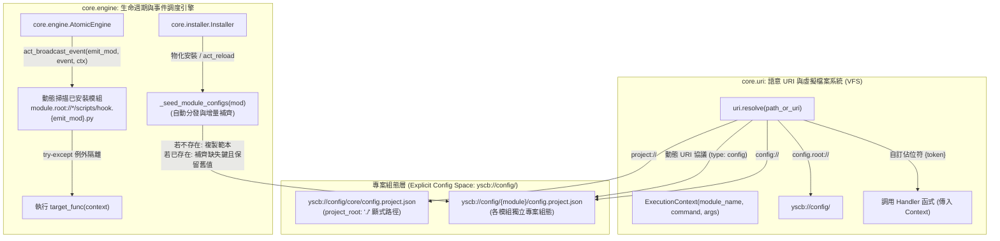
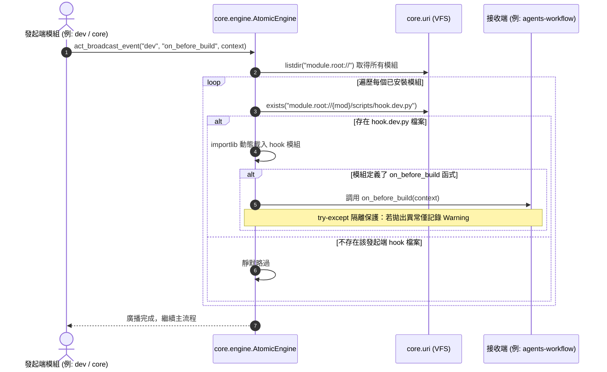
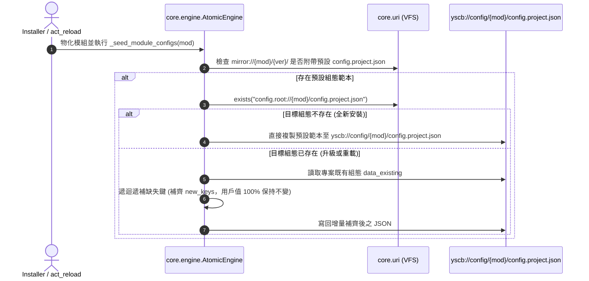

# 架構設計書 (Architecture Plan)

> 功能名稱：Core 模組功能打磨 (Core Module Polish)  
> 建立日期：2026-08-24  
> 所屬主計畫：[2026_08_23_2030_architecture_refactor](../umbrella_overview.md)  
> 依據 P01：[P01_requirements_spec.md](./P01_requirements_spec.md)  
> 狀態：Confirmed  
> 擴充項目：none  
> 模板版本：v1.2  

---

## 1. 系統架構拓撲 (System Architecture)

---

## 2. 模組分層與職責劃分 (Module Components)

| 模組 / 檔案路徑 | 職責定義 | 依賴關係 | 對應 FR |
| :--- | :--- | :--- | :--- |
| [`source/core/core/uri.py`](file:///h:/UseFolder/CodeRepo/ys_codebase/ys_codebase/source/core/core/uri.py) | 1. 實作 `ExecutionContext` 資料類別。 2. 實作 `project://` 顯式無 Fallback 解算（讀取 `config/core/config.project.json` 之 `project_root`，未定義拋出 `ValueError`）。 3. 將 `config.root://` 更新為 `yscb://config/`，`config://` 更新為 `yscb://config/{module}/`。 4. 打通 `contributes` 宣告之 `type: "config"` 與 `type: "const"` 自訂 URI 協議與 `path_placeholders` 動態 handler 解算。 | `json`, `os`, `importlib` | FR-01, FR-02, FR-05 |
| [`source/core/core/engine.py`](file:///h:/UseFolder/CodeRepo/ys_codebase/ys_codebase/source/core/core/engine.py) | 1. 實作 `act_broadcast_event(emit_module, event_name, context)`：動態遍歷模組載入 `hook.{emit_module}.py` 並調度執行，實施 try-except 例外隔離。 2. 實作 `_seed_or_update_config`：支援組態不存在時自動部署，已存在時遞迴比對增量補齊缺失條目。 | `core.uri`, `importlib.util` | FR-03, FR-04 |
| [`source/core/core/installer.py`](file:///h:/UseFolder/CodeRepo/ys_codebase/ys_codebase/source/core/core/installer.py) | 1. 於 `cmd_install` / `cmd_update` / `cmd_reload` 流程中觸發組態自動分發與增量補齊。 2. 觸發 `on_install`, `on_update`, `on_remove`, `on_reload` 事件廣播。 | `core.engine`, `core.uri` | FR-03, FR-04 |
| `R01 ~ R04 白皮書` | 同步回填最新架構設計（`hook.{emit_module}.py`、顯式 `config/`、`project://` 零 Fallback、增量補齊）。 | 無 | NFR-04 |

---

## 3. 關鍵流程循序圖 (Sequence Diagrams)

### 3.1 命名空間 Hook 事件廣播流程 (`hook.{emit_module}.py`)

### 3.2 組態預設分發與增量缺失補齊流程 (Config Seeding & Auto-Fill)

---

## 4. 影響檔案清單 (Impacted Files)

| 檔案路徑 | 變更類型 | 說明 |
| :--- | :---: | :--- |
| [`source/core/core/uri.py`](file:///h:/UseFolder/CodeRepo/ys_codebase/ys_codebase/source/core/core/uri.py) | Modify | 實作 `ExecutionContext`、`project://` 顯式配置解算（無 fallback）、`config/` 顯式目錄與動態 contributes 解析 |
| [`source/core/core/engine.py`](file:///h:/UseFolder/CodeRepo/ys_codebase/ys_codebase/source/core/core/engine.py) | Modify | 實作 `act_broadcast_event`（命名空間 hook 調度與隔離）與 `_seed_or_update_config`（增量補齊） |
| [`source/core/core/installer.py`](file:///h:/UseFolder/CodeRepo/ys_codebase/ys_codebase/source/core/core/installer.py) | Modify | 整合組態自動分發、生命週期事件發送與 `project://` 零 fallback 防護 |
| [`source/core/tests/test_uri.py`](file:///h:/UseFolder/CodeRepo/ys_codebase/ys_codebase/source/core/tests/test_uri.py) | Modify | 新增 `project://` 顯式與未配置阻斷測試、`config/` 新協議測試 |
| [`source/core/tests/test_engine.py`](file:///h:/UseFolder/CodeRepo/ys_codebase/ys_codebase/source/core/tests/test_engine.py) | Modify | 新增命名空間 hook 廣播、例外隔離與組態增量補齊測試 |
| [`source/core/tests/test_installer.py`](file:///h:/UseFolder/CodeRepo/ys_codebase/ys_codebase/source/core/tests/test_installer.py) | Modify | 新增模組安裝時自動種入與增量補齊組態驗證 |
| `R01_module_architecture_survey.md` ~ `R04_lifecycle_invocation_flow.md` | Modify | 回填對齊最新白皮書規範 |

---

## 5. 本階段決策紀錄 (Phase 2 Decision Records)

- **[P02:DR-01] 顯式 project_root 組態路徑**：`project://`  строго 從 `yscb://config/core/config.project.json` 之 `project_root` 解算；未配置直接拋出 `ValueError`。
- **[P02:DR-02] 顯式 config/ 專案目錄**：`config.root://` = `yscb://config/`，`config://` = `yscb://config/{module}/`。
- **[P02:DR-03] 命名空間 Hook 動態載入策略**：動態載入 `hook.{emit_module}.py` 時採用獨立模組名稱注入 `sys.modules`，防止全域命名空間污染。
- **[P02:DR-04] 字典遞迴深度補齊演算法**：組態補齊採用原地鍵補齊（Recursive Key Infill），僅新增缺失的 key，既有 key 的 value 絕對不被覆寫。
