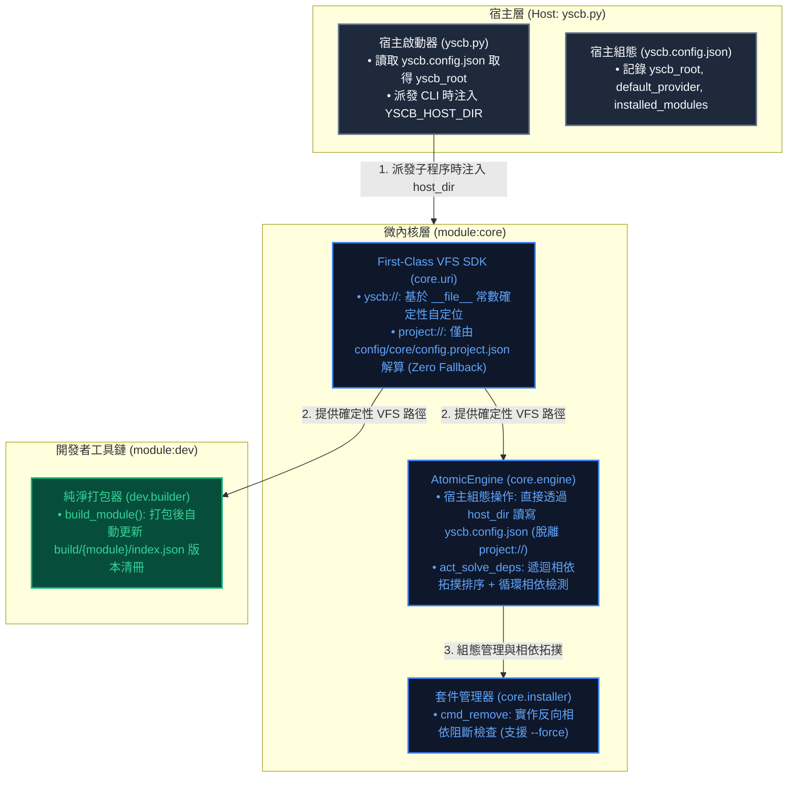
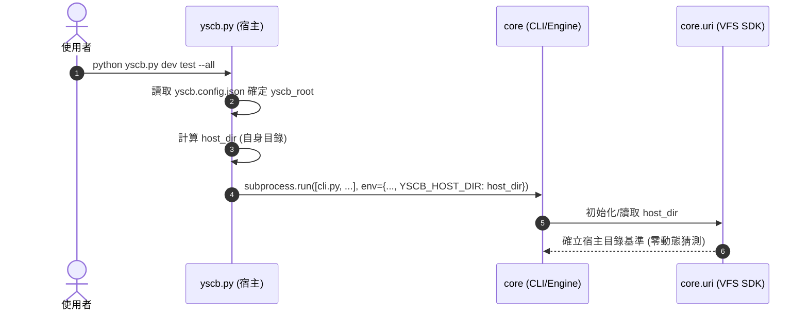
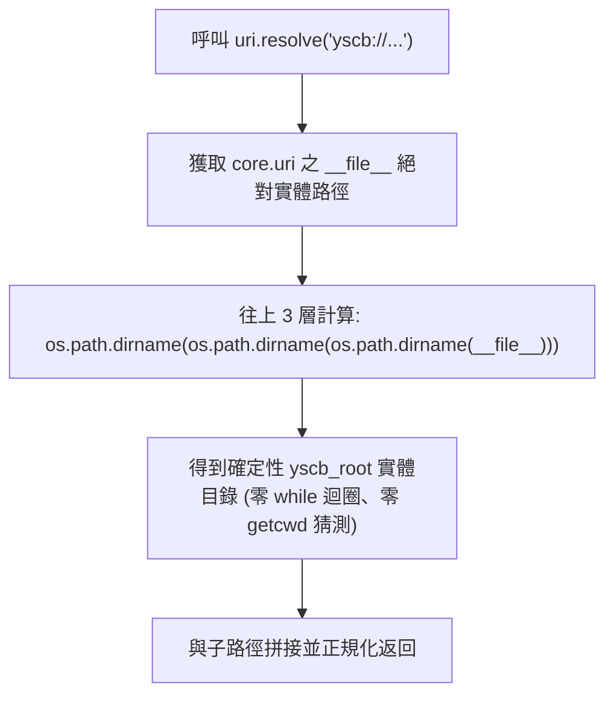
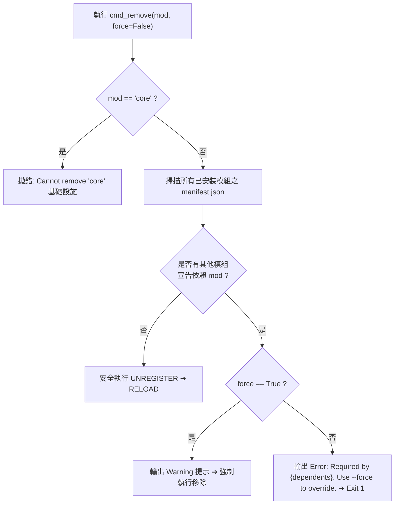
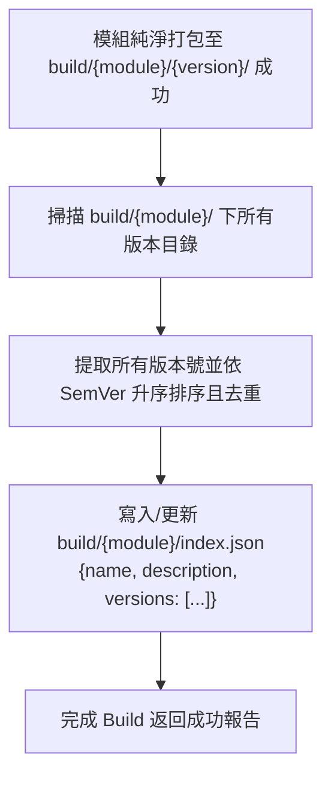

# 架構與模組設計 (Architecture & Module Design)

> 功能名稱：架構合規性缺陷修復與穩固性強化 (Architecture Compliance Bugfix & Hardening)  
> 建立日期：2026-08-25  
> 所屬主計畫：[2026_08_23_2030_architecture_refactor](../umbrella_overview.md)  
> 依據 P01：[P01_requirements_spec.md](./P01_requirements_spec.md)  
> 狀態：Confirmed  
> 擴充項目：none  
> 模板版本：v1.4  

---

## 1. 架構拓撲與模組分層設計

---

## 2. 核心循序與調用流程 (Sequence & Flowcharts)

### 2.1 宿主派發與 Host Context 注入循序圖

### 2.2 `yscb://` 代碼位置常數確定性解析流程

### 2.3 `cmd_remove` 反向相依安全阻斷防護流程

### 2.4 `dev build` 自動更新 `index.json` 流程

---

## 3. 受影響檔案與變更矩陣

| 檔案路徑 | 變更性質 | 影響模組 / 核心職責 | 說明 |
| :--- | :---: | :--- | :--- |
| [`source/core/core/uri.py`](file:///h:/UseFolder/CodeRepo/ys_codebase/ys_codebase/source/core/core/uri.py) | Modify | `core.uri` | 實作 `__file__` 常數自定位、`set_host_dir()`、環境變數 `YSCB_HOST_DIR` 探測，徹底移除 `while` 爬目錄與 `os.getcwd()` 猜測。 |
| [`source/core/core/engine.py`](file:///h:/UseFolder/CodeRepo/ys_codebase/ys_codebase/source/core/core/engine.py) | Modify | `core.engine` | `_get_config`, `_save_config`, `act_init`, `act_snapshot`, `act_restore_snapshot` 改用 `host_dir` 操作；實作 `act_solve_deps` 遞迴相依拓撲求解與循環相依檢測。 |
| [`source/core/core/installer.py`](file:///h:/UseFolder/CodeRepo/ys_codebase/ys_codebase/source/core/core/installer.py) | Modify | `core.installer` | `cmd_remove` 增加反向相依阻斷檢查（支援 `--force` 旗標與參數解析）。 |
| [`source/dev/dev/builder.py`](file:///h:/UseFolder/CodeRepo/ys_codebase/ys_codebase/source/dev/dev/builder.py) | Modify | `dev.builder` | `build_module` 打包完成後自動維護 `build/{module}/index.json`。 |
| [`source/dev/contributes.format.md`](file:///h:/UseFolder/CodeRepo/ys_codebase/ys_codebase/source/dev/contributes.format.md) | NEW | `dev` | 建立 Dev 模組對外貢獻說明書。 |
| [`yscb.py`](file:///h:/UseFolder/CodeRepo/ys_codebase/yscb.py) | Modify | `host` | `cmd_init` 補齊 `default_provider`；`dispatch_module` 派發子程序時注入 `YSCB_HOST_DIR` 環境變數。 |
| [`source/core/tests/`](file:///h:/UseFolder/CodeRepo/ys_codebase/ys_codebase/source/core/tests/) | Modify/NEW | `core.tests` | 補充宿主組態解耦、反向相依阻斷、`FileNotFoundError` 阻斷與相依拓撲測試案例。 |
| [`source/dev/tests/`](file:///h:/UseFolder/CodeRepo/ys_codebase/ys_codebase/source/dev/tests/) | Modify/NEW | `dev.tests` | 補充 `index.json` 自動生成驗證測試。 |

---

## 4. 決策紀錄 (Decision Records)

### [P02:DR-01] 宿主 Context 注入採用「環境變數傳遞 + API 設定」雙通道
- **結論**：`yscb.py` 在 `dispatch_module` 時，將自身的 `host_dir` 注入至 `os.environ["YSCB_HOST_DIR"]`；`core.uri` 提供 `set_host_dir(path)` 與 `get_host_dir()` 作為程式碼調用通道。
- **理由**：既滿足 CLI 子程序調度時的無縫傳遞，又滿足外部 Python 程式碼直接引用 SDK 時的顯式配置。

### [P02:DR-02] `index.json` 採原地掃描增量維護
- **結論**：`Builder.build_module` 在每次成功產出版本目錄後，掃描 `build/{module}/` 目錄下所有包含 `manifest.json` 的子目錄，提取版本號並依 SemVer 排序寫入 `index.json`。
- **理由**：保證 `index.json` 永遠與本地套件庫實體版本目錄 100% 同步，且不遺漏手動放置或歷史建置之版本。

---

## 5. 閉合確認 (Closing Confirmation)

- [x] 開發者已確認：P02 架構設計與循序圖確認無誤，可進入 Phase 3
