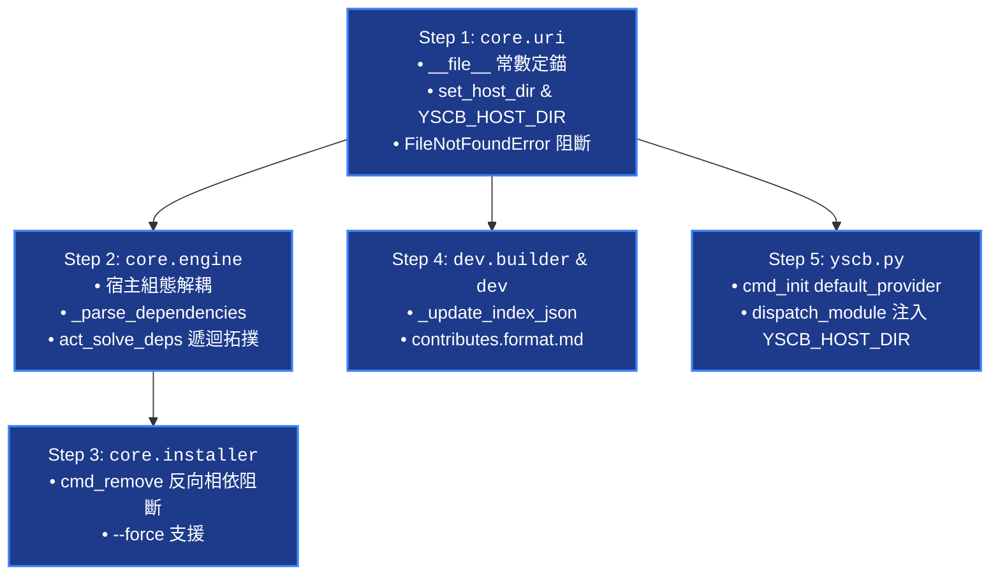

# API 規格定義書 (API Specification)

> 功能名稱：架構合規性缺陷修復與穩固性強化 (Architecture Compliance Bugfix & Hardening)  
> 建立日期：2026-08-25  
> 所屬主計畫：[2026_08_23_2030_architecture_refactor](../umbrella_overview.md)  
> 依據 P02：[P02_architecture_plan.md](./P02_architecture_plan.md)  
> 狀態：Confirmed  
> 擴充項目：none  
> 模板版本：v1.4  

---

## 1. Public & Internal API 簽名定義

### 1.1 `core.uri` 定錨與 Context 注入 API

```python
# 模組：core.uri

_active_host_dir: Optional[str] = None

def set_host_dir(host_dir: Optional[str]) -> None:
    """
    顯式設定宿主入口目錄 (Host Context Injection)。
    
    :param host_dir: 包含 yscb.config.json 與 yscb.py 之實體絕對路徑
    """
    global _active_host_dir
    _active_host_dir = os.path.normpath(os.path.abspath(host_dir)) if host_dir else None

def get_host_dir() -> Optional[str]:
    """獲取當前注入之宿主目錄。優先讀取 _active_host_dir，次之讀取環境變數 YSCB_HOST_DIR。"""
    if _active_host_dir:
        return _active_host_dir
    env_dir = os.environ.get("YSCB_HOST_DIR")
    if env_dir and os.path.isdir(env_dir):
        return os.path.normpath(os.path.abspath(env_dir))
    return None

def _get_yscb_root() -> str:
    """
    常數自定位：以 uri.py 自身實體路徑為基準向上 3 層確定性計算 yscb_root。
    
    運行端：<yscb_root>/modules/core/core/uri.py -> 往上 3 層 = <yscb_root>
    源碼端：<yscb_root>/source/core/core/uri.py -> 往上 3 層 = <yscb_root>
    
    :return: 實體絕對 yscb_root 路徑
    """
    curr = os.path.dirname(os.path.abspath(__file__))
    # core -> core (or source/modules) -> yscb_root
    yscb_root = os.path.dirname(os.path.dirname(os.path.dirname(curr)))
    return os.path.normpath(yscb_root)

def _find_host_config(start_dir: Optional[str] = None) -> Tuple[str, str]:
    """
    定位宿主目錄與 yscb_root。零猜測、零 while 爬目錄。
    
    1. 優先使用 get_host_dir() 注入之目錄。
    2. 若未注入，以 _get_yscb_root() 之父層目錄作為宿主目錄。
    3. 驗證 host_dir 下之 yscb.config.json 是否存在；若不存在拋出 FileNotFoundError。
    
    :return: (host_dir, yscb_dir)
    :raises FileNotFoundError: 當 yscb.config.json 實體不存在時
    """
    yscb_dir = _get_yscb_root()
    host_dir = get_host_dir() or os.path.dirname(yscb_dir)
    cfg_path = os.path.join(host_dir, CONFIG_FILENAME)
    if not os.path.isfile(cfg_path):
        raise FileNotFoundError(
            f"'{CONFIG_FILENAME}' not found at host directory '{host_dir}'. "
            "Please initialize environment with 'python yscb.py init <yscbRoot>' first."
        )
    return host_dir, yscb_dir
```

---

### 1.2 `core.engine.AtomicEngine` 宿主組態與相依拓撲 API

```python
# 模組：core.engine.AtomicEngine

class AtomicEngine:
    def _get_config(self) -> Tuple[str, Dict[str, Any]]:
        """
        讀取宿主組態 yscb.config.json（脫離 project://，使用 host_dir 實體路徑）。
        
        :return: (cfg_real_path, config_dict)
        """
        host_dir, _ = uri._find_host_config()
        cfg_path = os.path.join(host_dir, "yscb.config.json")
        if not os.path.isfile(cfg_path):
            raise FileNotFoundError(f"yscb.config.json not found at '{cfg_path}'.")
        with open(cfg_path, "r", encoding="utf-8") as f:
            return cfg_path, json.load(f)

    def _save_config(self, config_data: Dict[str, Any]) -> None:
        """寫入宿主組態 yscb.config.json（原子替換）。"""
        host_dir, _ = uri._find_host_config()
        cfg_path = os.path.join(host_dir, "yscb.config.json")
        uri.write_json(cfg_path, config_data, indent=2)

    def act_snapshot(self, tag: Optional[str] = None) -> str:
        """建立組態快照至 snapshot://。"""
        host_dir, _ = uri._find_host_config()
        host_cfg = os.path.join(host_dir, "yscb.config.json")
        snapshot_id = tag or f"snap_{int(time.time())}"
        snap_dir = f"snapshot://{snapshot_id}"
        uri.makedirs(snap_dir)
        if os.path.isfile(host_cfg):
            uri.copy(host_cfg, f"{snap_dir}/yscb.config.json")
        return snapshot_id

    def act_restore_snapshot(self, snapshot_id: str) -> None:
        """自 snapshot:// 還原組態。"""
        host_dir, _ = uri._find_host_config()
        host_cfg = os.path.join(host_dir, "yscb.config.json")
        snap_dir = f"snapshot://{snapshot_id}"
        snap_cfg = f"{snap_dir}/yscb.config.json"
        if not uri.exists(snap_cfg):
            raise FileNotFoundError(f"Snapshot '{snapshot_id}' does not exist.")
        uri.copy(snap_cfg, host_cfg)
        self.act_reload(clean_stage=True, inject_stage=True)

    def _parse_dependencies(self, raw_deps: Any) -> Dict[str, str]:
        """
        雙向相容解析 Dict 與 List 格式之 dependencies 宣告。
        
        :param raw_deps: {"core": ">=1.0.0"} 或 ["core >=1.0.0", "helper"]
        :return: {module_name: version_constraint}
        """
        ...

    def act_solve_deps(
        self, 
        target_module: str, 
        version_constraint: Optional[str], 
        provider_url: str
    ) -> List[Tuple[str, str]]:
        """
        遞迴求解模組相依拓撲並檢測循環依賴。
        
        :return: 拓撲排序後的待安裝清冊 [(dep_1, ver_1), ..., (target_module, target_ver)]
        :raises ValueError: 檢測到循環相依時
        """
        ...
```

---

### 1.3 `core.installer.Installer` 反向相依阻斷 API

```python
# 模組：core.installer.Installer

class Installer:
    def cmd_remove(
        self, 
        module_name: str, 
        clean: bool = False, 
        force: bool = False
    ) -> int:
        """
        移除模組，實作反向相依性阻斷檢查。
        
        :param module_name: 目標模組名稱
        :param clean: 是否一併自 mirror:// 刪除產物
        :param force: 是否強制移除被依賴之模組
        :return: 0 成功，1 失敗/阻斷
        """
        ...
```

---

### 1.4 `dev.builder.Builder` 索引自動生成 API

```python
# 模組：dev.builder.Builder

class Builder:
    def _update_index_json(
        self, 
        module_name: str, 
        build_module_dir: str, 
        description: str = ""
    ) -> None:
        """
        掃描 build/{module_name}/ 下現存版本目錄，生成或更新標準 index.json。
        
        Schema:
        {
            "name": module_name,
            "description": description,
            "versions": ["0.9.0", "1.0.0", "1.1.0"]  # SemVer 升序排序
        }
        """
        ...
```

---

## 2. 實作順序與依賴拓撲 (Implementation Topology)



---

## 3. 決策紀錄 (Decision Records)

### [P03:DR-01] 統一以 `_find_host_config()` 作為宿主組態單一真相入口
- **結論**：所有微內核模組若需操作宿主組態 `yscb.config.json`，一律透過 `uri._find_host_config()` 獲取 `host_dir` 並拼接路徑，嚴禁任何模組自訂組態搜尋路徑。
- **理由**：確立宿主目錄定位之單一真理來源 (SSOT)。

---

## 4. 閉合確認 (Closing Confirmation)

- [x] 開發者已確認：P03 API 規格與依賴拓撲確認無誤，可進入 Phase 4
