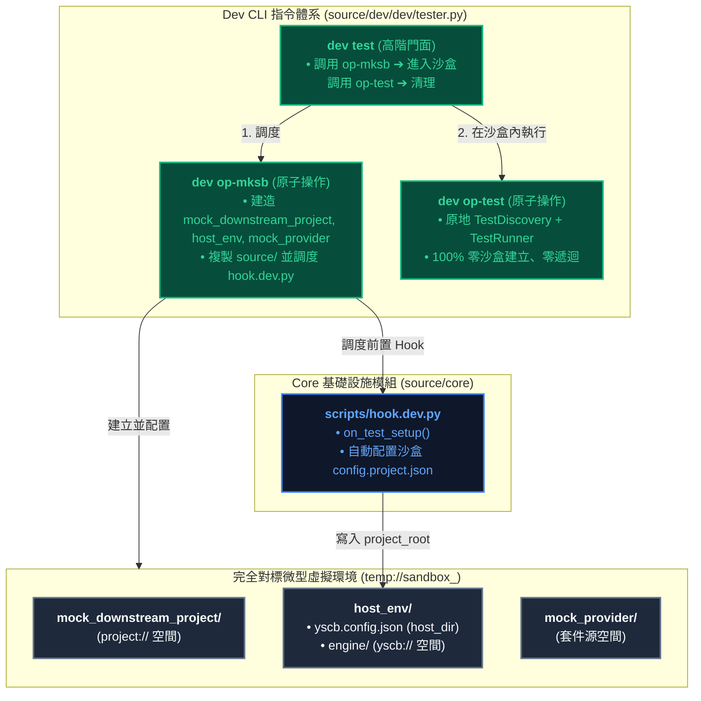
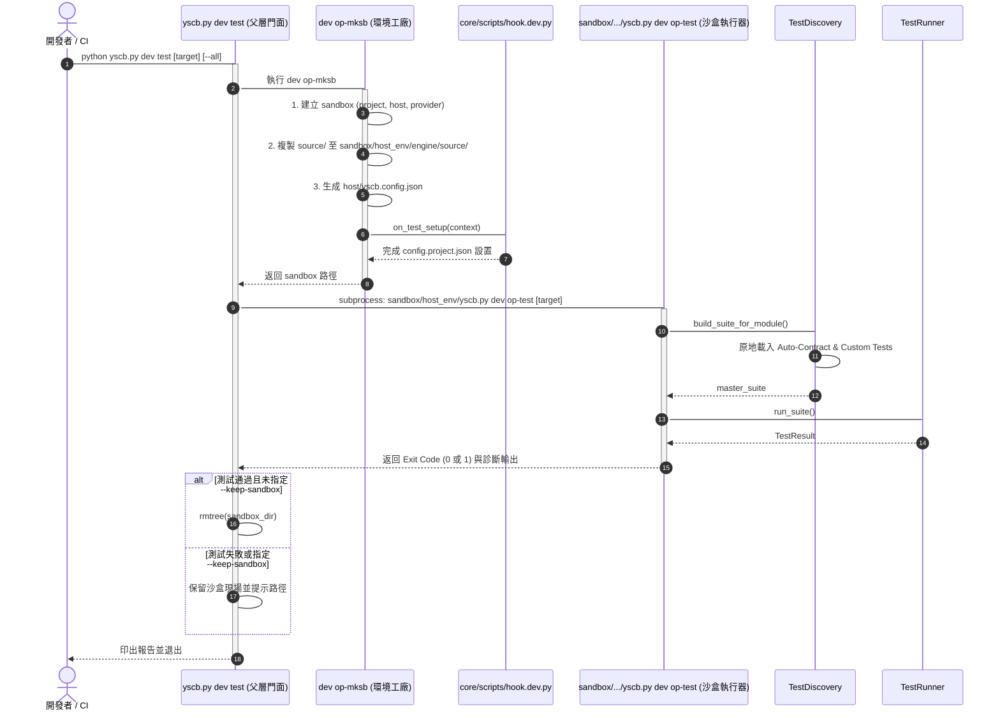

# 架構與模組設計說明書 (Architecture & Module Plan)

> 功能名稱：測試框架生命週期與全隔離虛擬沙盒重構 (Testing Lifecycle & Virtual Sandbox Refactor)  
> 建立日期：2026-08-25  
> 所屬主計畫：[2026_08_23_2030_architecture_refactor](../umbrella_overview.md)  
> 依據 P01：[P01_requirements_spec.md](./P01_requirements_spec.md)  
> 狀態：Confirmed  
> 擴充項目：none  
> 模板版本：v1.4  

---

## 1. 系統模組劃分與邊界 (Module Architecture & Boundaries)

---

## 2. 測試執行期循序圖 (Lifecycle Sequence Flow)

---

## 3. 受影響模組與檔案矩陣 (Impacted Files Matrix)

| 檔案路徑 | 變更類型 | 核心職責與修改重點 | 對應 FR / EC |
| :--- | :---: | :--- | :---: |
| [`source/core/scripts/hook.dev.py`](file:///h:/UseFolder/CodeRepo/ys_codebase/ys_codebase/source/core/scripts/hook.dev.py) | NEW | 實作 `on_test_setup` 與 `on_test_teardown`，於沙盒中配置 `project_root`。 | FR-03 EC-02 |
| [`source/dev/dev/testing/case.py`](file:///h:/UseFolder/CodeRepo/ys_codebase/ys_codebase/source/dev/dev/testing/case.py) | Modify | 重構 `YSCBTestCase`：三層虛擬沙盒鋪設、源碼複製、Hook 調度、雙層套件源支援與安全清理。 | FR-01, FR-02, FR-04 EC-01, EC-04 |
| [`source/dev/dev/testing/runner.py`](file:///h:/UseFolder/CodeRepo/ys_codebase/ys_codebase/source/dev/dev/testing/runner.py) | Modify | `TestDiscovery` 健全 `--type` 過濾與遞迴 `filter_suite(suite, pattern)`。 | FR-05, FR-06 EC-03 |
| [`source/dev/dev/testing/requirement.py`](file:///h:/UseFolder/CodeRepo/ys_codebase/ys_codebase/source/dev/dev/testing/requirement.py) | Modify | 補齊 `Requirement.LOGIC`, `Requirement.HOST_CLI`, `Requirement.NETWORK` 列舉值與過濾輔助函式。 | FR-06 |
| [`source/dev/dev/builder.py`](file:///h:/UseFolder/CodeRepo/ys_codebase/ys_codebase/source/dev/dev/builder.py) | Modify | 打包時確保保留 `scripts/hook.dev.py`。 | EC-05 |

---

## 4. 決策紀錄整合 (Decision Records Master List)

- `[P02:DR-01]`：`core.uri` 保持純淨 0 修改，沙盒透過將源碼複製至 `sandbox/host_env/engine/source/`，直接藉由 `__file__` 達成天然 VFS 自定位。
- `[P02:DR-02]`：沙盒內環境採用「全黑盒自治」模式，每個測試案例具備專屬的三層子目錄（`project`, `host`, `provider`）。
- `[P02:DR-03]`：模組測試前置 Hook 統一命名為 `scripts/hook.dev.py`，作為 `dev` 模組調度的標準協議。
